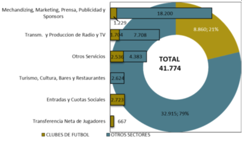

**Resumen**

Este trabajo analiza los determinantes del precio de los pases en el
mercado del fútbol argentino mediante la estimación de modelos de
precios hedónicos. A partir de un enfoque empírico, se utilizan modelos
de regresión lineal (MCO), modelos censurados y el modelo Tobit para
evaluar cómo factores individuales (edad, posición en el campo,
rendimiento pasado) y colectivos (valor del plantel, contexto del
mercado de transferencias) influyen en el valor de los jugadores. Los
resultados indican que el rendimiento previo, el valor del plantel del
club comprador y el tiempo restante de contrato, medido en ventana de
transferencias, tienen efectos significativos sobre el precio.

Además, se evidencia que el modelo Tobit es adecuado para capturar la
censura en los datos, aunque muestra diferencias respecto a los efectos
estimados en modelos de mínimos cuadrados. Se discute el rol del poder
de negociación en las transferencias sin costo y su impacto en la
interpretación de los coeficientes. Los hallazgos contribuyen a la
literatura sobre la Economía del Deporte al ofrecer evidencia sobre los
mecanismos de formación de precios en un mercado donde los clubes no
siempre maximizan beneficios, sino que también buscan otros objetivos
estratégicos y deportivos.

This study analyzes the determinants of transfer fees in the Argentine
football market through the estimation of hedonic pricing models. Using
an empirical approach, linear regression (OLS), censored models, and
Tobit models are employed to evaluate how individual factors (age,
playing position, past performance) and collective factors (squad market
value, transfer window timing) influence player valuation. The results
indicate that prior performance, the buyer club's squad value, and
remaining contract time, measured in terms of the transfer window, have
significant effects on transfer prices.

Additionally, the Tobit model proves suitable for capturing data
censoring, although it shows differences when compared to OLS estimates.
The role of bargaining power in free transfers and its impact on
coefficient interpretation is also discussed. These findings contribute
to the Sports Economics literature by providing evidence on price
formation mechanisms in a market where clubs do not always seek to
maximize profit but rather pursue strategic and sporting objectives.

**Palabras Clave**: Economía del Deporte, Poder de Negociación, Precios
Hedónicos, Mercado Laboral, Organización Industrial.

*Clasificación JEL*: L83, C5.

# Contenido {#contenido .TOC-Heading}

[Introducción [6](#introducción)](#introducción)

[1. Marco Teórico [13](#marco-teórico)](#marco-teórico)

[1.1. Antecedentes [13](#antecedentes)](#antecedentes)

[1.2. Breve repaso sobre la Economía del Deporte
[20](#breve-repaso-sobre-la-economía-del-deporte)](#breve-repaso-sobre-la-economía-del-deporte)

[1.3. El mercado de transferencias
[25](#el-mercado-de-transferencias)](#el-mercado-de-transferencias)

[1.4. El modelo de precios hedónicos
[31](#el-modelo-de-precios-hedónicos)](#el-modelo-de-precios-hedónicos)

[1.4.1. Precios hedónicos con poder de negociación
[35](#precios-hedónicos-con-poder-de-negociación)](#precios-hedónicos-con-poder-de-negociación)

[1.5. Síntesis del capítulo
[39](#síntesis-del-capítulo)](#síntesis-del-capítulo)

[2. Metodología [42](#metodología)](#metodología)

[2.1. Introducción [42](#introducción-1)](#introducción-1)

[2.2. Especificación empírica
[42](#especificación-empírica)](#especificación-empírica)

[2.3. Datos y variables [48](#datos-y-variables)](#datos-y-variables)

[2.3.1. Datos [48](#datos)](#datos)

[2.3.2. Variables [53](#variables)](#variables)

[2.3.3. Modelos econométricos
[61](#modelos-econométricos)](#modelos-econométricos)

[3. Resultados y discusión
[64](#resultados-y-discusión)](#resultados-y-discusión)

[3.1. Introducción [64](#introducción-2)](#introducción-2)

[3.2. Modelos hedónicos con Precios Positivos
[64](#modelos-hedónicos-con-precios-positivos)](#modelos-hedónicos-con-precios-positivos)

[3.3. Censura, truncamiento y estimación Tobit
[71](#censura-truncamiento-y-estimación-tobit)](#censura-truncamiento-y-estimación-tobit)

[Conclusiones [76](#conclusiones)](#conclusiones)

[Bibliografía [80](#_Toc198470891)](#_Toc198470891)

[Anexo 1 [86](#anexo-1)](#anexo-1)

[Anexo 2 [87](#anexo-2)](#anexo-2)

**\
**

**Índice de Tablas**

[Tabla 1 *Los 20 fichajes más caros de la historia del futbol a precios
de octubre de 2024* [8](#_Ref197277552)](#_Ref197277552)

[Tabla 2 *Transferencias con contrato verificado por temporada y
ventana* [50](#_Ref197615001)](#_Ref197615001)

[Tabla 3 *Transferencias con precio positivo por temporada y ventana*
[51](#_Ref197615051)](#_Ref197615051)

[Tabla 4 *Observaciones obtenidas con scraping con precio positivo sin
contrato vigente. (Precios corrientes)*
[52](#_Ref197616403)](#_Ref197616403)

[Tabla 5 *Definición de las Variables*
[53](#_Ref197682009)](#_Ref197682009)

[Tabla 6 *Precios promedio de las transferencias en el fútbol argentino
por posición y tipo de transferencia en el periodo 2021-2024 (en euros
constantes de junio 2021)* [55](#_Ref197683245)](#_Ref197683245)

[Tabla 7 *Promedio de características de los jugadores transferidos con
contrato vigente por posición en el período 2021-2024*
[57](#_Ref197947296)](#_Ref197947296)

[Tabla 8 *Resumen estadístico de las variables de rendimiento en el
período 2021-2024* [59](#_Ref197950312)](#_Ref197950312)

[Tabla 9 *Parámetros Estimados de Modelos Simples de Precios Hedónicos:
variable dependiente lprecio* [68](#_Ref198034319)](#_Ref198034319)

[Tabla 10 *Parámetros Estimados del Modelo Censurado y del modelo Tobit:
variable dependiente lprecio* [72](#_Ref198041508)](#_Ref198041508)

[Tabla 11 *Efectos Marginales de los Modelos Truncado (MCO), Censurado
(MCO) y Censurado Tobit: Variable Dependiente lprecio.*
[72](#_Ref198045226)](#_Ref198045226)

[Tabla 12 *Comparación de coeficientes Probit vs. Tobit estandarizados*
[75](#_Ref198045529)](#_Ref198045529)

[Tabla 13 *Estimación Probit sobre la probabilidad de tener precio:
Variable Dependiente tiene_precio (1 = precio \> 0)*
[86](#_Ref197959854)](#_Ref197959854)

[Tabla 14 *Regresión del valor de clubes en el período 2020-2023*
[87](#_Ref197966963)](#_Ref197966963)

[Tabla 15 *Efectos fijos de la nacionalidad del equipo en el logaritmo
del valor del plantel respecto de Argentina. Modelo (2)*
[88](#_Toc198472217)](#_Toc198472217)

**\
**

**Índice de Figuras**

[Figura 1 Distribución del negocio del fútbol argentino en el año 2013.
[9](#_Ref197281367)](#_Ref197281367)

[Figura 2 Clasificación de los tipos de productos deportivos según su
objeto social [24](#_Ref197338036)](#_Ref197338036)

[Figura 3 Modelo de precios hedonicos de equilibrio
[35](#_Ref197510592)](#_Ref197510592)

[Figura 4 Modelo de precios hedónicos de equilibrio con excedente por
distribuir [37](#_Ref197512534)](#_Ref197512534)

[Figura 5 Histograma del logaritmo del precio de las transferencias de
futbolistas con contrato para el periodo 2021-2024
[47](#_Ref197601074)](#_Ref197601074)

[Figura 6 Distribución de las transferencias por cuatrimestre
[50](#_Ref197614977)](#_Ref197614977)

**\
**

# Introducción {#introducción .Titulo-1-sin-numeracion}

El presente trabajo surge a partir de ser detectada una carencia en el
estudio económico del mercado de pases del fútbol argentino. Si bien el
campo de la Economía del Deporte es relativamente nuevo, en los últimos
30 años han proliferado las investigaciones teóricas y empíricas que,
usando conceptos, modelos y metodologías de la economía pura y aplicada,
estudian diferentes aspectos económicos y sociales que hacen al fenómeno
del deporte en general, y del fútbol en particular. Entonces, debido a
que está literatura está concentrada en el mercado europeo, se eligió de
tema de investigación el estudio de los factores que inciden en la
determinación del precio de los jugadores en el mercado de pases del
fútbol argentino.

El fútbol constituye una pasión de multitudes en gran parte de los
países del mundo, y con el paso del tiempo, este deporte (como muchos
otros) ha generado varios mercados, donde la cantidad de dinero que se
mueve en los mismos es cada vez más elevada.

Así, por ejemplo, La consultora Deloitte & Touche (2024) estima que para
la temporada 2022/23, el mercado europeo del fútbol en su totalidad
alcanzó los 35 300 millones de euros, representando un crecimiento del
16% respecto del año anterior; una tasa de crecimiento superior al de la
economía europea en su conjunto para ese año. En gran parte, este
crecimiento se explica por la recuperación lenta a la caída de los
ingresos generado por la pandemia del año 2020. Las proyecciones para la
temporada 23/24 y 24/25 son de un crecimiento menor, cercano al 6.5 y 4%
respectivamente.

A nivel local se carece de información que permita establecer
comparaciones en el tiempo. En la única investigación al respecto,
Coremberg, Sanguinetti y Wierny (2016) estiman que el Valor Bruto de
Producción (VBP) ---o facturación--- de los productos, servicios y
sectores asociados al fútbol en el año 2013 fue de ARS 32 915 millones
(aproximadamente USD 5 000 millones). Los clubes de fútbol tan sólo se
apropian del 20%, es decir, ARS 8 860 millones (aproximadamente USD
1 363 millones). Asimismo, en términos relativos, el VBP del fútbol
representa el 2.2% del consumo de los hogares argentinos, numero para
nada despreciable si se tiene en cuenta que el eje central de este
consumo está impulsado por Asociaciones Civiles Sin Fines de Lucro
(ACSFL). En este sentido, el VBP del fútbol no es muy distante a las
estimadas para España (2.1% en 1999), o para el deporte en general de
algunos países, como son: España 3.5%, Polonia 2.1%, Reino Unido 3.2%,
Austria 3.6%, y Holanda 1.3% (Coremberg et al., 2016).

Estos cambios en los ingresos tienen una estrecha relación con los
mercados de transferencias. Si se entiende que la competencia económica
y la competencia deportiva entre los clubes están relacionadas entre sí,
el mercado de transferencias funciona como una suerte de puente, que
distribuye el talento hacia los equipos de mayores ingresos y, a su vez,
distribuye el dinero hacia los equipos que poseen una mayor cantidad de
talento en sus planteles (y no pueden sostener sus costos).

En lo que respecta a valores individuales pagados por un futbolista, en
la Tabla 1 se muestran los fichajes más caros de la historia reciente
del fútbol. En la misma, puede observarse que, aun actualizando los
precios, los fichajes de los años prepandemia siguen siendo superiores a
los pagados por figuras incuestionables del pasado reciente.

El interés por la economía del deporte en la argentina tiene su primer
antecedente con Di Marco (1978), quien sostiene que: "La diversidad y
enorme difusión del deporte en la mayoría de los países del mundo ha
dado como resultado una compleja demanda de bienes y servicios para
satisfacer sus fines.". Argentina no es la excepción, sin embargo, el
campo de la Economía del Deporte casi no ha sido explorado en ninguno de
sus aspectos. Esto es algo que sorprende debido al relativo interés
social del fútbol.

En este sentido, Coremberg, Sanguinetti, y Wierny estimaron que para el
año 2013, la suma total del valor de producción de los productos y
servicios asociados al fútbol es ARS 41 774 millones (aproximadamente
USD 6 300 millones de ese año u USD 8 500 millones de dólares actuales)
para el negocio en su conjunto, lo que representó aproximadamente el
1.2% del PBI. Los clubes de fútbol explican sólo el 21% del giro del
negocio, mientras que el 79% se genera en los sectores asociados. Donde
"la prensa, publicidad y sponsors participan del 25% del giro del
negocio, en tanto que la transmisión y producción de radio y TV un 23.4%
y el merchandising (bebidas, indumentaria, etc.) un 22.6%. El turismo,
cultura, bares y restaurantes un 8% y el resto de los servicios y
sectores un 13%" (Coremberg et al., 2016).

  ------------------------------------------------------------------------------------------------------------------------------------------------------------------------------------------------------------
  []{#_Ref197277552 .anchor}Tabla 1\                                                                                                                                                                  
  *Los 20 fichajes más caros de la historia del futbol a precios de octubre de 2024*                                                                                                                  
  ----------------------------------------------------------------------------------------------------------------- ---------- --------------- ----------- -- ----------- --------- --- ------------- --------
  **Jugador**                                                                                                       **Edad**   **Temporada**   **Precio de    **Precio                  **Ranking\    
                                                                                                                                               pase\          Actual\                   Histórico**   
                                                                                                                                               (Millones      (Millones                               
                                                                                                                                               €)**           €)**                                    

  Neymar                                                                                                            25         17/18           222.0                      285.41                      1

  Kylian Mbappé                                                                                                     19         18/19           180.0                      226.88                      3

  Philippe Coutinho                                                                                                 25         17/18           135.0                      173.56                      2

  Ousmane Dembele                                                                                                   20         17/18           135.0                      173.56                      4

  Joao Félix                                                                                                        19         19/20           127.2                      158.90                      5

  Eden Hazard                                                                                                       28         19/20           120.8                      150.14                      6

  Antoine Griezmann                                                                                                 28         19/20           120.0                      149.14                      16

  Cristiano Ronaldo                                                                                                 33         18/19           117.0                      147.47                      8

  Jack Grealish                                                                                                     25         21/22           117.5                      140.88                      7

  Paul Pogba                                                                                                        23         16/17           105.0                      137.35                      9

  Cristiano Ronaldo                                                                                                 24         09/10           94.0                       136.33                      10

  Romelu Lukaku                                                                                                     28         21/22           113.0                      135.48                      11

  Zinedine Zidane                                                                                                   29         01/02           77.5                       133.60                      12

  Gareth Bale                                                                                                       24         13/14           101.0                      132.96                      37

  Enzo Fernández                                                                                                    22         22/23           121.0                      128.21                      13

  Declan Rice                                                                                                       24         23/24           116.6                      120.34                      17

  Moisés Caicedo                                                                                                    21         23/24           116.0                      119.12                      20

  Gonzalo Higuain                                                                                                   28         16/17           90.0                       117.81                      14

  Jude Bellingham                                                                                                   20         23/24           113.0                      116.62                      15

  Neymar                                                                                                            21         13/14           88.0                       116.42                      42

  Fuente: Elaboración propia con datos de transfermarket.com y                                                                                                                                        
  [Eurostat](https://ec.europa.eu/eurostat/databrowser/view/prc_hicp_midx__custom_13918102/default/table?lang=en)                                                                                     
  ------------------------------------------------------------------------------------------------------------------------------------------------------------------------------------------------------------

Los ingresos por transferencias de futbolistas, junto a la venta de
entradas y las cuotas societarias, son los únicos recursos de los que
participan exclusivamente los clubes de fútbol (Coremberg et al., 2016).
Para el resto de las actividades, la apropiación del VBP por parte de
los clubes es de la siguiente forma: Obtienen 6.3% del merchandising,
prensa y publicidad, el 18% de la transmisión y producción televisiva y
radial y un 36.7% del negocio del rubro otros servicios. En tanto que el
turismo, cultura y alimentos fuera del hogar asociados al fútbol se
generan exclusivamente por sectores asociados (Figura 1).

Coremberg et al. (2016) sostienen que es un mito decir que *el fútbol
local mueve mucho dinero*, debido a que el VBP solo representa el 2.2%
del consumo de las familias. Sin embargo, esta situación no debe servir
para excluir al fútbol de la investigación económica. En Argentina, los
clubes son Sociedades Civiles Sin Fines de Lucro, y, por tanto, no debe
analizarse su alcance como el de una industria más.

La importancia y el interés social del fútbol sobrepasan al consumo en
nuestro país. Los clubes, cumplen el rol de contención social intentando
mantener a los jóvenes fuera del delito y el consumo de drogas,
principalmente, durante su periodo de formación.

  -----------------------------------------------------------------------
  []{#_Ref197281367 .anchor}Figura 1\
  Distribución del negocio del fútbol argentino en el año 2013.
  -----------------------------------------------------------------------
  {width="5.083333333333333in" height="3.03125in"}

  Fuente: Coremberg et al. (2016)
  -----------------------------------------------------------------------

Otro dato que refuerza el interés social por el fútbol es el *rating*
televisivo. La final de la Copa del Mundo 2022[^1], ganada por la
Selección Nacional, cosechó 15 puntos más de rating que el debate
presidencial de 2023[^2]. La preponderancia del fútbol en la televisión
es un fenómeno que no se limita a un máximo histórico, sino que es un
fenómeno que se observa año a año, aun en medio de la expansión de otros
medios de entretenimiento.

El mercado de transferencias presenta un atractivo particular al momento
de plantear el recorte dentro del análisis económico del fútbol. Y,
particularmente, la determinación del precio de transferencia por ser
parte integral del análisis económico del mercado laboral del fútbol
(Carmichael, 2006). En términos concretos, el mercado de transferencias
puede considerarse uno de los pocos mercados (si no es el único), en el
cuál las firmas pagan una tarifa por el derecho a contratar un
trabajador con formación especializada, que está prestando sus servicios
en otra firma. La oportunidad para estudiar un mercado con las
características antes mencionadas está limitada al fútbol, debido a que
los principales deportes de conjunto en América del Norte no poseen un
mercado de transferencias desde que se estableció la agencia libre en
1976 (Carmichael, 2006).

El interés por el mercado laboral del fútbol es aún mayor si se tienen
en cuenta las cifras que se pagan por el derecho de contratar a los
jugadores de fútbol (Tabla 1), los salarios de los futbolistas con
respecto a los salarios de otros trabajadores y a la cantidad de años
que el jugador puede prestar sus servicios. Además, esta situación
ocurre, desde hace casi 30 años, en un marco de libertad. Es decir, que
los jugadores no pueden considerarse un insumo que las firmas deportivas
comercian como si fuesen un bien más de la economía, sino que deben
entenderse como un trabajador con sus respectivos derechos. Esta
situación, implica que el club que quiera contratar a un futbolista
necesita de su consentimiento y el del club de origen, y esto abre dos
vías de negociación: la negociación salarial y la negociación por la
transferencia.

El objetivo principal de este trabajo es abordar cuestiones empíricas
hasta ahora descuidadas en la literatura local. Particularmente, conocer
los precios implícitos de las características de los jugadores de fútbol
en el mercado de pases de Argentina, y estimar el impacto del poder de
mercado y de negociación inferido a partir del tamaño de los clubes.
Para ello, será necesario, previamente, revisar la literatura existente
sobre los mercados del deporte en general, del fútbol en particular y
con más especificidad del mercado de transferencia de jugadores.

Para alcanzar estos objetivos, se recurrirá inicialmente al enfoque
cualitativo a través de la revisión bibliográfica y al análisis
descriptivo con el objetivo de analizar las características propias de
los mercados asociados al deporte. Para tal fin, se identificarán los
puntos en común entre el análisis de la teoría económica para los
mercados tradicionales con los planteados por la Economía del Deporte,
destacándose las particularidades que pueden refutar algunas de las
conclusiones heredadas de la teoría. Para ahondar sobre la determinación
de los precios de transferencia, se incorporarán los textos académicos
enfocados a tal fin.

Seguidamente, se utilizará el enfoque cuantitativo para la construcción
de un modelo econométrico, que permita dar cuenta de los factores
determinantes de los precios, sus valores implícitos y la existencia o
no de poder de negociación. Para tal fin, se recopilarán los datos
disponibles en el sitio web *transfermarkt* para todos los jugadores
transferidos del fútbol argentino en el periodo 2021-2024[^3].

El análisis de los datos se realizará a través de un modelo de precios
hedónicos con poder de mercado. Además, siguiendo lo estudiado por
Carmichael, Forrest, y Simmons (1999) sobre las transferencias de precio
cero, se estimará un modelo *Tobit* de variables censuradas.

Otra alternativa estudiada para el tratamiento de este tipo de muestras
es, en analogía con lo estimado por los autores, estimar la probabilidad
de un jugador de ser transferido con precio. En la medida en que algunos
jugadores son más propensos a tener precio de transferencia que otros,
por la razón que sea, una ecuación estimada por MCO sufrirá un sesgo de
selección que conducirá a estimaciones sesgadas e inconsistentes de los
coeficientes. Para ello se puede proponer un procedimiento en dos pasos
de Heckman (1979) para la corrección del sesgo de selección a tener una
tarifa de transferencia en el mercado de pases.

El problema con este tratamiento es que requiere de una variable de
exclusión que afecte la probabilidad de tener precio, pero no al precio
en sí mismo. Esta variable no fue encontrada, y es algo esperable, ya
que, estimar la probabilidad de tener precio es, en parte, una forma de
estimar el precio.

En contrapartida, para estudiar los problemas de autoselección, se
analizará la diferencia entre un modelo truncado para observaciones con
precio, frente un modelo censurado con precio observado cero, y un
modelo Tobit que incorpore la probabilidad de observar el precio. En
este sentido, es importante aclarar que solo se tendrán las
transferencias sin precio, pero con contrato activo. Ya que se considera
que una transferencia sin un contrato que vincule a un jugador con la
institución en la que jugó la última temporada, no requiere una tarifa
de transferencia, y, por tanto, la probabilidad de observar un precio
debería ser cero.

La estructura del Trabajo Final de Maestría constará de tres capítulos.
En el Capítulo 1 exponen los antecedentes de la investigación, y se
desarrollará el marco teórico desde el punto de vista económico y
estadístico. Posteriormente en el Capítulo 2 se describe la metodología
empleada para estudiar el mercado de transferencias del fútbol
argentino, y los datos y las variables utilizados en la investigación.
En el Capítulo 3, se presentan los resultados empíricos con sus
interpretaciones. Para finalmente cerrar el trabajo con las conclusiones
generales de la tesina.

