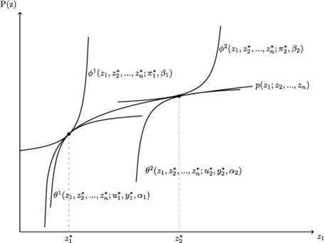

Capítulo 1

# Marco Teórico

## Antecedentes

La literatura económica relacionada con el mercado de transferencias del
fútbol comienza a difundirse en la década de los 90, enfocándose en las
ligas europeas (Carmichael y Thomas, 1993; Speight y Thomas, 1997;
Reilly y Witt, 1995; Carmichael et al., 1999). No obstante, comparado
con la proliferación del resto de las áreas de la Economía del Deporte,
los estudios sobre fútbol son relativamente escasos.

La falta de literatura referida al mercado de transferencias de
futbolistas, especialmente en la etapa inicial del desarrollo de la
Economía del Deporte, puede explicarse a través de dos dificultades. La
primera de ellas es que la mayor parte de la literatura referida a la
Economía del Deporte fue escrita en Estados Unidos, donde el fútbol, no
posee la misma importancia que los deportes conocidos como los cuatro
grandes (béisbol, fútbol americano, hockey sobre hielo y básquetbol).
Estos deportes no poseen un mercado de transferencias, entonces, el
estudio de este tipo de mercado depende exclusivamente de los trabajos
realizados para el fútbol. Esta problemática no se observa en otras
áreas de la Economía del Deporte, como son: el balance competitivo
(Mohamed y Quirk, 1971; Quirk y El-Hodiri, 1974), el principio de
invarianza (Fort y Quirk, Cross-Subsidization, Incentives, and Outcomes
in Professional Team Sports Leagues, 1995; Vrooman, 1995; Krautmann y
Oppenheimer, 1994; Hylan et al., 1996), la determinación de los salarios
(Scully, 1974), los efectos de la salida de la cláusula de reserva
(Holahan, 1978; Hill y Spellman, 1983), la incertidumbre en el
resultado, entre otros.

La segunda dificultad que encontró el desarrollo de la literatura
relacionada con las transferencias de futbolistas es la complejidad
propia del deporte. El aporte de los jugadores durante los partidos es
mayor al capturado por las estadísticas tradicionales (Goles
convertidos, goles recibidos, asistencias, partidos jugados). Otro
inconveniente relacionado con la naturaleza del deporte es que algunas
características de las acciones de juego no son medibles en estadísticas
o, en el caso de que lo sean, su aplicabilidad a este tipo de estudios
se presenta con una excesiva complejidad[^4].

Con el avance de la tecnología, algunas empresas comenzaron a obtener
estadísticas de mayor precisión. Por ejemplo, desde 1996 la empresa Opta
*Sports* recolecta e informa estadísticas de los partidos con un gran
grado de detalle. Además, a partir de ellas, la empresa desarrolla
índices de rendimiento que son tenidos en cuenta por los clubes de
fútbol para valorar los aportes de los jugadores en los partidos. En la
investigación económica, solo se pudo dar cuenta de una única
utilización (Carmichael et al., 2000), a pesar de las buenas críticas y
su gran recepción entre los medios de comunicación y los clubes de
fútbol.

Actualmente, existen sitios web que ofrecen una valoración de los
jugadores, aunque esta no debe entenderse como una estimación del
precio. Aunque hace algunos años, ninguno de ellos establecía a las
estadísticas como un criterio explícito, posteriormente se fue
incorporando el criterio. Por ejemplo, el CIES Football Observatory
(2018) establecía entre sus criterios para los jugadores transferidos en
las cinco grandes ligas: La duración del contrato, el año de
transferencia, el valor en libros, el estado del préstamo, la
nacionalidad y el nivel económico del club comprador (estimado si se
desconoce). Posteriormente ---intentando esta vez predecir precios---
ajustaron su modelo en función del trabajo escrito por su propio
director, Raffaele Poli. Según algunos medios de comunicación, este
modelo habría sido un pedido de la FIFA para fijar precios de
futbolistas[^5] [^6].

En su trabajo, Poli, Besson, y Ravenel (2024) incorporaron a los
regresores que el observatorio utilizaba, variables de rendimiento como
los minutos jugados y los goles convertidos en los últimos 2 años
calendario, los gastos de los compradores (liga y equipo) y los ingresos
de los vendedores, la posición más ocupada por el jugador, los puntos
obtenidos por los clubes, entre otros.

Por otro lado, el sitio web alemán transfermarkt.com, establece
explícitamente los criterios que se utilizan para la valoración de los
futbolistas en su foro de opinión recién desde 2021. Textualmente dice:

> Los valores de mercado de Transfermarkt se calculan teniendo en cuenta
> varios modelos de fijación de precios. Un factor importante es la
> comunidad de Transfermarkt, cuyos miembros discuten y evalúan en
> detalle los valores del mercado de los jugadores. En general, los
> valores de mercado de Transfermarkt no deben equipararse a las
> cantidades realmente pagadas en concepto de traspaso. El objetivo no
> es predecir un precio, sino más bien el valor esperado de un jugador
> en el mercado. Tanto las modalidades individuales de fichajes como el
> contexto general son relevantes para determinar los valores de
> mercado. \[\...\] Asimismo, Transfermarkt no utiliza ningún algoritmo
> para elaborar sus valores, sino que se basa en el criterio de la
> comunidad (Transfermarket, 2024)

La primera investigación económica sobre el mercado de transferencia de
futbolistas es el trabajo de Carmichael y Thomas (1993), donde los
autores expanden al fútbol las contribuciones realizadas a la economía
del deporte en general y al béisbol en particular por Rottenberg (1956).
Para realizar su trabajo, tomaron datos de los jugadores transferidos al
final de la temporada 90-91 del fútbol inglés, utilizando como
principales determinantes del precio, las características de los equipos
involucrados, las características del jugador y su rendimiento. Debido a
que no existían antecedentes sobre mercados de transferencias de
deportistas, Carmichael y Thomas (1993) basaron su investigación de
*cómo* incorporan los equipos profesionales de fútbol, en la negociación
por el salario de los agentes libres del béisbol.

Reilly y Witt (1995) extienden el trabajo de Carmichael y Thomas (1993),
incluyendo la posibilidad de discriminación racial sin encontrar
resultados significativos de discriminación para las transferencias de
la temporada 91-92. Medcalfe (2008), 13 años después, obtiene iguales
conclusiones para las transferencias de la temporada 2001-2002. En este
sentido, no puede dejar de destacarse la fuerte influencia del estudio
del béisbol norteamericano, el cual ha estudiado ampliamente el fenómeno
de la discriminación fundamentado en la historia de dicho deporte
(Gwartney y Haworth, 1974; Raimondo, 1983; Hill y Spellman, 1984;
Christiano, 1986; Nardinelli y Simon, 1990). Otro aporte interesante de
Reilly y Witt (1995), es no tomar la edad como una variable continua,
sino que, a diferencia de sus predecesores, la determinan como variable
binaria en función de determinados rangos de interés.

Por otra parte, Speight y Thomas (1997) estudian el impacto del
arbitraje sobre los precios en el fútbol inglés. Más específicamente, la
influencia del *Football league Appeal Committee* (FLAC), sobre los
precios de las transferencias de jugadores en el período que comprende
las temporadas 85/86 y la 89/90.

Dobson y Gerrard (1999) analizaron las transferencias del fútbol inglés
entre junio de 1990 y agosto de 1996. El objetivo principal era
determinar la tasa de inflación en los precios de las transferencias y
la segmentación del mercado. Adicionalmente, buscaron captar el efecto
que había tenido la ley Bosman en los precios pagados por las
transferencias de los futbolistas. La segmentación del mercado tuvo como
referencia tres tipos de transferencia (horizontal, ascenso, descenso)
para la primera división y para las divisiones menores en conjunto.
Buscaron determinar cuáles son las variables significativas en cada
caso, teniendo en cuenta cuatro conjuntos de variables que ya habían
establecido otros autores: características de los jugadores,
características del club comprador y del club vendedor, y otras
variables de control.

La ley o sentencia Bosman del año 1995, significó un punto de inflexión
en la metodología a aplicar en estos estudios debido a que transformó el
mercado de transferencias en Europa. Uno de los efectos de esta
sentencia fue eliminar el derecho a una tarifa de traspaso, formación o
promoción una vez finalizado el contrato entre el futbolista profesional
mayor a 24 años y el equipo. La influencia de esta sentencia en los
modelos teóricos de determinación de los precios de transferencia tardó
algunos años en manifestarse. Por ejemplo, Szymanski y Smith (1997)
deciden suponer, por primera vez, que el mercado de transferencias de
jugadores puede considerarse competitivo, con restricciones a partir del
periodo conocido como de *libertad de contratación* (1977-78), y sin
restricciones a partir de la sentencia Bosman.

Carmichael et al. (1999) estiman el primer modelo bajo un enfoque
competitivo, utilizando como base el modelo de precios hedónicos. La
justificación para dicho cambio metodológico tenía su base en el
objetivo de la investigación: modelar los efectos de selección de
muestras a través del proceso de dos pasos de Heckman, para corregir el
sesgo muestral encontrado en los modelos anteriores. De esta manera, en
el primer paso, se estima la probabilidad de ser transferido de cada
jugador y en la segunda etapa se estima el modelo de precios de las
transferencias, incluyendo la corrección al sesgo de selección.

La decisión de utilizar un modelo de precios hedónicos no está
fundamentada en la sentencia Bosman, los autores utilizaron los precios
de transferencias de la temporada 94-95 de la liga inglesa, que son
anteriores a la sentencia. La imposibilidad de utilizar un enfoque de
negociación se encuentra en la inexistencia de un club comprador para un
jugador no transferido.

Los autores sostienen que el enfoque de negociación seguido en la
literatura es, de hecho, inconsistente con el modelo de
selección-corrección, ya que el primero contiene variables para las
características de los clubes compradores, como son los ingresos o
ganancias y las asistencias a los estadios. Dichas variables no pueden
incluirse en un modelo de corrección de selección, ya que todas las
variables en la ecuación del precio (excepto el término de corrección de
selección) deben incluirse en la ecuación de probabilidad de
transferencia. Este último contiene información sobre todos los
jugadores, no solo los transferidos, y para aquellos jugadores no
transferidos, no existe información sobre el club comprador (Carmichael
et al., 1999, p. 128).

Está investigación determinó que existen jugadores con una mayor
probabilidad de ser transferidos. Este aumento es más alto para
jugadores más experimentados, que han marcado mayor cantidad de goles y
jugadores a préstamo sin un largo historial de transferencias. Estos
resultados implican que la estimación de ecuaciones de precios hedónicos
requiere corrección por sesgo de selección.

Carmichael et al. (1999), encontraron en las afirmaciones de Szymanski y
Smith (1997), un antecedente para asumir el mercado competitivo. Estos
últimos sostienen que el mercado de transferencias se caracteriza por la
libertad de contratación para los jugadores, muchos compradores y
vendedores (en un mercado internacional en el que el idioma no es una
barrera importante), y una red de información integral (con base
subjetiva) en la que el esfuerzo y el rendimiento de los jugadores son
observados y monitoreados fácilmente. También puede agregarse otro
aporte de Szymanski y Smith (1997) asociado a los mercados competitivos
en el fútbol: las empresas en esta industria tienen poco control sobre
sus principales costos de insumos, los jugadores, porque se negocian en
un mercado, a su criterio, competitivo.

De todas maneras, Carmichael (2006) continuará sosteniendo que el
enfoque de negociación es apropiado en la medida en que el mercado de
transferencias no es verdaderamente competitivo porque se caracteriza
por (a) la incertidumbre que conduce al riesgo y la incompletitud
contractual, y/o (b) la negociación de pequeños números de agentes
(Equipos o jugadores de interés) asociada con la especificidad de la
transacción de forma tal de que la identidad es importante.

Respecto a la existencia de incertidumbre, Carmichael y Thomas (2000)
sostienen que la misma existe debido a la información asimétrica sobre
aspectos de la calidad y el compromiso de un jugador. Además, existe un
riesgo porque no estará claro, antes de una transferencia, qué tan bien
se desempeñará un jugador como parte de una nueva estructura de equipo.
El debate sobre el apartado (b) será discutido en la sección
[1.3](#el-mercado-de-transferencias) de este trabajo.

Por su parte, Tunaru, Clark, y Viney (2005) incorporan el factor
dinámico en la determinación del valor del jugador, intentando responder
a la siguiente pregunta: "¿Cuánto *vale* este jugador en este momento en
el tiempo?". Su enfoque se basa en modelos de opciones reales que, según
los autores, es una de las mejores herramientas teóricas para la toma de
decisiones disponibles para cuando los objetos analizados no se
comercializan en el mercado. Concretamente, mide la incertidumbre que
rodea el rendimiento profesional de un jugador, incluyendo eventuales
lesiones, y la incertidumbre que rodea a los ingresos de un club.
También se incorporan los rendimientos derivados de las actuaciones del
jugador, así como aquellos derivados de la imagen del jugador, la imagen
del club, de la fidelidad de la afición, de la economía en general, etc.

Si bien reconocen que los jugadores se venden y compran en una especie
de mercado, este no se corresponde con el significado financiero de
mercado. Además, sostienen que las transferencias de jugadores de un
club a otro a cambio de una suma de dinero son menos comunes, por lo
menos en comparativa con la cantidad total de jugadores. De todas
maneras, esto no afectaría la metodología propuesta porque, de una forma
u otra, los modelos de opciones reales que muestran se pueden aplicar de
la misma manera, solo que el uso de los resultados difiere ligeramente
según sea el caso.

Ruijg y van Ophem (2015) buscan determinar los precios de los jugadores
para la temporada 2011-2012 de la primera división de la liga inglesa.
Los autores también realizan una corrección por sesgo de selección de la
muestra, pero a diferencia de Carmichael et al. (1999) utilizan la
hipótesis de que la muestra seleccionada de transferencias no es una
muestra aleatoria de todas las transferencias, porque el número relativo
de tasas de transferencia que realmente se hace pública es muy pequeño
(38% para la temporada 2011/12 y el 9% para la 2012/13).

Una de las herramientas utilizadas para la corrección de este problema,
es la clasificación de los equipos involucrados en las transferencias
dentro y fuera del país analizado (Inglaterra). El objetivo es
determinar si la transferencia representa una mejora o un deterioro, ya
que a entender de los autores: "las grandes mejoras van acompañadas de
un nuevo salario alto, un precio alto de transferencia cuando sea
aplicable y una alta productividad." (Ruijg y van Ophem, 2015).
Utilizaron como base el ranking de equipos de la UEFA, pero se
encontraron con la necesidad de adaptarlo debido a que no existía una
correspondencia plena entre un ranking positivo y el pago de salarios
elevados.

Rodríguez, Hassan, y Coad (2019) analizan los factores que influyen en
el valor de mercado de los jugadores de fútbol en las principales ligas
europeas durante la temporada 2015/2016. Para ello, utilizaron un marco
de regresión hedónica e implementaron el Promedio de Modelos Bayesianos
(BMA) a través de la composición de modelos de Monte Carlo con cadenas
de Markov (MC) y el Promedio de Modelos Bayesianos con Variables
Instrumentales (IVBMA) para abordar la incertidumbre del modelo y la
endogeneidad. El objetivo de este enfoque es poder abarcar los 35.000
millones de modelos posibles con las 36 variables seleccionadas.

Los autores determinaron que variables como el rendimiento, la
participación en el equipo nacional, la edad, y la participación en la
selección mayor y sub-21, son determinantes clave del valor de mercado.
Sugieren que la relación de la edad con el valor de mercado es
cuadrática, y esta alcanza su valor máximo alrededor de los 26 años. El
estudio también resalta la importancia de comprender el valor de mercado
de los jugadores como un fenómeno económico significativo en el fútbol
profesional.

Más recientemente, Poli, Besson, y Ravenel (2021) estudiaron los
determinantes de los precios de transferencia de los equipos de las
principales ligas europeas para el periodo de julio de 2012 a noviembre
de 2021, analizando más de 2000 transacciones. El trabajo destaca la
importancia de incorporar los años de contrato restantes del jugador
para mejorar la predictibilidad.

Es importante destacar, que el trabajo de los autores se centra en la
predictibilidad de los precios, y no en los efectos individuales de los
determinantes en los precios. De todas maneras, la significatividad de
los coeficientes es importante en este tipo de análisis. Posteriormente
(Poli et al., 2024), realizaron los últimos avances en modelización
estadística de los factores que los actores del mercado tienen en cuenta
para determinar los precios de transferencia de los jugadores de fútbol
profesional. Ampliaron la muestra a más de 8000 transacciones de
jugadores transferidos por dinero desde clubes de todo el mundo durante
el período que se extiende desde julio de 2014 hasta marzo de 2024. El
trabajo muestra que un modelo estadístico puede explicar hasta el 85% de
las diferencias en las tarifas de transferencia pagadas por los
jugadores. A pesar de los casos específicos y otras posibles
distorsiones, los autores sostienen que el uso de un modelo estadístico
para determinar los precios de transferencia de jugadores es muy
relevante a escala global.

Cómo puede observarse, desde la década de los noventa existe una
proliferación de trabajos teóricos y empíricos para conocer el fenómeno
de determinación de precios en el mercado de fútbol. Sin embargo, tales
estudios han estado focalizados en el mercado de pases del fútbol
europeo, no encontrándose antecedentes para el fútbol latinoamericano en
general, y argentino en particular. Con esta investigación se busca
reducir ese vacío.

## Breve repaso sobre la Economía del Deporte

La investigación sobre la Economía del Deporte, área de estudio se
focaliza en los deportes de equipo y no en las competencias
individuales, inicia con el trabajo realizado por Rottenberg (1956)
sobre el mercado de trabajo del béisbol norteamericano. Para ello,
necesitó previamente revisar algunas de las particularidades de los
mercados que rodean al deporte desde la perspectiva de la teoría
económica tradicional.

Fort (2005) sintetizo este trabajo en sus once puntos principales, a los
cuales denominó las anclas sobre las que se sostiene la Economía del
Deporte. Posteriormente, han sido destacadas por Sloane (2006) en su
evaluación del medio siglo de la Economía del Deporte, reforzando así la
importancia de resaltar estos conceptos al momento de estudiar la
materia.

Las once **Anclas** de la Economía del Deporte son:

1.  El mercado laboral es monopsonista. Esto es así, pues para la época,
    los jugadores de béisbol, y los futbolistas también, eran propiedad
    de los equipos de por vida.

2.  El mercado de productos es monopolístico. Esta es una característica
    específica para el caso específico del béisbol norteamericano, donde
    existen derechos de exclusividad en las ciudades para cada equipo.

3.  Hay clubes ricos y pobres, basados en asistencias en relación con el
    tamaño de la población.

4.  La asistencia del público al estadio es una función de algunas
    variables clave[^7].

5.  La cláusula de reserva no proporciona una distribución equitativa
    del talento.

6.  Las ventajas del sistema *draft*[^8] son en gran medida ilusorias.

7.  La perspectiva de salarios muy altos atrae a un exceso de jugadores,
    llevando a una amplia dispersión salarial.

8.  Los propietarios de los equipos de béisbol son maximizadores
    racionales de ganancias[^9].

9.  Las diferencias en la calidad de los rivales no deben ser "demasiado
    grandes" para producir un producto exitoso (incertidumbre de
    resultado).

10. El mercado libre es tan eficiente como la cláusula de reserva en
    términos de asignación de recursos (el principio de invariancia).

11. La desaparición de la cláusula de reserva no tendría ningún impacto
    en la cantidad de entrenamiento o la calidad del juego.

Respecto al alcance y validez de esta lista, debe tenerse en cuenta que
dichas Anclas constituyen un punto de partida razonable para el modelado
teórico en la Economía del Deporte, lo que no significa que sus
enunciados sean verdaderos. En algunos casos, las anclas operan como
supuestos axiomáticos para el modelado, mientras que otros resultan ser
hipótesis de trabajo plausible de contrastar para algún caso en
particular.

Respecto al alcance y validez de esta lista, debe tenerse en cuenta que
dichas Anclas constituyen un punto de partida razonable para el modelado
teórico en la Economía del Deporte, lo que no significa que sus
enunciados sean verdaderos. En algunos casos, las anclas operan como
supuestos axiomáticos para el modelado, mientras que otros resultan ser
hipótesis de trabajo plausible de contrastar para algún caso en
particular.

Di Marco (1978) clasifica a la Economía del Deporte según su
manifestación sea directa o indirecta en la economía. La primera de
ellas es el aporte que hace la actividad deportiva al producto bruto.
Esta puede realizarse hacia atrás (inversión en capital) o hacia
adelante (comercialización). Además, la actividad deportiva posee un
efecto multiplicador en la economía, por su impacto en los medios de
comunicación, el sector financiero y la inversión en obras. La segunda
manifestación se da, sin ser exhaustivos, a través de posibles mejoras
en el nivel de vida y aumento de la productividad laboral de individuos
que participan en una actividad deportiva.

En lo que respecta a las particularidades de la Economía del Deporte,
Neale (1964) es quien más ha desarrollado dicha cuestión. En su trabajo
titulado *The Peculiar Economics of professional sports*, evidencia
varias singularidades de la Economía del Deporte, que le otorgan un
atractivo especial al estudio de este campo.

Concretamente, a través de un contraejemplo, propone lo que él denomina
la paradoja de Louis-Schmelling[^10], con la que explica por qué en la
Economía del Deporte el máximo beneficio de la industria no se encuentra
en el monopolio, sino que, por el contrario, requiere de algún tipo de
competencia. Esto se debe, en gran parte, a que la esencia del deporte
es la competencia, y en la cual la incertidumbre del resultado deportivo
juega un papel fundamental. Es por esto, que se necesita que exista
competencia de al menos dos contendientes para la existencia de un
mercado deportivo.

Otro aporte de Neale es el concepto de *producto conjunto invertido*. En
la teoría económica, se denomina producto conjunto, al grupo de
productos que se obtienen de un único insumo por medio de un proceso
indivisible. En este caso, el espectáculo deportivo funciona de manera
invertida, porque requiere de al menos dos contendientes que hacen la
función de *insumo* de un producto final único: el encuentro. Neale
sostiene que, en el deporte, "se obtiene un producto indivisible a
partir de procesos separados de dos o más firmas" (Neale, 1964, p. 2).
Esta lógica no niega la individualidad de cada contrincante. En otras
palabras, existe una dualidad producto divisible-indivisible ofrecido
por un equipo. Aunque el consumidor asista al estadio o encienda el
televisor para ver jugar a un equipo en particular, también está viendo
a su rival. No puede deshacerse de él, porque está viendo competir a su
equipo y para ello necesita a su contrincante. El aficionado, por
ejemplo, puede ir el domingo a ver a River Plate, pero también está
viendo el partido River-Platense o River-Vélez. El consumo del rival
viene atado por la naturaleza del deporte. Sin embargo, el rival no es
inerte: algunos despiertan mayor interés que otros, ya sea por la
rivalidad o la dificultad que representan, generando con ello un
resultado económico diferente.

Si bien en estas primeras aproximaciones a la teoría económica del
deporte se hace referencia específica al espectáculo deportivo, existen
otros mercados al margen de este, por ejemplo, los artículos distintivos
que identifican a los equipos. No obstante, la existencia de estos
depende fundamentalmente del espectáculo deportivo.

Lozano y Gallego (2011) clasifican los productos y servicios ofrecidos
por los equipos de fútbol, según el objeto social que representan. Esta
clasificación se presenta en la Figura 2. Desde esta perspectiva, el
*producto conjunto invertido* responde a la participación en
competencias deportivas de carácter profesional (Categoría A), la cual
puede entenderse como aquella que da origen al resto de las otras
categorías (B y C). De esta manera, se puede hablar del espectáculo
deportivo, como el producto principal de este tipo peculiar de mercado.

  -----------------------------------------------------------------------
  []{#_Ref197338036 .anchor}Figura 2\
  Clasificación de los tipos de productos deportivos según su objeto
  social
  -----------------------------------------------------------------------
  {width="5.802083333333333in" height="1.875in"}

  Fuente: Lozano (2016)
  -----------------------------------------------------------------------

Di Marco (1978) sostiene que, dentro del análisis microeconómico del
deporte, el aporte Neale (1964) contribuyó a la teoría de la firma en el
contexto de la competencia deportiva y de la competencia en los
mercados. A su entender, uno de los aportes más importantes, es
establecer que los ingresos dependen de la competencia deportiva y no de
la competencia económica, ya que, a mayor colusión económica y mayor
competencia deportiva, se obtendrían mayores ingresos y beneficios. Para
arribar a esta conclusión, debe considerarse a la liga, y no a los
clubes, como la firma que toma decisiones. En palabras de Neale (1964),
la conclusión, entonces, es que la empresa de negocios tal como se
entiende en la ley (y, por lo tanto, en la discusión común) no es la
firma como se entiende en la teoría económica. Más bien, la firma es la
liga. Y más adelante sostiene que una vez realizado este punto, la
conclusión teórica es clara: cada deporte profesional es un monopolio
natural.

La teoría aceptada actualmente, establece al club como la firma y se
basa en los postulados de Rottenberg (1956) para determinar los axiomas
de comportamiento, a excepción del Ancla 8 enunciada anteriormente,
porque al margen de los intereses personales de algún propietario o
gerenciador, el club de fútbol es, esencialmente, maximizador de
utilidad (Sloane P. J., 1969).

Para concluir este breve repaso sobre la Economía del Deporte, se
revisarán los aportes teóricos de Sloane (1971), quien es el primero en
abordar los aspectos económicos que rodean al fútbol. Su principal
aporte consiste en introducir al club de fútbol como un maximizador de
utilidad. Esta función de utilidad $U( \cdot )$, según el autor, depende
del éxito deportivo ($E$), la asistencia de los espectadores ($A$), la
\`\`salud\'\' de la liga ($S$) y los beneficios económicos ($\pi$),
donde estos últimos deben ser no negativos (Rodriguez, 2012).
Formalmente, el objetivo del club vendría dado por

  -----------------------------------------------------------------------
  $$\max{U(E,A,S,\pi)\ \ }\ s.a\ \ \pi \geq 0$$              **1.1**
  ---------------------------------------------------------- ------------

  -----------------------------------------------------------------------

Posteriormente, el supuesto de los beneficios no negativos se ha
flexibilizado permitiendo que sean negativos, siempre y cuando no
comprometan la sostenibilidad del club.

Esta nueva restricción debe ser comprendida en un contexto más amplio.
Porque si bien el objetivo principal del club de fútbol es maximizar
victorias, y estas a su vez incrementan los beneficios por la vía de las
asistencias a los estadios, merchandising y otros ingresos; también la
lucha salarial por contratar mejores jugadores para obtener victorias
produce una disminución de los beneficios que puede volverlos negativos.
En este caso, pueden permitirse temporalmente, siempre y cuando no se
ponga en riesgo la supervivencia de la institución deportiva. Como
sostienen Szymanski y Smith (1997, p. 149), el incremento de la
competencia es un juego de suma negativa.

## El mercado de transferencias

Previo al desarrollo de los modelos específicos de determinación de los
precios, es importante entender cuál es la naturaleza del mercado de
transferencias de jugadores en la Economía del Deporte. Una primera
pregunta que puede surgir en este sentido es ¿Por qué y para qué se
venden y se compran jugadores de fútbol como si fuese un activo más en
propiedad de la firma cuando en ningún otro oficio o profesión se da
este fenómeno?

Para responder a esta pregunta es necesario remontarse a los inicios del
fútbol en Inglaterra, donde los encargados de establecer la normativa de
traspasos de jugadores tomaron un sistema similar a la cláusula de
reserva del béisbol norteamericano: *retain and transfer system*
(sistema de retención y traspasos).

Este sistema, consistía en impedir la movilidad de los jugadores,
otorgando al club apoderado, pleno poder para disponer del futuro del
jugador. Los jugadores, solo podían abandonar el club si la entidad
deportiva los dejaba en libertad de acción. Se requería de dicho
consentimiento, aun con el contrato vencido. Además, los clubes poseían
la libertad de renovar el contrato del jugador en condiciones menos
favorables, o la ventaja de colocarlos en una lista de transferibles sin
goce de sueldo.

Davenport (como se citó en la nota al pie 59 de Cardenal Carro, 1996)
cuenta la experiencia ocurrida en el béisbol:

> \... la Liga de Béisbol nació en Estados Unidos bajo un régimen de
> libertad de mercado de trabajo y en el campeonato de 1869 los
> Cincinnati Red Stockings ganaron los 57 partidos de que constaba, a la
> constante subida de los salarios en la disputa por los deportistas se
> correspondía el completo desinterés del público por la ausencia de una
> verdadera competición; ni un solo Club logró beneficios económicos, y
> solo a partir de 1880, con la introducción de la Cláusula de Reserva
> --- similar al derecho de retención europeo \-\-- se produjo el
> despegue deportivo y financiero de la que ha llegado a ser la mayor
> liga del mundo (Collusive Competition in Major League Baseball: Its
> Theory and Institutional Development, American Economist, 1969); algo
> similar ocurrió en el baloncesto con los Celtics, y la solución que
> adoptó la Liga en este caso fue dispersar los deportistas de ese club
> e introducir las consiguientes restricciones en el mercado de trabajo
> (Berry et al., Labor relations in professional sports, Auburn House
> Publishing Company, Dover, Massachussets, Londres, 1986, p. 154).

En efecto, el objetivo reglamentación es lograr cierto equilibrio en la
competencia para favorecer el atractivo de esta, lo que en el ámbito de
la Economía del Deporte se define como *balance competitivo*. Una
competencia balanceada implica menor grado de previsibilidad en los
resultados, y esto incentiva el interés de los consumidores. Otro efecto
buscado en esta reglamentación es proteger la economía de los equipos
pequeños, dándoles la posibilidad de tener un rédito económico por sus
mejores jugadores, permitiéndoles cancelar deudas, realizar inversiones
y/o reemplazar al jugador vendido.

En el fútbol, el sistema de retención y traspasos se aplicó por primera
vez en Inglaterra, en el año 1893 logrando resultados similares al
béisbol en lo que corresponde a la estabilización de la competencia,
gracias a la rigidez en las plantillas. El despegue económico, es
atribuible a la identificación (fidelización y fanatismo) de los
aficionados que, en cierta medida, comienzan a ser consumidores
exclusivos de una marca (equipo) dentro de un mercado restringido por la
localización. En consecuencia, puede considerarse que los consumidores
son demandantes de un bien *casi* monopólico.

El proceso de inscripción de los jugadores es fundamental para asegurar
la pureza de la competición, al evitar que los jugadores puedan ser
alineados simultáneamente por varios equipos en una misma temporada
(Gerrard, 2002). Así, sólo pueden participar en una competición, los
jugadores inscritos en la correspondiente federación. Además, cada
jugador sólo puede estar inscrito por un único club. A partir de ese
momento, el club es poseedor de los derechos federativos del jugador, lo
que le permitirá alinearlo en las competiciones en las que éste
participe durante el período de vigencia de la inscripción.

En resumen, como sostiene, Davenport (1969) la cláusula de reserva creó
un nuevo mercado: el de los contratos de jugadores. Los clubes se
convirtieron en compradores y vendedores de los servicios de un jugador.
A partir de ese momento, se compran y venden jugadores porque se puede
poseer un derecho de exclusividad sobre el uso de su fuerza de trabajo
mientras el contrato se encuentre en su periodo de vigencia. Este
derecho es una mercancía comerciable.

Cabe aclarar que, dentro del Derecho, existe otra corriente que postula
que el derecho de los clubes es sobre el *pase* o *ficha* del jugador,
siendo esta la que otorga a su vez una serie de prerrogativas, como la
de firmar un contrato con el jugador en las condiciones que libremente
acuerden. Sin embargo, esta postura excluye la situación de los
futbolistas amateur. En cualquier caso, no es el objetivo de este
trabajo resolver un debate propio del derecho, a los efectos económicos,
la situación es la misma.

Una vez presentado el *porqué* de las transferencias de los jugadores de
fútbol, el siguiente paso es definir el *para qué* de las mismas.
Carmichael y Thomas (1993) sostienen al respecto: El objetivo principal
de cualquier mercado de transferencia formal debe ser doble: (1)
facilitar y organizar la adquisición e intercambio de jugadores por los
clubes para permitir la reconstitución de los equipos con el objetivo de
aumentar las fortalezas de juego y mejorar el rendimiento del equipo; y
(2) para facilitar el movimiento de jugadores entre clubes en su
búsqueda de mejores oportunidades, mayores ganancias o mayor
satisfacción laboral.

Esta visión abre camino a dos vías de investigación, la primera es la
referente a la determinación de los precios de los futbolistas
fundamentada en las motivaciones de los equipos de fútbol; la segunda
vía alude a la determinación de los salarios de los jugadores de fútbol,
como componente económico fundamental en la relación entre la
satisfacción del jugador y su poder de negociación respecto a los
equipos. El desarrollo de este trabajo está enfocado a la primera de
estas.

Adicionalmente, se puede mencionar una tercera motivación que podría
considerarse propia del fútbol español o más específicamente de todas
las ligas de fútbol que compartan una reglamentación contable similar.

En dicho país, el Plan General de Contabilidad 2007 y Normas de
Adaptación al PGC 90 a las Sociedades Anónimas Deportivas (SAD) del año
2000 solo reconoce los derechos federativos de los futbolistas
adquiridos a terceros porque se pueden medir con fiabilidad, mientras
que los surgidos de las divisiones inferiores no pueden medirse de
manera fidedigna por carecer de precio de adquisición (Lozano F. M.,
2016). Teniendo en cuenta que la capacidad crediticia de los clubes
depende principalmente de su patrimonio, esto representa una desventaja
para aquellos clubes (SAD para España) que posean un plantel con gran
cantidad de canteranos.

Si bien esta problemática pudo haber sido reducida por la implementación
del *fair play* financiero al fijar topes de incorporación, dicho
crédito puede ser utilizado para otras inversiones (ampliaciones del
estadio, mejoras edilicias, etc.). Por tanto, algunos clubes pueden
adaptarse a dicha normativa, comprando y vendiendo jugadores de similar
calidad (no indispensables) para reflejar el verdadero valor de su
plantel.

Desde el punto de vista formal, la determinación de los precios de los
futbolistas suele modelarse siguiendo dos enfoques
teóricos-metodológicos. El primero es el utilizado por Carmichael y
Thomas (1993) conocido como *bargaining problem* (enfoque de negociación
de dos partes), que consiste en el estudio de la distribución del
excedente que pueden generar dos agentes conjuntamente a través de la
solución de negociación de Nash. Estos modelos tienen más relevancia en
la etapa previa al caso Bosman, debido a que los modelos de negociación
destacan el poder de los equipos compradores y vendedores,
operacionalizado en las características financieras, comerciales y de
rendimiento de los clubes, junto con las características de los
jugadores y sus estadísticas de rendimiento. Es importante destacar que
los efectos de esta favorecieron la movilidad de los jugadores de
fútbol, disminuyendo el poder que los clubes ejercen sobre su libertad
laboral.

El segundo enfoque plantea al mercado de transferencias como un mercado
competitivo, argumentando que a partir de la disminución del poder
monopsónico de los equipos, se consolidó un mercado de muchos
compradores y vendedores en el cual la información del rendimiento y las
características de los jugadores es fácilmente observable. Esta
propuesta la inician Szymanski y Smith (1997) luego de modelar la
estructura del mercado del fútbol inglés. Los autores sostienen, además,
que empíricamente ambos enfoques son difíciles de distinguir.

Cuando el mercado analizado es competitivo, los productos se diferencian
por la calidad y, además, poseen un número considerable de atributos. El
*modelo de precios hedónicos* constituye el modelo más utilizado en la
literatura empírica. El mismo propone que los precios de equilibrio en
un mercado con productos diferenciados pueden expresarse como una
función de los precios implícitos de los atributos o características que
el bien en cuestión posee.

Altman (2013) (fundador de North Yard Analytics) realiza una crítica muy
interesante a la idea de que el mercado de jugadores de fútbol es un
mercado competitivo y eficiente, como postulan Kuper y Szymanski (2012)
en *Soccernomics*. Puntualmente, Altman critica la correspondencia entre
calidad y precio que implicaría asumir tales características
competitivas del mercado. Refiriéndose a lo dicho por Kuper y Szymanski,
sostiene que varias de las declaraciones de los autores son erróneas.
Para los mejores jugadores, que ganan salarios semanales de cientos de
miles de libras, hay muy pocos compradores y vendedores. Cuando solo
tres o cuatro equipos intentan comprar los servicios de tres o cuatro
jugadores principales, lo más probable es que la eficiencia sufra. Esto
parece ser un argumento sólido respecto de seguir en la línea de los
modelos de negociación antes mencionados, y en especial para los
*jugadores top*.

Este debate sobre la correspondencia del supuesto de mercado competitivo
se inicia junto con los estudios del mercado de transferencias.
Carmichael y Thomas (2000) en respuesta a la propuesta de mercado
competitivo de Szymanski y Smith (1997) sostienen un enfoque de
negociación debido a que la situación en la cual los agentes son escasos
y además poseen poder de mercado, es apropiado destacar dichas
características en la determinación del precio y no dejar librado a la
posibilidad de que el precio resultante sea un reflejo de la calidad de
este tipo de jugadores. La negociación de pequeños números entre clubes
es relevante porque ni los clubes ni los jugadores son homogéneos: En un
caso extremo, un club en particular puede tratar de adquirir un jugador
en particular, en cuyo caso la situación es de monopolio bilateral. Una
situación más probable es cuando un jugador de un club en particular es
buscado por varios equipos, en cuyo caso el club vendedor tiene un grado
de poder de monopolio (Carmichael y Thomas, 2000, p. 4).

Además, puede añadirse otra crítica de Altman (2013) al modelo
competitivo de Kuper y Szymanski (2012), los clubes pueden no pagar a
los jugadores solo para ganar juegos. En el pasado, los clubes
supuestamente han traído jugadores a sus filas para vender camisetas (si
eran famosos y estaban al final de su carrera) o para abrir nuevos
mercados. Más adelante sostiene que hay muchas razones para sospechar
que el mercado para los jugadores está lejos de ser eficiente para
traducir el dinero en resultados. Un ejemplo de esto en Argentina es el
intento de Boca Juniors por captar el público japonés incorporando a la
estrella de la *J1 League* Naohiro Takahara en el año 2001.

En este sentido, hay que determinar qué se entiende por eficiencia al
momento de contratar un futbolista. En un entorno de maximización de
victorias, es probable que este tipo de contrataciones no se consideren
eficientes. Sin embargo, en un entorno maximizador de utilidad (Ecuación
1.1), si pueden considerarse eficientes.

Esto quiere decir que el término *eficiencia* empleado económicamente,
puede ser más extenso que el deportivo, porque lo incluye junto con las
expectativas de ingresos futuros. Dicho de otra manera, no se trata solo
de transformar dinero en resultados, sino de dinero en más dinero, sea
por mejores resultados, por la expansión de la demanda, por la venta de
merchandising, etc. Es decir, definir si prevalece la noción de la firma
de Sloane (1971), sobre la de Rottenberg (1956).

Finalmente, se ha definido que para este trabajo se seleccionará el
modelo de precios hedónicos con la incorporación de variables que
capturen el poder de negociación. El objetivo de esta decisión es por la
potencia del enfoque hedónico para modelar mercados con productos
diferenciados vía atributos, como es en el caso de los jugadores de
fútbol, incorporando además variables de poder de negociación por
considerar certeras las críticas respecto a que los mercados no son lo
suficientemente competitivos.

## El modelo de precios hedónicos[^11]

Como se mencionó anteriormente, cuando el mercado analizado es
competitivo, los productos se diferencian por la calidad y, además,
poseen un número considerable de atributos, el modelo más utilizado es
el *modelo de precios hedónicos*. El mismo consiste en usar la variación
sistemática en los precios de los bienes que es atribuida a sus
características para obtener su disposición a pagar.

El principio subyacente del modelo de precios hedónicos consiste en que
cualquier producto (o servicio) representa un conjunto de
características que conforman su nivel de calidad, y es la valoración
implícita de estas características la que permite explicar el precio
final del mismo. Es decir, que los bienes son valorados por la utilidad
que brindan sus atributos.

Si bien existen antecedentes de este tipo de análisis, Lancaster (1966)
fue el primero en presentar formalmente el problema del modelo de
precios hedónicos. Sin embargo, el trabajo de Rosen (1974) es el primero
en formalizar el modelo a partir de la especificación de una la función
hedónica de precios estimable, consistente con el comportamiento de
mercado de firmas maximizadoras de beneficios y consumidores
maximizadores de utilidad. Rosen considera que existen mercados
competitivos implícitos que definen los precios sombra de equilibrio o
precios hedónicos de cada una de las características que componen un
bien. Esto permite a los consumidores evaluar las características
incluidas en su composición cuando deciden comprar el bien. Estos
precios hedónicos o implícitos son aquellos que igualan la oferta y la
demanda de los atributos del bien.

Formalmente, sea $Z$ el conjunto de $n$ atributos
($z_{1},z_{2},\ldots,z_{n}$) que forman al bien analizado ($z$). Y sea
$P(Z)$ la función de precios que se obtiene de igualar la oferta y
demanda de estos atributos. La demanda de estos atributos se deriva de
un proceso de maximización de la utilidad del consumidor representada
por $U\left( x;z_{1},\ldots,z_{n};\alpha \right)$, donde $x$ representa
un bien compuesto normalizado con precio unitario, y $\alpha$ es, según
Costanigro et al. (2012) el parámetro que representa las preferencias
del consumidor, mientras que Desormeaux y Piguillem (2003) definen al
parámetro $\alpha$ como el vector de características observables solo
por el consumidor.

A partir de la función de utilidad, se puede obtener la disposición a
pagar del bien heterogéneo por parte del consumidor, dado un nivel de
ingresos fijos *M*. Esta función debe satisfacer la condición de
maximizar

  -----------------------------------------------------------------------------------------------------
  $\max_{x,Z}U\left( x,z_{1},\ldots,z_{n};\alpha \right)$   *s.a.*   $$M = x + P(Z)$$         **1.2**
  --------------------------------------------------------- -------- ------------------------ ---------

  -----------------------------------------------------------------------------------------------------

Al resolver el problema de la Ecuación 1.2, el consumidor selecciona el
par ($Z,x$) que satisface la condición:

  ---------------------------------------------------------------------------------------------------------------------------------------------------------
  $$\frac{\partial P}{\partial z_{i}} = \frac{\partial U\text{/}\partial z_{i}}{\partial U\text{/}\partial x},\forall i = 1,\ 2,\ \ldots,n$$   **1.3**
  -------------------------------------------------------------------------------------------------------------------------------------------- ------------

  ---------------------------------------------------------------------------------------------------------------------------------------------------------

de forma tal que la tasa marginal de sustitución de cualquiera de las
características del bien heterogéneo, y del bien compuesto *x*, es igual
a la tasa a la cual puede intercambiar cada $z\_ i$ por *x* en el
mercado.

Una representación alternativa de la condición 1.3 es a partir de
definir la función de oferta (*bid function*) del consumidor,
$\theta(Z,M,u,\alpha)$, que indica la disposición a pagar de un
consumidor (WTP del inglés *willingness to pay*) para un nivel fijo de
utilidad ($u$), de ingreso ($M$) y sus preferencias ($\alpha$). En otras
palabras, representa la relación que existe entre la oferta de unidades
monetarias que el consumidor hará por $Z$ cuando una o más de sus
características cambien, *ceteris paribus* la utilidad y el ingreso.
Dado que la diferencia entre el ingreso del consumidor ($M$) y la oferta
de dinero que el consumidor hace por $Z$ (i.e. $\theta$) es igual al
gasto en el bien compuesto ($x$), se puede establecer que

$U\left( M - \theta,z_{1},\ldots,z_{n};\alpha \right) = u$, la cual
indica cómo se modifica la oferta de pago del consumidor en respuesta a
los cambios en $Z$, cuando $M$ y $u$ son constantes. Maximizando la
utilidad, se obtiene la oferta marginal que el consumidor está dispuesto
a hacer por cada $z_{i}$, esto es:

  -------------------------------------------------------------------------------------------------------------------------------------
  $$\frac{\partial\theta}{\partial z_{i}} = \frac{\partial U\text{/}\partial z_{i}}{\partial U\text{/}\partial x} > 0,$$   **1.4**
  ------------------------------------------------------------------------------------------------------------------------ ------------

  -------------------------------------------------------------------------------------------------------------------------------------

Con
$\frac{\partial^{2}\,\theta}{\partial\, x_{i}^{2}} < 0\ ,\forall i = 1,\ 2,\ \ldots,n$

Para los oferentes, se presenta un problema simétrico al de los
consumidores. Se supone, entonces, que tienen una función de costos
$C(N,\ Z;\ \beta)$, donde $N$, representa el número de bienes producidos
con características $Z$ y $\beta$ que es un parámetro que identifica a
cada oferente en función de los precios a los que se enfrenta y su
tecnología. Se asume que la función de costos es creciente y convexa en
$N$ y $Z$. La función de beneficios a maximizar queda determinada por la
diferencia entre los ingresos y costos de cada oferente, formalmente:
$\Pi(N,Z) = Np(Z) - C(N,Z;\beta)$ . Al suponer un mercado competitivo,
con muchos compradores y vendedores, se considera dada la función de
precios $P(Z)$, entonces los oferentes eligen el número de bienes $N$ y
el vector de atributos $Z$ que maximicen su función de beneficios. De
este proceso, se determina que en el óptimo cada productor ofrece bienes
en el mercado, hasta que se igualan los costos marginales de cada
atributo respecto de su precio hedónico, y se ofrecen bienes hasta que
el costo adicional del último bien compuesto se iguala a su valor
$P(Z)$. Formalmente, ambas condiciones vienen dadas por:

  ----------------------------------------------------------------------------------------
  $$\frac{\partial P}{\partial z_{i}} = \frac{\partial C}{\partial z_{i}}$$   **1.5**
  --------------------------------------------------------------------------- ------------
                                                                              

  $$P(Z) = \frac{\partial C}{\partial N}$$                                    **1.6**
  ----------------------------------------------------------------------------------------

Equivalente a la función *bid* de oferta del consumidor, la función de
oferta de la firma

$\phi = \phi(Z,\Pi;\beta)$, indica el precio al cual el oferente está
dispuesto a vender (WTA) el bien diferenciado $Z$, manteniendo fijos los
beneficios a un determinado nivel $\Pi$. A partir de ella, se puede
definir la función de oferta $\Pi = N\phi - C(N,Z;\beta)$. En el óptimo
de esta función, se igualan el precio marginal que la firma está
dispuesta a aceptar por cada característica $z_{i}$, con su respectivo
costo marginal unitario de bienes diferenciados, i.e.

  --------------------------------------------------------------------------------------------------------
  $$\frac{\partial\phi}{\partial z_{i}} = \frac{\partial C\text{/}\partial z_{i}}{N} > 0,$$   **1.7**
  ------------------------------------------------------------------------------------------- ------------

  --------------------------------------------------------------------------------------------------------

Con
$\frac{\partial^{2}\phi}{\partial z_{i}^{2}} > 0,\forall i = 1,\ 2,\ldots,n$

Por el supuesto de mercado competitivo, los consumidores son tomadores
de precios, por tanto, el óptimo se produce en la función de precios
$p(Z)$ de forma tal que

  --------------------------------------------------------------------------------------------------------------
  $$\theta\left( Z^{*},u^{*},M;\alpha \right) = P\left( Z^{*} \right)$$                             **1.8**
  ------------------------------------------------------------------------------------------------- ------------
  $$\frac{\partial\phi}{\partial z_{i}} = \frac{\partial P\left( Z^{*} \right)}{\partial z_{i}}$$   **1.9**

  --------------------------------------------------------------------------------------------------------------

con $i\  = \ 1,\ \ldots,\ n$, donde la función de oferta *bid* del
consumidor es tangente a la función de precios hedónicos para todas las
dimensiones de $Z$.

Para los oferentes, el óptimo tiene condiciones análogas, esto es

  --------------------------------------------------------------------------------------------------------------
  $$\phi\left( Z^{*},\Pi^{*},\beta \right) = P\left( Z^{*} \right)$$                                **1.10**
  ------------------------------------------------------------------------------------------------- ------------
  $$\frac{\partial\phi}{\partial z_{i}} = \frac{\partial P\left( Z^{*} \right)}{\partial z_{i}}$$   **1.11**

  --------------------------------------------------------------------------------------------------------------

Cuando al menos un comprador y un vendedor cumplen la condición de
equilibrio

  ------------------------------------------------------------------------------------------------------------------------------
  $$P\left( Z^{*} \right) = \theta\left( Z^{*},u^{*},M;\alpha \right) = \phi\left( Z^{*},\Pi^{*};\beta \right),$$   **1.12**
  ----------------------------------------------------------------------------------------------------------------- ------------

  ------------------------------------------------------------------------------------------------------------------------------

se produce una venta. Es decir, que cuando se observa una venta, se ha
producido una coincidencia en la disposición marginal a pagar del
consumidor y la disposición marginal a vender del vendedor para todas
las características de un bien $z\_ i$ determinado.

Entonces, al rastrear el lugar geométrico de los puntos de tangencia
entre la oferta del comprador y la curva de oferta del vendedor, y
$P(Z\_ i)$, se representa un conjunto de una familia de funciones de
valor (Figura 3). Dada una distribución estable de preferencias y
tecnología en la población de consumidores y empresas que participan en
un mercado, la función de precio hedónico puede representarse como una
función exclusiva de los atributos del producto; es decir

  -----------------------------------------------------------------------
  $$P(Z) = P\left( z_{1},z_{2},\ldots,z_{n} \right)$$        **1.13**
  ---------------------------------------------------------- ------------

  -----------------------------------------------------------------------

  -----------------------------------------------------------------------
  []{#_Ref197510592 .anchor}Figura 3\
  Modelo de precios hedonicos de equilibrio
  -----------------------------------------------------------------------
  {width="4.739583333333333in" height="3.5625in"}

  -----------------------------------------------------------------------

Se puede notar que si especificar una determinada función de utilidad y
de costos, con solo asumir las condiciones de regularidad de dichas
funciones, se obtiene una función regular para $P(Z)$ de equilibrio,
pero sin ninguna forma funcional explícita. Por ende, en la
representación empírica se le debe suponer una cierta relación
funcional, que, comúnmente, es alguna función conocida de una
combinación lineal de los atributos más una perturbación estocástica. En
el capítulo metodológico se especificará dicha función para el
tratamiento empírico de este trabajo.

### Precios hedónicos con poder de negociación

La incorporación de las variables que identifican a los equipos tiene su
fundamento principalmente en Carmichael (2006) quien sostiene que el
enfoque de negociación es apropiado en la medida en que el mercado de
transferencias no es verdaderamente competitivo porque se caracteriza
por: (a) la incertidumbre que conduce al riesgo y la incompletitud
contractual, o (b) la negociación de pequeños números de agentes
asociada con la especificidad de la transacción de forma tal de que la
identidad es importante.

Cuando esto último sucede, las partes que intervienen en la negociación
de un traspaso pueden afectar los precios, lo que invalida los
resultados de los modelos de precios hedónicos estándar (Feenstra,
1995). La consecuencia fundamental de esta imperfección del mercado es
la perdida de eficiencia de los precios de transacción con su
correspondiente perdida de bienestar general.

Harding, Rosenthal, y Sirmans (2003) explican que cuando los mercados
son débiles, es decir, existen pocos compradores y vendedores, hay pocos
sustitutos para el bien heterogéneo, y el excedente no se reduce a cero
debido a la ausencia de ingresos de nuevos compradores y vendedores.
Esto produce que el excedente siga siendo positivo y su distribución
depende del poder de negociación de los agentes involucrados (Figura 4).
Para introducir este poder de negociación al análisis de los bienes
heterogéneos, se adiciona un término $B\_ j$, que incorpora el efecto de
la negociación en una operación $j$ determinada, respecto de su valor de
mercado. Entonces, cuando el término $B\_ j$ tiene valores positivos, el
poder de negociación es favorable al vendedor (al ejercer un peso
alcista sobre el precio), mientras que valores negativos representan un
poder de negociación favorable al comprador (al influenciar con un
descuento sobre el precio).

  -----------------------------------------------------------------------
  []{#_Ref197512534 .anchor}Figura 4\
  Modelo de precios hedónicos de equilibrio con excedente por distribuir
  -----------------------------------------------------------------------
  {width="4.6875in" height="3.504159011373578in"}

  -----------------------------------------------------------------------

Cotteleer, Gardebroek, y Luijt (2008) diferencian las características
personales del poder negociación. Esto se debe a que algunas
características personales pueden influir en el poder de negociación,
mientras que otras afectan directamente a las curvas WTP y WTA, y en
consecuencia a los precios de mercado. Además, suponen que los precios
sombra no interactúan con la forma del mercado ni con las
características de los agentes, produciendo cambios paralelos en la
función de precios hedónicos. Esta posición, también es asumida por
Harding et al. (2003) y en términos más generales por Feenstra (1995),
cuando sostiene que los márgenes precio-costo en modelos de precios
hedónicos bajo competencia imperfecta, no interactúan con otras
variables explicativas del modelo.

Para el caso del poder de mercado, Cotteleer et al. (2008) utilizan las
*proxies* del número de potenciales compradores y vendedores en un
mercado cerrado, con el objetivo de determinar el excedente generado por
la ausencia de competidores. Mientras que Harding et al. (2003)
simplemente sostienen que este excedente existe, sin poner el énfasis en
su determinación. Para este trabajo se descarta determinarlo a través
del poder de mercado, porque según Carmichael y Thomas (2000) existen
dos tipos particulares de transferencias en lo que respecta a poder de
mercado: Un monopolio bilateral cuando un solo equipo se interesa por un
jugador en particular o la existencia de cierto poder monopólico por
parte del vendedor cuando un jugador de un club en particular es buscado
por varios equipos. El número de equipos interesados a priori se
desconoce, y durante el proceso de negociación solo es realmente
conocido por el club vendedor. Entonces, se espera que el efecto del
número de equipos involucrados en una transferencia sea poco relevante y
tenga más peso la identidad de estos.

Se descartan estrategias como las utilizadas por el CIES Football
Observatory (2018), el cual establece una categorización de potenciales
compradores, pero solo para algunas ligas de Europa. Debido a que estos
potenciales compradores no se corresponden con un interés real de esos
clubes, no es correcto tenerlos en cuenta. No es el objetivo principal
de esta investigación medir el poder de mercado, sino el poder de
negociación, por lo cual, se decide seguir el modelo de Harding et al.
(2003), pero incorporando algunos de los aportes de Cotteleer et al.
(2008).

Según Harding et al. (2003), cuando la función de precios hedónicos es
no lineal, las diferencias en el poder de negociación entre compradores
y vendedores pueden afectar implícitamente sobre los precios sombra. Por
tanto, para que exista independencia entre las variables de negociación
y los precios implícitos, es fundamental asumir el supuesto de
linealidad. De esta forma, para una determinada transacción j (i.e. una
cierta transferencia de un jugador) en el mismo intervienen tanto sus
atributos (vía función **¡Error! No se encuentra el origen de la
referencia.**) como un efecto del poder de negociación en dicha
transacción $j$ ($B_{j}$, que puede asumirse que tiene una relación
lineal con el precio de la forma:

  ----------------------------------------------------------------------------------
  $$P_{j}\left( Z_{j},B_{j} \right) = P\left( Z_{j} \right) + B_{j}$$   **1.14**
  --------------------------------------------------------------------- ------------

  ----------------------------------------------------------------------------------

donde $Z_{j}$ es el vector de los atributos del jugador que se está
transfiriendo en la operación j, $P\left( Z_{j} \right)$ es la función
hedónica general sin poder de negociación (Ecuación 1.13) y los $B_{j}$
reflejarán implícitamente el resultado esperado de la negociación entre
vendedores y compradores que intervienen en la transacción j, la que
puede interpretarse como un desvío de su valor de mercado como producto
de una asimetría en el poder de negociación. Por lo tanto, los valores
positivos para $B_{j}$ implican beneficios de negociación superiores al
promedio para el vendedor $j$, y los valores negativos implican
beneficios de negociación superiores al promedio para el comprador $j$.
Como se explicará en la sección metodológica, este poder de negociación
es introducido a partir de variables de los clubes que intervienen en la
compraventa de un determinado jugador como pueden ser el valor del
plantel, la posición en la tabla y la división de la temporada anterior,
entre otras.

Del modelo de Harding et al. se adopta la exclusión del poder de mercado
y se elimina el supuesto de simetría en los efectos de los parámetros de
poder de negociación. En su lugar, a partir de lo establecido por
Cotteleer et al., se permite la asimetría de los coeficientes de los
parámetros de negociación. Este cambio tiene su fundamento en lo
establecido por (Carmichael y Thomas, 1993), quienes sostienen que no es
realista tratar simétricamente a compradores y vendedores en una
situación de negociación de transferencias de futbolistas. Además, para
impedir que la correlación entre los atributos no observados y los
parámetros de negociación arrojen estimadores sesgados, se incorpora de
Cotteleer et al. (2008) el supuesto de independencia entre las
características observadas y no observadas. Estos dos supuestos permiten
facilitar la interpretación de los coeficientes de las características
de negociación obtenidos y asegurar que los estimadores obtenidos son
insesgados.

## Síntesis del capítulo

En el presente capítulo se desarrollaron algunos puntos relacionados con
el tratamiento económico del deporte, tanto a nivel general como del
fútbol en particular. Luego de la revisión de los antecedentes, se
presentaron brevemente las once anclas sobre las que se sentaron las
bases de la Economía del Deporte, introduciendo dos de los conceptos más
importantes de esta área de estudio: el Balance Competitivo y El
Principio de Invarianza. Seguidamente, se revisaron algunas
peculiaridades de la Economía del Deporte, sobre las que la utilización
de la teoría económica general puede producir conclusiones erróneas. Se
pueden destacar tres de estas cuestiones planteadas por Neale (1964): La
paradoja de Louis-Schmelling, el producto conjunto invertido y la
relación entre la competencia económica-competencia deportiva y los
ingresos.

La paradoja de Louis-Schmelling establece que para la firma deportiva la
existencia de competencia es esencial para la existencia del mercado,
por oposición al mercado monopólico como situación ideal para una firma
de un mercado de bienes no deportivos. La relación de los ingresos con
los dos tipos de competencia es intuitiva dentro de la teoría económica,
la excesiva competencia económica entre las firmas produce una caída en
los ingresos, la novedad se encuentra en la incorporación de la
competencia deportiva como generadora de ingresos. Por otro lado, el
producto conjunto invertido, incorpora un nuevo tipo de producción donde
son necesarias al menos dos firmas que compiten entre sí para la
producción de un bien deportivo.

En lo que respecta al fútbol, se han analizado los productos que ofrece
el deporte al mercado y se los ha clasificado según su objeto social, y
se han descrito los tipos de ingresos que estos productos generan en las
entidades deportivas (Lozano y Gallego, 2011). Además, se presentó la
función de utilidad de los clubes de fútbol, representativa de los
objetivos que puede esperarse que tengan las entidades deportivas: éxito
deportivo, asistencia de espectadores, la "salud" de la liga y los
beneficios económicos que eventualmente pueden ser negativos.

El Mercado de transferencias es una institución particular del fútbol
que se caracteriza por comercializar las fichas o pases de los
futbolistas federados. En este capítulo se intentó responder al *porqué
y para qué* de estas transferencias. La posesión de un derecho de
exclusividad del uso de una fuerza de trabajo especializada, el proceso
de inscripción y la necesidad de estabilizar los planteles son un
aspecto fundamental para la existencia del mercado, pero estos aspectos
también están presentes en otros deportes que no poseen un mercado como
mecanismo de asignación de jugadores, aun teniendo una evolución similar
al fútbol en cuanto a sus normas, por lo que puede deducirse que existen
otros factores adicionales. Los objetivos de las transferencias son
facilitar y organizar la adquisición e intercambio de los jugadores para
que los clubes puedan reconstruir sus equipos para mejorar su
rendimiento, y que los jugadores obtengan mayores ganancias y
satisfacción laboral.

Además, se presentó una breve discusión sobre la metodología empleada en
el estudio de estas con el objetivo de fundamentar teóricamente la
selección del modelo empleado en este tipo de estudios. Particularmente,
se presentó el debate entre el modelo de precios hedónicos para los
mercados competitivos (Szymanski y Smith, 1997; Kuper y Szymanski, 2012)
y el enfoque de negociación de dos partes, (Carmichael y Thomas, 1993;
Carmichael, 2006) que estudia la distribución del excedente cuando las
características de los agentes son importantes en la determinación de
los precios.

Finalmente, se abordó el marco teórico de los modelos de precios
hedónicos. Desarrollando los problemas del consumidor y del oferente
hasta presentar el equilibrio de mercado. Dentro de este marco, se
especificó el modelo general de precios hedónicos con poder de
negociación que será abordado en la investigación. Esta decisión se debe
a que las partes de negociación son importantes. En otras palabras, los
agentes influyen en los precios cuando la negociación se da entre pocos
oferentes y demandantes cuando esta circunstancia es característica
propia del tipo de transacción.

