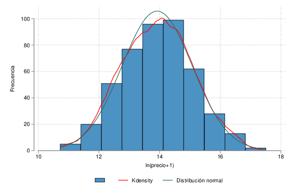
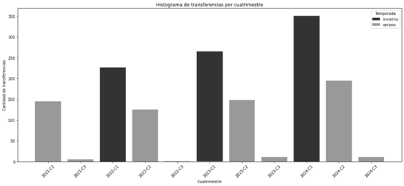

Capítulo 2

# Metodología

##  Introducción

En el presente capítulo se expondrán los materiales y métodos utilizados
en la investigación para estimar los precios implícitos de las
características de los jugadores cómo así también el efecto sobre los
precios de las transferencias de variables que aproximan el poder de
negociación de los clubes.

En primer lugar, se presenta la especificación empírica general del
modelo de precios hedónicos presentados de forma general en las
Ecuaciones 1.13 y 1.14. Luego se describirán los datos y las variables
utilizadas que se incluirán como predictores de los precios negociados
en el mercado de pases. Posteriormente, se presentarán los modelos
econométricos definitivos y los métodos de estimación.

## Especificación empírica

Con el objetivo de analizar los determinantes de los precios de
transferencia, es necesario definir los conjuntos de variables
utilizadas en la investigación y la estrategia utilizada para modelar
las mismas. Considerando que tenemos una muestra $N$ de pases de
jugadores en un total $T$ temporadas, la variable dependiente de interés
($P_{it}$) es el precio de transferencia del equivalente al 100% del
pase del futbolista i en la temporada t, con $i = 1\ldots,n_{t}$,
$t = 1,\ldots,T$ y $n_{t} = 1,\ldots,N$. Sean $Z_{it}$ los atributos o
características del jugador i transferido en t, incluyendo su historial
de estadísticas de juegos, vamos a suponer para las Ecuaciones 1.13 y
1.14 el siguiente modelo lineal semilogarítmico

  -----------------------------------------------------------------------------------------------
  $$\ln\left( P_{it} \right) = \alpha + \beta^{T}Z_{it} + B_{it} + \epsilon_{it}$$   **2.1**
  ---------------------------------------------------------------------------------- ------------

  -----------------------------------------------------------------------------------------------

donde $\alpha$ es un término en común (intercepto), $\beta$ es el vector
de precios sombra de los atributos de los jugadores, $B_{it}$ es efecto
del poder de negociación durante el pase $i$ en $T$ y $\epsilon_{it}$ es
un término de perturbación aleatoria que suponemos independiente e
idénticamente distribuido.

La especificación semilogarítmica para modelos hedónicos es quizás la
más utilizada por algunas ventajas metodológicas asociadas a dicha
transformación de la variable respuesta en un modelo lineal. En términos
económicos, permite una interpretación fácil y directa de los parámetros
estimados, en el sentido de que los precios implícitos quedarían
expresados a partir de su representación como cambios porcentuales en el
precio final del pase. En términos estadísticos, la no-negatividad de
los precios y la asimetría en la distribución de estos resulta ser
consistente con una distribución log-normal (Costanigro et al., 2012).

También, siguiendo el criterio del rango de la variable para analizar
transformaciones, al tener valores de una variable que abarcan más de un
orden de magnitud y es estrictamente positiva, es probable que la
sustitución de la variable original por su logaritmo sea útil. Por el
contrario, si el rango de una variable es considerablemente menor que un
orden de magnitud es poco probable que cualquier transformación de esa
variable sea útil (Weisberg, 2005).

Para el efecto del poder de negociación $B$ vamos a suponer un modelo
paramétrico, donde dicho efecto dependerá linealmente de las
características de los vendedores $B^{v}$ y de los compradores $B^{c}$ y
de un efecto aleatorio no observable $e_{B}$, de la forma

  -----------------------------------------------------------------------
  $$B = \gamma^{T}B^{v} + \delta^{T}B^{c} + e_{B},$$         **2.2**
  ---------------------------------------------------------- ------------

  -----------------------------------------------------------------------

siendo $e_{B}$ independiente de $\epsilon_{it}$. Los vectores $\gamma$ y
$\delta$ son los coeficientes que determinan el poder de negociación de
los vendedores y compradores respectivamente.

Por lo tanto, reemplazando 2.2 en 2.1, la especificación empírica vendrá
dada por

  ---------------------------------------------------------------------------------------------------------------------------------------
  $$\ln\left( P_{it} \right) = \alpha + \beta^{T}Z_{it} + \gamma^{T}B_{it}^{v} + \delta^{T}B_{it}^{c} + \varepsilon_{it}$$   **2.3**
  -------------------------------------------------------------------------------------------------------------------------- ------------

  ---------------------------------------------------------------------------------------------------------------------------------------

donde $\varepsilon_{it} \doteq \epsilon_{it} + e_{B}$ .

Debido a que algunas variables pueden presentar las características que
expone Weisberg (2005), como puede ser el valor de mercado del plantel,
en dichos casos se aplicara una especificación log-log.

  -----------------------------------------------------------------------------------------------------------------------------------------------------------------------------
  $$\ln\left( P_{it} \right) = \alpha + \beta^{T}Z_{it} + \lambda_{v}\ln\left( B_{it}^{v} \right) + \lambda_{c}\ln\left( B_{it}^{c} \right) + \varepsilon_{it}$$   **2.4**
  ---------------------------------------------------------------------------------------------------------------------------------------------------------------- ------------

  -----------------------------------------------------------------------------------------------------------------------------------------------------------------------------

En este caso, $\lambda$ representaría la elasticidad precio-valoración
de mercado del plantel, pues

$$\lambda_{k} = \frac{\partial\ln\left( P_{it} \right)}{\partial\ln\left( B_{it}^{k} \right)},$$

y muestra el cambio porcentual en el precio negociado de un pase ante un
cambio del 1% de la valoración de expertos al plantel.

Cuando la variable dependiente es observada de manera incompleta, ya sea
por censura, truncamiento o cuando sea completamente observada, pero sea
a través de una muestra autoseleccionada, ésta no es representativa de
la población y la estimación por MCO obtiene parámetros sesgados e
inconsistentes. En el mercado de traspasos de jugadores de fútbol, este
fenómeno sucede de la misma forma.

Para suplir el problema de la muestra autoseleccionada, podemos optar
por no extender las conclusiones de los jugadores transferidos a los no
transferidos, y limitar la interpretación de los resultados a este
subconjunto. Una posible solución sería aplicar el modelo de estimación
en dos pasos de Heckman, pero la base de datos *scrapeada* no dispone de
estadísticas de jugadores no transferidos.

Además, como sostienen Carmichael et al. (1999), para enfoque de
negociación como el seleccionado en este trabajo, el enfoque es
inconsistente con el modelo de selección-corrección, ya que el enfoque
de negociación contiene variables para las características de los clubes
compradores. Dichas variables no pueden incluirse en un modelo de
corrección de selección, ya que todas las variables en la ecuación del
precio (excepto el termino de corrección de selección) deben incluirse
en la ecuación de probabilidad de transferencia. Este último contiene
información sobre todos los jugadores, no solo los transferidos, y para
aquellos jugadores no transferidos, no existe información sobre el club
comprador.

En este mismo sentido, se puede plantear el problema análogo para los
jugadores transferidos con y sin precio. Restringir la muestra solo a
aquellas observaciones en las que el precio de transferencia es positivo
y realizar una estimación por mínimos cuadrados ordinarios (MCO) sobre
este subconjunto equivale a estimar un modelo truncado, ya que se
eliminan de la muestra aquellas observaciones con $y_{i} = 0$.

Si la decisión de transferir a un jugador o el precio mínimo aceptado en
una negociación está correlacionada con las características que
determinan el valor de mercado, la estimación por MCO sobre la muestra
truncada puede generar sesgo de selección. No obstante, en contextos
donde el interés está centrado exclusivamente en el mercado de jugadores
efectivamente transferidos con precio, este enfoque permite obtener
estimaciones válidas dentro de este grupo.

Se puede aplicar una estimación Tobit para incorporar a aquellos
jugadores transferidos con precio cero. De esta manera, se puede
corregir la censura de la variable predicha, ajustando por la
probabilidad de la observación del precio. Para realizar dicha
estimación, se decidió excluir los jugadores cuyo contrato está vencido
por considerar que no representan el mismo tipo de transferencia que
aquellas con contrato activo. En este último caso, se asume que el club
dio su consentimiento para que el jugador abandone la institución sin un
pago.

La utilización de la transformación logarítmica para modelar los precios
impide incorporar a los jugadores de precio cero. Esto se puede
solucionar sumando una unidad al precio. Sobre la pertinencia de
realizar este procedimiento, se puede ilustrar con un ejemplo simple que
dicha transformación de la variable es inocua para las observaciones de
precio cero, ya que, para las observaciones con precio se puede ver
fácilmente que el logaritmo natural del valor mínimo 45 249 es
aproximadamente igual al logaritmo natural de 45 250.

Supongamos que la FIFA prohíbe transferir de manera gratuita jugadores
con contrato vigente, pero no establece un precio mínimo. Los clubes
podrían eludir esta restricción sin problemas estableciendo un valor
simbólico de 1 euro que no tendría impacto en su patrimonio. Las
voluntades de los equipos serían las mismas.

A diferencia de las aplicaciones tradicionales donde la variable es
censurada en la cota, en este caso hay sospecha de que la cota sucede en
un valor positivo por encima de cero (Figura 5). No obstante, esto no es
un problema porque no se requiere observar ningún valor de $y^{*}$, solo
conocer el valor de la cota. Formalmente:

$$\ln\left( y_{i} \right) = \left\{ \begin{matrix}
\ln\left( y_{i}^{*} + 1 \right), & \text{si\ }y_{i}^{*} > L \\
0, & \text{si\ }y_{i}^{*} \leq L \\
\end{matrix} \right.\ \quad\text{con\ }L > 0$$

En dichos casos, lo correspondiente es modelar con un límite inferior
cercano y menor al mínimo observado, ya que si se censurará en cero se
estaría indicando que la censura comienza en cero y que es probable
encontrar observaciones entre el mínimo y cero. Esto no parece ser
consistente con lo observado en la Figura 5a donde hay una brecha entre
las observaciones con precio y las sin precio. Según la prueba de
normalidad de Royston (1992), no se puede rechazar que las observaciones
con precio tienen distribución normal (Figura 5b) al menos al 62%, por
lo cual parece bastante improbable que dicha brecha pueda contener
observaciones cercanas a cero.

Carson y Sun (2007) realizando simulaciones de Montecarlo, llegaron a la
conclusión que los umbrales de censura distintos de cero pueden ser una
fuente de sesgo más importante que la no normalidad o la
heterocedasticidad. Recomiendan, además, que para el trabajo aplicado es
conveniente establecer un umbral igual al mínimo de la variable
dependiente no censurada. En muestras grandes, no hay pérdida de
eficiencia en relación con conocer y utilizar el umbral correcto,
siempre que no se esté dispuesto a abandonar el supuesto de que el
umbral de censura es constante o modelarlo explícitamente.

  -----------------------------------------------------------------------
  []{#_Ref197601074 .anchor}Figura 5\
  Histograma del logaritmo del precio de las transferencias de
  futbolistas con contrato para el periodo 2021-2024
  -----------------------------------------------------------------------
  \(a\) Muestra completa

  {width="5.110121391076116in"
  height="3.406748687664042in"}

  \(b\) Precios positivos

  {width="5.068405511811024in"
  height="3.378938101487314in"}

  Fuente: Elaboración propia con datos de *transfermarkt*.
  -----------------------------------------------------------------------

Asimismo, también recomiendan que para garantizar que las observaciones
que alcanzan el valor mínimo observado se consideren observaciones no
censuradas, es posible que debamos establecer un umbral ligeramente
menor que este. En este sentido, podría sería útil usar la preferencia
por los números redondos para establecer el umbral. Sin embargo, en esta
investigación no es particularmente útil, porque la información de los
precios fue obtenida en euros, mientras que las transferencias en
Argentina, y en la mayoría de los países, se negocia en dólares. De
todas formas, se utilizará como umbral el logaritmo natural del número
redondo más cercano al mínimo.

## Datos y variables

### Datos

Para el análisis empírico, se utilizarán los datos correspondientes a
las dos temporadas anteriores al traspaso de los $N = 1484$ jugadores
transferidos desde y hacia la liga argentina de primera división durante
las siete ventanas de transferencias que van del verano europeo de 2021
al verano europeo de 2024. Los datos provienen del sitio web
*transfermarkt*. Por el análisis de los datos obtenidos de dicho sitio,
se consideran los traspasos de enero a abril, inclusive, como traspasos
de *invierno*, y todos los restantes son de *verano*, debido a las
constantes irregularidades en los calendarios y decisiones de la
Asociación del Fútbol Argentino.

La reputación de *transfermarkt* es el factor principal de su elección,
ya que la misma es de consulta tanto de aficionados, como por personas
intervinientes en las compraventas de jugadores (directores deportivos,
representantes, etc.). Lozano (2016) destaca la fiabilidad de los
precios expuestos en dicho sitio. Ha comparado al azar 5 operaciones
analizadas en estudios de caso en los cuales la información de los
costos de adquisición y de venta final había sido obtenida de manera
confidencial. Cabe destacar, que, para operaciones realizadas en los
países sudamericanos, dicha fiabilidad puede ser menor, ya que la
información disponible habitualmente es menor.

Hay que recordar que para garantizar que la excesiva competencia
económica perjudique el atractivo de la competencia deportiva, el
mercado de pases requiere que los jugadores sean transferidos en
momentos determinados y conocidos por todos, afectando lo menos posible
la competencia deportiva y logrando la mayor estabilidad posible en los
planteles. Esto se logra organizando los fichajes en dos momentos, el
inicio de la temporada y en un intervalo intermedio que permita recurrir
al mercado frente a imprevisto o a resultados desfavorables.

Por convención, debido a que se incluyen traspasos con el resto del
mundo y porque así se encuentran clasificadas en la página que es fuente
de información, se consideran las estaciones de traspaso, verano e
invierno, según las estaciones del hemisferio norte. Sin importar que,
en el fútbol sudamericano, las temporadas corresponden al año
calendario, es decir, la mayor parte de los traspasos suceden luego del
mercado de invierno europeo, en lugar del verano.

En lo que respecta a la distribución temporal de los datos, los datos se
fragmentaron en siete ventanas de transferencia. Para la temporada 2021
hay 376 traspasos, 226 de invierno y 150 de verano; para la 2022 son 352
traspasos, 266 de invierno y 126 de verano; para la 2023, 511 traspasos,
351 de invierno y 160 de verano; y para finalmente, para la temporada
2024, solo se contabilizaron los 206 traspasos de verano, ya que la
ventana de invierno todavía se encuentra abierta (Figura 6).

De los 1484 traspasos documentados inicialmente, 1116 corresponden a
jugadores con contrato activo confirmado, según se detalla en la Tabla
2. Puede observarse una tendencia creciente en la cantidad de
transferencias con contrato verificado hasta 2023, seguida por una caída
en 2024, explicada porque solo se incluye la ventana de verano de dicha
temporada. La concentración de operaciones en el mercado de invierno es
sistemática en todas las temporadas completas (2021--2023), lo que
sugiere un patrón institucional o estratégico por parte de los clubes.

  -----------------------------------------------------------------------
  []{#_Ref197614977 .anchor}Figura 6\
  Distribución de las transferencias por cuatrimestre
  -----------------------------------------------------------------------
  {width="6.102777777777778in"
  height="2.8222222222222224in"}

  Fuente: Elaboración propia con datos de *transfermarkt*.
  -----------------------------------------------------------------------

Por otro lado, la Tabla 3 muestra que solo una fracción de estas
transferencias tiene un precio positivo registrado (453 casos). Aunque
el número absoluto de transferencias con precio aumenta en 2023, el peso
relativo respecto del total de operaciones con contrato verificado sigue
siendo bajo (aproximadamente el 40%). La mayor presencia de traspasos
pagos en la ventana de invierno también se mantiene, aunque la
diferencia con el mercado de verano es menos pronunciada que en el total
de transferencias.

  --------------------------------------------------------------------------------------
  []{#_Ref197615001                                                            
  .anchor}**Tabla                                                              
  2**\                                                                         
  *Transferencias con                                                          
  contrato verificado                                                          
  por temporada y                                                              
  ventana*                                                                     
  ------------------- ---------------- ----------- -------------- ------------ ---------
                      **Temporada**    **Total**   **Invierno**   **Verano**   

                      **2021**         242         155            87           

                      **2022**         274         171            103          

                      **2023**         403         258            145          

                      **2024**         197         --             197          

                      Total            1116        584            532          

  Fuente: Elaboración                                                          
  propia con datos de                                                          
  *transfermarkt*.                                                             
  --------------------------------------------------------------------------------------

  --------------------------------------------------------------------------------------
  []{#_Ref197615051                                                            
  .anchor}**Tabla 3\                                                           
  ***Transferencias                                                            
  con precio positivo                                                          
  por temporada y                                                              
  ventana*                                                                     
  ------------------- ---------------- ----------- -------------- ------------ ---------
                      **Temporada**    **Total**   **Invierno**   **Verano**   

                      **2021**         94          59             35           

                      **2022**         107         67             40           

                      **2023**         175         98             77           

                      **2024**         77          --             77           

                      **Total**        **453**     **224**        **229**      

  Fuente: Elaboración                                                          
  propia con datos de                                                          
  *transfermarkt*.                                                             
  --------------------------------------------------------------------------------------

El criterio utilizado para definir las temporadas de las estadísticas de
rendimiento es la de los torneos completos disputados en una temporada.
Esto es, se consideran todos los torneos disputados por el jugador en la
temporada anterior al traspaso, siempre y cuando estos torneos no tengan
partidos jugados más allá de una temporada antes de la apertura de la
ventana de transferencia.

Es importante destacar, que, debido a la nomenclatura utilizada por la
web, los equipos vendedores del norte poseen temporadas del tipo
$t/t + 1$ (julio a junio), mientras que los equipos del sur $t$ (enero a
diciembre). Debido a la técnica de *scraping* utilizada, cuando el
jugador juega entre hemisferios, se corre el riesgo de sumar una
temporada y media. En concreto, la regla seguida es que, si es traspaso
de verano, se excluyen los torneos con partidos previos al 30 de junio
del año anterior. Para los traspasos de invierno, los torneos con
partidos anteriores al 31 de diciembre de la temporada anterior. De esta
forma, se acorta a, como máximo, una temporada las estadísticas
consideradas[^12].

A partir de las reglas de scraping establecidas para la fecha de fin de
contrato, se detectaron 9 jugadores con precio positivo y sin contrato
vigente que se analizaron individualmente. En la Tabla 4 se expone la
información de dichas observaciones.

  ----------------------------------------------------------------------------------------------------------------------
  []{#_Ref197616403                                                                                 
  .anchor}Tabla 4\                                                                                  
  *Observaciones                                                                                    
  obtenidas con                                                                                     
  scraping con precio                                                                               
  positivo sin                                                                                      
  contrato vigente.                                                                                 
  (Precios                                                                                          
  corrientes)*                                                                                      
  ------------------- ------------- -------------- --------------- ------------------- ------------ --------------------
  **Nombre**          **Precio**    **Vendedor**   **Comprador**   **Fecha de**        **Fecha de** **observaciones**

                      **(euros)**                                  **transferencia**   **fin de     
                                                                                       contrato**   

  Jhonatan Candia     285 000       Arsenal FC     CA Huracán      7/5/2021            30/6/2021    La tarifa es pagada
                                                                                                    al jugador, se
                                                                                                    considera salario

  Nicolás Giménez     2 050 000     CA Talleres    FC Baniyas      7/1/2021            30/6/2021    Según
                                                                                                    mercadodepases.com
                                                                                                    el jugador antes de
                                                                                                    ir a préstamo renovó
                                                                                                    hasta diciembre de
                                                                                                    2022

  Tomás Cuello        2 250 000     Club Atlético  Club Athletico  23/2/2022           31/12/2021   Según
                                    Tucumán        Paranaense                                       mercadodepases.com
                                                                                                    el jugador antes de
                                                                                                    ir a préstamo renovó
                                                                                                    hasta diciembre de
                                                                                                    2022

  Emiliano González   450 000       Club           Club Almagro    1/1/2023            31/12/2022   Según
                                    Estudiantes de                                                  mercadodepases.com
                                    La Plata                                                        el jugador antes de
                                                                                                    ir a préstamo renovó
                                                                                                    hasta diciembre de
                                                                                                    2024

  Juan Brunetta       2 350 000     CD Godoy Cruz  Santos Laguna   7/1/2023            30/6/2023    Según
                                    Antonio Tomba                                                   mercadodepases.com
                                                                                                    el club de destino
                                                                                                    ejerció la opción de
                                                                                                    compra media
                                                                                                    temporada antes

  Gastón Martirena    2 360 000     Liverpool FC   Racing Club     31/7/2023           31/7/2023    No hay información
                                    Montevideo                                                      de renovación, ni de
                                                                                                    motivo por el pago
                                                                                                    del pase con
                                                                                                    contrato vencido

  Diego Herazo        836 000       Deportes       CA San Lorenzo  2/12/2024           31/12/2023   No hay información
                                    Tolima         de Almagro                                       de renovación, pero
                                                                                                    si se sabe que el
                                                                                                    equipo vendedor lo
                                                                                                    compro antes de
                                                                                                    venderlo

  Rodrigo Piñeiro     2 320 000     Unión Española CA Vélez        28/1/2024           31/12/2023   El jugador firmo con
                                                   Sarsfield                                        el club de origen un
                                                                                                    contrato por 3 años
                                                                                                    el año anterior.

  Aníbal Leguizamón   363 000       CS Emelec      CA Belgrano     22/8/2024           30/6/2024    El 12 de agosto de
                                                                                                    2024 renueva hasta
                                                                                                    2027 con el club
                                                                                                    vendedor

  Fuente: elaboración                                                                               
  propia con datos de                                                                               
  *transfermarkt*.                                                                                  
  ----------------------------------------------------------------------------------------------------------------------

Para el caso de Jhonatan Candia, se detectó que la tarifa de
transferencia se abonó al jugador que ya tenía el pase en su poder, por
lo que se corrigió el valor a 0 por considerarlo parte del salario del
jugador. Respecto a Juan Brunetta, el club comprador ejerció la opción
de compra durante la ventana anterior, aunque se sospecha que para ser
cedido tuvo que renovar su contrato previamente. De todas formas, se
corrigió la fecha de transferencia.

Para los casos restantes, se encontraron deficiencias en el método de
*scraping* que no permite capturar la fecha real de finalización de
contrato cuando la renovación es muy cercana a la transferencia. En
todos los casos, excepto los de Gastón Martirena y Diego Herazo, se
encontró una fecha de fin de contrato válida, por lo que se reemplazaron
los valores. Para estos dos jugadores, se encontraron indicios de un
contrato vigente, pero no la fecha, por lo que se eliminó la fecha de
fin de contrato, y las variables que se construyen a partir de ella,
pero se mantuvo el indicador de contrato vigente.

### Variables

Las variables utilizadas podemos clasificarlas en 4 grupos: a) las
monetarias, b) los atributos del jugador, dados por las características
personales del mismo y sus estadísticas de rendimiento; c) Las
características de los clubes, que son tomadas a los fines de captar las
potenciales asimetrías en el poder de negociación; y d) las temporales,
para controlar por la ventana o la temporada en que se realiza el pase y
la distancia en ventanas de transferencia entre el vencimiento del
contrato y la transferencia.

A modo de síntesis, en la Tabla 5 se expone una breve descripción de las
variables utilizadas en este trabajo. En lo que sigue se presentará una
descripción más detallada de cada una de ellas.

  ------------------------------------------------------------------------------------
  []{#_Ref197682009                                                       
  .anchor}Tabla 5*\                                                       
  Definición de las                                                       
  Variables*                                                              
  ----------------------- ----------------------------------------------- ------------
  **Variable**            **Descripción**                                 **Signo
                                                                          esperado**

  **Variable                                                              
  dependiente**                                                           

  lprecio                 Logaritmo del precio declarado de la            n/d
                          transferencia deflactado a junio de 2021 más 1  
                          (equivalente al 100% del pase).                 

  **Variables                                                             
  independientes**                                                        

  edad                    Edad del jugador al momento de la transferencia \- (-)
                          (en años).                                      

  altura                  Altura del jugador (en centímetros).            \+

  comunitario             Dummy: 1 si el jugador posee ciudadanía         \+
                          comunitaria.                                    

  extranjero              Dummy: 1 si el jugador no es argentino.         ?

  delantero               Dummy: 1 si la posición principal del jugador   ?
                          es delantero.                                   

  mediocampista           Dummy: 1 si la posición principal del jugador   ?
                          es mediocampista.                               

  portero                 Dummy: 1 si la posición principal del jugador   ?
                          es arquero.                                     

  pj                      Partidos jugados en la temporada anterior.      \+

  goles                   Goles convertidos en la temporada anterior.     \+

  asis                    Asistencias realizadas en la temporada          \+
                          anterior.                                       

  amonestac               Tarjetas amarillas recibidas en la temporada    \-
                          anterior.                                       

  expuls                  Expulsiones en la temporada anterior.           \-

  goles_concedidos        Goles concedidos por el equipo en la temporada  \-
                          anterior (relevante para arqueros).             

  vallas_inv              Cantidad de vallas invictas logradas en la      \+
                          temporada anterior.                             

  rest_ventana_transfer   Cantidad de ventanas de transferencia restantes \+
                          hasta que venza el contrato del jugador con el  
                          club.                                           

  temporada               Variable continua: indica el año de la          \+
                          temporada.                                      

  verano                  Dummy: 1 si la transferencia ocurrió en la      ?
                          ventana de verano europeo.                      

  lvalor_plantel_c        Logaritmo del valor total del equipo comprador. \+

  lvalor_plantel_v        Logaritmo del valor total del equipo vendedor.  \+
  ------------------------------------------------------------------------------------

#### Variables Monetarias {#variables-monetarias .unnumbered}

La variable respuesta de interés es el precio del pase ($P$) en su
transformación logarítmica. Se utilizará el logarítmo del precio más 1
con el objetivo de incluir las transferencias de precio cero en los
modelos censurados y Tobit.

La variable precio $P$, representa la cantidad de dinero (en euros)
declarada en el sitio web *transfermarkt* por la cual los equipos de
fútbol efectivamente realizan la transferencia o el equivalente al 100%
cuando el porcentaje del pase negociado sea menor deflactado por el
índice de precios al consumidor armonizado de Eurostat[^13]. El monto
del pase se desconoce hasta el momento en el cual se realiza el pago,
por lo cual un jugador no posee precio hasta que es transferido.

En la base de datos, el valor *Libre* fue codificado como 0, mientras
que las transferencias de precio desconocido fueron codificadas como
valor faltante (*missing value*). Sin embargo, puede ser posible que
este campo represente una omisión informativa en lugar de una
transferencia gratuita. El presente análisis trata estos casos como
ceros reales, aceptando esta posible fuente de error de clasificación.

En la Tabla 6 se presentan los precios promedio deflactados de las
transferencias (P), desagregados por posición del jugador y tipo de
transferencia. La última columna *Total* muestra el promedio general del
precio por posición, calculado utilizando todas las transferencias
observadas para esa posición, sin importar el tipo de operación. De
manera análoga, la fila *Total* al pie de la tabla reporta el precio
promedio general por tipo de transferencia, considerando todas las
observaciones correspondientes a ese tipo, sin importar la posición. Es
decir, tanto las filas como las columnas de totales están ponderadas por
la cantidad de observaciones reales en cada grupo, y no representan un
promedio aritmético simple entre las celdas anteriores.

  ---------------------------------------------------------------------------------------------------------------
  []{#_Ref197683245                                                                                   
  .anchor}Tabla 6\                                                                                    
  *Precios promedio                                                                                   
  de las                                                                                              
  transferencias en                                                                                   
  el fútbol argentino                                                                                 
  por posición y tipo                                                                                 
  de transferencia en                                                                                 
  el periodo                                                                                          
  2021-2024 (en euros                                                                                 
  constantes de junio                                                                                 
  2021)*                                                                                              
  ------------------- --------------- ------------------- ----------- ------------------- ----------- -----------
                      **Posición**    **Importaciones**   **Local**   **Exportaciones**   **Total**   

                      **Portero**     818 442             534 430     2 270 665           901 747     

                      **Defensa**     1 132 993           793 411     2 976 407           1 660 167   

                      **Medio campo** 1 484 135           979 687     5 172 873           2 827 603   

                      **Delantero**   1 334 572           1 281 750   3 774 841           2 158 740   

                      **Total**       1 306 125           988 626     3 967 178           2 1472 88   

  Fuente: Elaboración                                                                                 
  propia con datos de                                                                                 
  transfermarkt                                                                                       
  ---------------------------------------------------------------------------------------------------------------

Esta forma de cálculo refleja con mayor precisión la estructura del
mercado, ya que toma en cuenta la frecuencia real de los distintos tipos
de transferencias y posiciones. De la tabla se desprende que las
exportaciones tienen, en promedio, valores notablemente más altos que
las importaciones y operaciones locales, lo que da cuenta del perfil
fuertemente exportador del fútbol argentino. Asimismo, las posiciones
ofensivas ---especialmente mediocampistas y delanteros--- tienden a
alcanzar precios promedio más elevados, aunque esto varía según el tipo
de operación.

#### Características del jugador {#características-del-jugador .unnumbered}

Las características propias del jugador tenidas en cuenta son cinco: La
edad (Variable *edad*), la estatura en centímetros (Variable *altura*),
si es comunitario, es decir, si no cuenta como extranjero en los clubes
miembros de la UEFA (Variable *comunitario*), si es extranjero (Variable
*extranjero*) para indicar que el jugador no posee nacionalidad
argentina, y la posición del jugador. Esta última se divide
tradicionalmente en cuatro posibilidades: portero, defensor,
mediocampista y delantero.

Según Carmichael y Thomas (1993), las características de los jugadores
que los equipos se disponen a contratar incluyen una mezcla de factores
intrínsecos y externos tanto de la carrera reciente como de la cosecha a
más largo plazo, que incluyen habilidad, experiencia, forma, condición
física, atractivo para el público, potencial y habilidad para el equipo.
Estas características deben medirse principalmente a través de variables
*proxy*. Por ejemplo, la relación entre la edad y el precio se basa en
la experiencia y el potencial. Mientras que la experiencia aumenta con
la edad, se espera que la capacidad y el potencial disminuyan después de
un punto. Como tal, se puede suponer que la relación general no es
lineal, lo que sugiere una forma cuadrática para la variable de edad
(ibid.). Sin embargo, dado el perfil exportador de la liga argentina,
también se puede esperar que predomine el efecto negativo de la pérdida
de potencial.

La presencia de la estatura (Variable *altura*) tiene por objetivo medir
el componente que aporta la capacidad física del jugador al precio. Más
específicamente, se busca determinar si, *ceteris paribus*, un jugador
con mayor potencia física tiene mayor valor. Fundamentado principalmente
en el aporte a los duelos aéreos. Se descarta el peso en este sentido,
por tener alta correlación en la altura. Al no encontrarse disponible la
velocidad máxima de los jugadores, esta variable fue descartada.

Respecto de las variables que hacen a la nacionalidad del jugador, se
exponen dos: comunitario y extranjero. La inclusión de estas variables
fue motivada por la existencia de cupos que limitan el número de
jugadores que pueden incorporarse con estas características. La variable
*extranjero*, entendida como que no posee la nacionalidad argentina,
afecta al mercado local. Mientras que la variable *comunitario* está
referida a su potencial libre acceso al mercado europeo, el cual, se
supone, es el de mayor prestigio.

En líneas generales, no se espera ningún signo para la posición de los
jugadores, debido a que se espera que las estadísticas de rendimiento
eliminen los efectos de la posición. Sin embargo, si se observa la Tabla
6, se puede decir que los medios y delanteros se negocian a precios más
altos que defensores y porteros.

A modo de resumen, se expone en la Tabla 7 las características de los
jugadores transferidos con precio por posición para el periodo de la
muestra.

  -------------------------------------------------------------------------------------------
  []{#_Ref197947296                                                             
  .anchor}Tabla 7\                                                              
  *Promedio de                                                                  
  características de                                                            
  los jugadores                                                                 
  transferidos con                                                              
  contrato vigente                                                              
  por posición en el                                                            
  período 2021-2024*                                                            
  ------------------- ------------ ------ ---------- ----------- -------------- -------------
  Categoría           Posición     N      Edad       Estatura    Comunitarios   Extranjeros
                                          (años)     (cm)                       

  Sin precio          Portero      22     26.82      188.90      31.82%         13.64%

                      Defensa      128    24.84      180.72      24.22%         22.66%

                      Medio campo  129    24.44      176.58      29.46%         17.50%

                      Delantero    174    24.87      178.10      17.24%         24.71%

  Con precio          Portero      60     30.15      186.82      21.67%         15.00%

                      Defensa      199    28.4       181.29      26.63%         26.13%

                      Medio campo  188    28.71      175.95      23.94%         23.94%

                      Delantero    216    28.51      179.39      24.70%         22.22%

  Total               Portero      82     29.26      187.16      24.39%         14.63%

                      Defensa      327    26.79      181.60      25.69%         24.77%

                      Medio campo  317    26.97      176.21      26.18%         21.14%

                      Delantero    390    26.88      178.77      21.30%         23.33%
  -------------------------------------------------------------------------------------------

Fuente: Elaboración propia con datos de *transfermarkt*

**Rendimiento del jugador en la temporada anterior a la transferencia**

Para las estadísticas de rendimiento, se tendrán en cuenta las
principales variables que tradicionalmente se consideran más importantes
para las posiciones: los partidos jugados (variable *pj*), los goles
convertidos (*goles*), las asistencias (*asis*) entendidas como los
pases realizados previos a anotar el gol, las tarjetas amarillas y las
expulsiones (*amonestac* y *expuls*), y para los porteros, los goles
concedidos y las vallas invictas (*goles*\_*conced* y *vallas*\_*inv*).

Siguiendo a Carmichael y Thomas (1993), se asume que el número de
apariciones en la liga durante la temporada anterior a la transferencia
refleja la forma y, posiblemente, el estado físico general. En este
caso, a diferencia de lo propuesto por los autores, se incorporan todos
los partidos jugados y no solo los partidos de liga. De esta forma se
intenta capturar el efecto de jugar otras competencias además de la
liga. De esta forma, se evaluará cada variable como un conjunto que, se
supone, mayor a medida que las características que representan vayan
mejorando[^14].

Podría considerarse que una forma más correcta de evaluar el efecto del
rendimiento en las competencias internacionales sobre el precio es tomar
una variable para la participación del equipo e incorporar las
estadísticas de rendimiento para cada competencia. Se omite para esta
investigación.

El número de goles marcados por el jugador en la temporada anterior
(variable *goles*) se utiliza como un indicador clave de su rendimiento.
Los goles son la estadística más fácil de recopilar y la que más
claramente puede asociarse al aporte individual del jugador. Otras
métricas, como balones recuperados, tiros fallados o atajadas, requieren
un mayor esfuerzo de recolección y procesamiento de datos.

Además, incluir todas estas variables en un modelo de regresión lineal
podría reducir la potencia estadística y generar una pérdida de grados
de libertad, especialmente considerando que el número de transferencias
con precio oscila entre 150 y 250 por ventana de transferencia. A esto
se suma que los coeficientes estimados pueden no ser estables en el
tiempo debido a cambios en el mercado de fichajes, como la inflación en
los precios, la evolución en la valoración de ciertas estadísticas o
nuevas regulaciones. Esto dificulta la identificación de los efectos de
una variable si su impacto no es lo suficientemente grande. No obstante,
estas métricas pueden resultar útiles en modelos predictivos más
avanzados, como Lasso, Ridge o el uso de componentes principales.

En la Tabla 8 se expone un resumen estadístico de las variables de
rendimiento. A partir de ella, se establece que el precio umbral para el
modelo Tobit es cercano a 45 000. También se puede observar que, si se
transfieren sin precio jugadores con buenas métricas, las medias y
medianas de las estadísticas siguen cierta tendencia a ser mejores en
las transferencias con precio.

  ---------------------------------------------------------------------------------------------------------
  []{#_Ref197950312                                                                          
  .anchor}Tabla 8\                                                                           
  *Resumen                                                                                   
  estadístico de las                                                                         
  variables de                                                                               
  rendimiento en el                                                                          
  período 2021-2024*                                                                         
  ------------------- --------------- -------------- ------------- -------------- ---------- --------------
  Categoría           Variable        Media          Mediana       SD             Mín        Máx

  Con precio          precio          2 436 141.28   1 270 000.0   3 654 380.93   53 000.0   44 250 000.0

                      pj              28.0           30.0          12.78          1.0        58.0

                      goles           3.62           2.0           4.54           0.0        23.0

                      asis            2.11           1.0           2.43           0.0        13.0

                      amonestac       4.41           4.0           3.57           0.0        19.0

                      expuls          0.30           0.0           0.62           0.0        4.0

                      goles_conced    1.8            0.0           6.12           0.0        62.0

                      vallas_invict   0.29           0.0           1.78           0.0        19.0

  Sin precio          precio          0.0            0.0           0.0            0.0        0.0

                      pj              22.31          22.0          11.58          1.0        58.0

                      goles           2.0            2.0           3.5            0.0        24.0

                      asis            1.19           1.0           1.81           0.0        11.0

                      amonestac       3.65           4.0           3.36           0.0        22.0

                      expuls          0.26           0.0           0.53           0.0        3.0

                      goles_conced    1.98           0.0           8.36           0.0        57.0

                      vallas_invict   0.58           0.0           2.57           0.0        21.0

  Total               precio          988 863.80     0.0           2 616 506.60   0.0        44 250 000.0

                      pj              24.66          25.0          12.41          1.0        58.0

                      goles           2.67           2.0           3.82           0.0        24.0

                      asis            1.56           1.0           2.13           0.0        13.0

                      amonestac       3.97           4.0           3.47           0.0        22.0

                      expuls          0.28           0.0           0.57           0.0        4.0

                      goles_conced    1.61           0.0           7.53           0.0        62.0

                      vallas_invict   0.46           0.0           2.28           0.0        21.0
  ---------------------------------------------------------------------------------------------------------

Fuente: Elaboración propia con datos de *transfermarkt*

#### Características de los clubes {#características-de-los-clubes .unnumbered}

Para operacionalizar las características de los clubes que representan
el poder de mercado, se va a utilizar el logaritmo del valor del plantel
de los compradores y vendedores informado por *transfermarkt* para la
temporada anterior. Esta decisión está fundamentada en que el valor del
plantel esta correlacionada un conjunto de características de los
clubes. El rezago temporal, se explica por la temporalidad de la
transferencia. Es concreto, se busca caracterizar a los clubes al
momento de la transferencia, y dado que las estadísticas de los clubes
se recopilan al final de la temporada, son las estadísticas previas más
cercanas que se disponen.

Para eliminar el efecto de la inflación, se deflactan los valores al mes
de junio de la temporada anterior al traspaso. Esto se decide debido a
que, por lo que se pudo corroborar, las ultimas actualizaciones de los
planteles se realizan al de final de temporada europea.

A partir de una regresión MCO *Pooleada* (POLS), se puede comprobar que
la variabilidad del valor del plantel, en su transformación logarítmica,
puede ser explicada en más del 80% por la variabilidad de un conjunto de
otras variables referentes al club. Estas variables son: el tamaño del
plantel (*len_plantel*), la posición en la liga (*league_position*), los
partidos de liga disputados (*partidos_jugados*), la cantidad de puntos
(*puntos*), los goles convertidos (*goles_favor*), los goles recibidos
(*goles_contra*), la división (*div*), la nacionalidad (*no_arg*) o
control por nacionalidad) (Tabla 14 del Anexo 2).

#### El momento de la transferencia {#el-momento-de-la-transferencia .unnumbered}

Finalmente, se dispone de dos variables destinadas a medir el momento de
la operación: el año de traspaso normalizado a 2021 (Variable
*tempbase*) y la estación del mercado (Variable *verano*) para indicar
verano o invierno europeo.

La primera variable intenta captar la existencia de inflación en los
precios con el paso del tiempo, tomando como base el año 2021. Para el
caso de la segunda variable, se busca capturar si existe algún efecto de
estacionalidad.

De la combinación de estas variables, se pueden ordenar consecutivamente
las ventanas de transferencias. Esto permite asignarles a las fechas de
vencimiento de contrato, un momento en relación con las ventanas de
transferencia disponibles para vender al jugador (Variable
*n_transfer_window*). Esto es importante debido a que la fecha de
vencimiento de contrato está ligada a la posibilidad de obtener un
precio por la transferencia. Además, se espera que la proximidad con la
fecha de vencimiento de contrato reduzca el poder de negociación de los
clubes.

### Modelos econométricos

De las especificaciones econométricas semilogarítmicas generales
(**2.1**)-(**2.4**) se ajustarán diferentes modelos econométricos
alternativos a fin de conocer los precios implícitos (precios sombra) de
los diferentes atributos de los jugadores y de los equipos negociadores
de la transferencia.

#### Modelos sin censura {#modelos-sin-censura .unnumbered}

En primer lugar, consideraremos los siguientes tres modelos más simples:

-   **Modelo 1**: Este es el modelo hedónico más simple, donde se ajusta
    la regresión (4.1) con
    \$$Z_{it} = \left( J_{i},R_{i,t - 1},T \right)$, donde \$$J_{i}$\$
    es el vector de características del jugador \$$i$\$,
    \$$R_{i,t - 1}$\$ es el vector de estadísticas de rendimiento del
    jugador en la temporada previa y \$$T$\$ son las variables
    temporales. Para el caso de la edad, se incluye el efecto
    cuadrático. Para este modelo \$$B_{it} = 0$\$, i.e. no se tienen en
    cuenta las características de los equipos que compran y venden.

-   **Modelo 2**: Este incorpora al Modelo 1 algunas características
    generales de los clubes. Específicamente, se incluyen el valor de
    mercado de los clubes compradores y vendedores. Además, se eliminan
    transformaciones no significativas (efecto cuadrático de la edad) y
    características personales no significativas.

-   **Modelo 3**: En este modelo, además de las características
    generales, se eliminan las estadísticas de rendimiento no
    significativas o con efecto opuesto al esperado, que no tienen
    interpretación teórica.

-   **Modelo 4**: En este modelo, en vez de incorporar las
    características de los clubes por medio de variables, se incluyen
    efectos específicos para el club comprador y vendedor. De esta
    manera, se tienen un modelo más saturado, con el fin de detectar si
    existen factores no observables de los equipos que cambien
    sustancialmente el modelo hedónico planteado.

Dado que en todos los modelos la regresión se estima con la
transformación logarítmica de la variable respuesta (*precio*), los
coeficientes son fácilmente interpretables en términos de su precio
implícito o como impacto marginal porcentual de cada atributo sobre el
precio. Tal interpretación es más directa si el predictor es una
variable continua (multiplicando por 100 el valor del coeficiente
respectivo). Pero si se quiere obtener el efecto de una forma más
precisa, se debe aplicar la fórmula
$\left( e^{\beta} - 1 \right)\text{.}100\%$.

Sin embargo, si la variable es categórica, siguiendo a Kennedy (1981),
debe aplicarse la siguiente formula sobre los parámetros estimados a fin
de estimar el impacto porcentual de dicha variable

$g^{*}(c) = \left( e^{\widehat{c} - \frac{1}{2}\widehat{V}\left( \widehat{c} \right)} - 1 \right) \times 100$

Donde \$ $\widehat{c}$ \$ es el coeficiente estimado de la variable y
$\widehat{V}\left( \widehat{c} \right)$ la varianza estimada. De esta
manera el valor $g^{*}(c)$ mide el impacto porcentual de dicha variable
sobre el precio del pase.

Este tipo de correcciones se evitarán cuando no haya grandes diferencias
entre la aproximación lineal y el efecto preciso.

#### Modelo Censurado {#modelo-censurado .unnumbered}

-   **Modelo Tobit**: Este modelo se aplica exclusivamente sobre el
    Modelo 3, incorporando la censura en los valores de transferencia.
    Dado que algunos jugadores no tienen un precio de transferencia
    observado, se utiliza un modelo Tobit para corregir el sesgo de
    selección en la variable dependiente. Se mantiene la especificación
    del Modelo 3, con las características generales de los clubes y las
    estadísticas de rendimiento relevantes, pero ajustando la estimación
    para reflejar que los valores de transferencia solo son observables
    por encima de un umbral de censura. Se excluyen las transferencias a
    precio cero sin contrato vigente (*rest_transfer_window* \> 0).

-   **Modelo Censurado**: En este modelo, se estiman los precios de
    transferencia mediante mínimos cuadrados ordinarios (MCO),
    incorporando tanto las observaciones con valores positivos como
    aquellas en las que el precio registrado es cero y tienen contrato
    vigente. A diferencia del modelo Tobit, que trata la censura como un
    fenómeno estructural del mercado, aquí se asume que un valor nulo de
    transferencia es un resultado válido y observable. El modelo
    mantiene la especificación del Modelo 3, incluyendo las
    características de los clubes y las estadísticas de rendimiento
    relevantes, sin excluir las transacciones en las que no se registra
    un precio de transferencia. Al tratarse de una regresión lineal sin
    ajuste por censura, los coeficientes estimados reflejan el impacto
    promedio sobre el logaritmo del precio, sin considerar
    explícitamente la probabilidad de que una observación pertenezca al
    subconjunto de valores positivos.

Respecto de las interpretaciones de los coeficientes obtenidos, vale
aclarar que los coeficientes de pendiente de MCO, son estimaciones
directas del cambio marginal. Para hacer que el coeficiente Tobit, sea
comparable se debe multiplicar por un factor de ajuste. Existen dos
métodos comunes para calcular un factor de ajuste para obtener efectos
parciales, al menos para variables explicativas continuas: el efecto
parcial al promedio, EPA y el efecto parcial promedio, EPP, el cual se
prefiere en la mayoría de los casos. Por desgracia, para las variables
explicativas discretas, comparar las estimaciones de MCO y de Tobit no
es tan fácil (Wooldridge, 2010).

