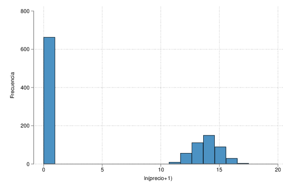

## Problema de investigacion

::: {.fragment}
<div style="border-left: 5px solid #e74c3c; padding-left: 15px;"> <!--color: #e74c3c;   -->
¿Cuáles son los atributos o características que determinan los precios de transferencia? ¿Cuál es su incidencia?
</div>
:::

::: {.fragment .fade-in}
<div style="border-left: 5px solid #e74c3c; padding-left: 15px;">
¿Tienen los clubes de fútbol poder de mercado y/o poder de negociación en las transferencias de futbolistas?
</div>
:::

::: {.notes}
Speaker notes go here.
:::


```{python}
#| label: setup
#| include: false

import pandas as pd
import numpy as np
import plotly.graph_objects as go
import plotly.io as pio

# --- 1. CONFIGURACIÓN ESTÉTICA ---
pio.templates.default = "plotly_dark"
# Paleta de colores consistente para toda la tesis
COLORES = {
    'mco': '#7f8c8d',       # Gris (Sesgado)
    'tobit': '#e74c3c',     # Rojo (Corregido)
    'probit': '#3498db',    # Azul (Probabilidad)
    'positivo': '#2ecc71',  # Verde
    'negativo': '#c0392b',  # Rojo oscuro
    'neutro': '#bdc3c7'     # Gris claro
}

# --- 2. CARGA DE DATOS CRUDOS (OPCIONAL) ---
# Intentamos cargar el excel. Si no está, creamos un df vacío para que no rompa.
try:
    df_raw = pd.read_excel('_transferencias_21-24_ppt.xlsx')
    # Limpieza básica si fuera necesaria en el futuro
    # df_raw['fecha'] = pd.to_datetime(df_raw['fecha'])
except FileNotFoundError:
    df_raw = pd.DataFrame()
    print("Aviso: No se encontró el archivo Excel. Se usarán solo los coeficientes cargados.")

# --- 3. CARGA DE RESULTADOS (TABLAS DE LA TESIS) ---

# A. TABLA 9: MODELOS MCO (1 a 4)
# Cargamos los coeficientes (b) y errores estándar (se)
datos_mco = {
    'Variable': [
        'Edad', 'Edad^2', 'Altura', 'Comunitario', 'Extranjero', 
        'Delantero', 'Mediocampista', 'Portero', 
        'Partidos Jugados', 'Goles', 'Asistencias', 
        'Ventanas Restantes', 'Temp. (Inflación)', 'Valor Plantel Comp.', 'Valor Plantel Vend.'
    ],
    # Modelo 1: Solo características jugador
    'MCO1_b': [-0.449, 0.006, 0.008, 0.337, -0.155, 0.106, 0.199, -0.467, 0.016, 0.032, 0.019, 0.202, 0.048, None, None],
    'MCO1_se': [0.176, 0.003, 0.008, 0.120, 0.121, 0.154, 0.137, 0.546, 0.006, 0.017, 0.026, 0.027, 0.059, None, None],
    
    # Modelo 2: Incorpora Clubes (Edad^2 pierde signif)
    'MCO2_b': [-0.169, 0.001, None, 0.146, None, 0.258, 0.241, -0.127, 0.010, 0.033, 0.002, 0.143, 0.181, 0.531, 0.307],
    'MCO2_se': [0.117, 0.002, None, 0.089, None, 0.113, 0.101, 0.449, 0.004, 0.014, 0.019, 0.021, 0.044, 0.045, 0.040],

    # Modelo 3: EL ELEGIDO (Sin edad^2, variables depuradas)
    'MCO3_b': [-0.108, None, None, None, None, 0.263, 0.243, 0.257, 0.012, 0.028, None, 0.138, 0.164, 0.542, 0.307],
    'MCO3_se': [0.014, None, None, None, None, 0.105, 0.098, 0.205, 0.003, 0.013, None, 0.021, 0.040, 0.044, 0.040],

    # Modelo 4: Efectos Fijos (Saturado)
    'MCO4_b': [-0.092, None, None, None, None, 0.117, 0.034, 0.419, 0.005, 0.040, None, 0.092, 0.016, None, None],
    'MCO4_se': [0.022, None, None, None, None, 0.170, 0.169, 0.292, 0.006, 0.020, None, 0.034, 0.057, None, None]
}
df_mco = pd.DataFrame(datos_mco)

# B. TABLA 11: EFECTOS MARGINALES (MCO vs TOBIT)
# Usamos los Efectos Marginales del Tobit para que sean comparables con MCO
datos_tobit = {
    # Mismos nombres que en las tablas del deck, para poder leer el
    # gráfico contra la Tabla 11 sin traducir.
    'Variable': [
        'edad', 'delantero', 'mediocampista', 'portero',
        'pj', 'goles',
        'lvalor_plantel_c', 'lvalor_plantel_v',
        'rest_ventana_transfer', 'temporada'
    ],
    # MCO Truncado (Modelo 3) - Repetimos para graficar comparaciones
    'MCO_b': [-0.108, 0.263, 0.243, 0.257, 0.012, 0.028, 0.542, 0.307, 0.138, 0.164],
    'MCO_se': [0.014, 0.105, 0.098, 0.205, 0.003, 0.013, 0.044, 0.040, 0.021, 0.040],
    
    # MCO Censurado (Con ceros, sin corrección)
    'Cens_b': [-0.657, -0.262, 0.167, 1.847, 0.064, 0.275, 2.442, -0.008, 0.553, 0.228],
    'Cens_se': [0.044, 0.490, 0.452, 0.768, 0.016, 0.058, 0.172, 0.179, 0.114, 0.170],

    # Tobit (Efectos Marginales)
    'Tobit_b': [-0.181, -0.011, 0.084, 0.606, 0.019, 0.069, 0.660, 0.112, 0.136, 0.074],
    'Tobit_se': [0.011, 0.112, 0.105, 0.218, 0.004, 0.013, 0.040, 0.041, 0.024, 0.040]
}
df_tobit = pd.DataFrame(datos_tobit)

# C. TABLA 13: MODELO PROBIT (Probabilidad de tener precio)
# Variables ligeramente distintas (lvalor_plantel_to = Comprador)
datos_probit = {
    'Variable': [
        'Edad', 'Delantero', 'Mediocampista', 'Portero', 
        'Partidos Jugados', 'Goles', 
        'Valor Plantel Comp.', 'Valor Plantel Vend.', 
        'Ventanas Restantes', 'Temp. (Inflación)'
    ],
    'Probit_b': [0.220, 0.220, 0.330, 0.701, 0.160, 0.122, 0.830, 0.270, 0.168, 0.310],
    'Probit_p_signif': [0.01, 0.1, 0.1, 0.05, 0.05, 0.01, 0.01, 0.1, 0.01, 0.1] # Basado en asteriscos
}
df_probit = pd.DataFrame(datos_probit)

# Función auxiliar para dibujar intervalos de confianza
def add_confidence_interval(fig, x_vals, y_val, color):
    fig.add_trace(go.Scatter(
        x=x_vals, y=[y_val, y_val],
        mode='lines', line=dict(color=color, width=3),
        showlegend=False, hoverinfo='skip'
    ))
```

```{python}
#| label: setup2
#| include: false 

# 1. Configuración Estética Global
# Hace que Plotly use el tema oscuro, esencial para el look and feel.
pio.templates.default = "plotly_dark"
COLOR_TOBIT = '#e74c3c'
COLOR_MCO = '#7f8c8d'

# Grupos de la descomposición del modelo (J, R, L/S, B). Se mantienen
# iguales en todo el deck: mismo color para el mismo grupo en todos los
# gráficos y tablas.
COLOR_JUGADOR = '#9b59b6'      # J: características personales y posición
COLOR_RENDIMIENTO = '#3498db'  # R: rendimiento de la temporada anterior
COLOR_TIEMPO = '#f39c12'       # L, S: contrato y momento de la operación
COLOR_NEGOCIO = '#2ecc71'      # B: poder de negociación (valor de plantel)

GRUPOS = {
    'Jugador': COLOR_JUGADOR,
    'Rendimiento': COLOR_RENDIMIENTO,
    'Contrato y tiempo': COLOR_TIEMPO,
    'Negociación': COLOR_NEGOCIO,
}

# 2. Datos Centralizados (Coeficientes y SE)
# **MODELO 3 (Base para Forest Plot y MCO en Dumbbell)**
# Orden igual al de la Tabla 9, para que el gráfico se lea contra ella.
df_mco_data = {
    'Variable': ['edad', 'delantero', 'mediocampista', 'portero',
                 'pj', 'goles',
                 'rest_ventana_transfer', 'temporada',
                 'lvalor_plantel_c', 'lvalor_plantel_v'],
    'Coef': [-0.108, 0.263, 0.243, 0.257, 0.012, 0.028, 0.138, 0.164, 0.542, 0.307],
    'SE':   [0.014, 0.105, 0.098, 0.205, 0.003, 0.013, 0.021, 0.040, 0.044, 0.040],
    'Grupo': ['Jugador', 'Jugador', 'Jugador', 'Jugador',
              'Rendimiento', 'Rendimiento',
              'Contrato y tiempo', 'Contrato y tiempo',
              'Negociación', 'Negociación'],
}
df_mco_data['Color'] = [GRUPOS[g] for g in df_mco_data['Grupo']]
```


---

## Justificación del problema {auto-animate=true}

::: {.fragment}
::: {data-id="caja-texto"}
- Ausencia de literatura para el mercado argentino
:::
:::

::: {style="visibility: hidden; opacity: 0;"}
- Importancia económica
    - VBP U$S 5.000 millones (2013) 
- Interés social
    - Rating televisivo...
- Particularidades
:::

## Justificación del problema {auto-animate=true}

::: {.columns}

::: {.column width="45%"}
::: {data-id="caja-texto"}
- Ausencia de literatura para el mercado argentino
     - Revisión de 29 papers
:::
:::

::: {.column}
{width="800" height="650"}

::: {style="font-size: 0.5em;"}
Fuente: Franceschi, Brocard, Follert & Gouguet (2024). *Determinants of football players’ valuation: A systematic review*.
:::
:::
:::

## Justificación del problema {auto-animate=true}

::: {data-id="caja-texto"}
- Ausencia de literatura para el mercado argentino
:::

::: {.fragment}
- Importancia económica
    - VBP U$S 5.000 millones (2013) 
:::

::: {.fragment}
- Interés social
    - Rating televisivo: Final WC-2022 (63pp) vs Debate 2023 (45pp)
    - Función social: Formación de jugadores
:::

::: {.fragment}
- Particularidades del mercado
:::


::: {.notes }
::: {style="font-size: 0.8em;"}

Los 5mM representan aprox U$S 7.000 millones actuales

El mercado de futbolistas es uno de los pocos mercados, en el cuál las firmas pagan una tarifa por el derecho a contratar un trabajador con formación especializada, que está prestando sus servicios en otra firma
:::
:::


## Objetivos de la Investigación

::: {.fragment .fade-in}
### Objetivo General
::: {.callout-note appearance="minimal" icon=false}
::: {style="font-size: 1.4em; text-align: center;"}
Estimar los **precios implícitos** de las características de los jugadores y cuantificar el impacto del **poder de negociación** de los clubes en el mercado argentino (2021-2024).
:::
:::
:::


::: {.fragment .fade-up}
### Objetivos Especificos
:::

::: {style="display: grid; grid-template-columns: 1fr 1fr; gap: 20px;"}

::: {.fragment .fade-up}
::: {.callout-important appearance="simple" icon=false title="1. Validación Teórica"}
::: {style="font-size: 1.1em;"}
Verificar aplicabilidad de literatura internacional al contexto local.
:::
:::
:::

::: {.fragment .fade-up}
::: {.callout-important appearance="simple" icon=false title="2. Estrategia Empírica"}
::: {style="font-size: 1.1em;"}
Desarrollar un modelo econométrico para la determinación de precios.
:::
:::
:::

::: {.fragment .fade-up}
::: {.callout-important appearance="simple" icon=false title="3. Estimación"}
::: {style="font-size: 1.1em;"}
Medir impacto de atributos y testear asimetrías de negociación.
:::
:::
:::

::: {.fragment .fade-up}
::: {.callout-important appearance="simple" icon=false title="4. Discusión"}
::: {style="font-size: 1.1em;"}
Contrastar resultados con la evidencia de mercados europeos.
:::
:::
:::

:::


---

## Hipótesis de Investigación

::: {style="display: grid; grid-template-columns: 1fr 1fr; gap: 20px;"}

::: {.fragment .fade-up}
::: {.callout-tip appearance="simple" icon=false title="1. Diferenciación Vertical"}
::: {style="font-size: 1.1em;"}
Las estadísticas históricas (**Goles y Asistencias**) impactan positivamente en el precio.
:::
:::
:::

::: {.fragment .fade-up}
::: {.callout-tip appearance="simple" icon=false title="2. Señal de Calidad"}
::: {style="font-size: 1.1em;"}
La cantidad de **Partidos Jugados** (última temporada) revela el estado físico y aumenta la disposición a pagar.
:::
:::
:::

::: {.fragment .fade-up}
::: {.callout-warning appearance="simple" icon=false title="3. Efecto Edad (Ambiguo)"}
::: {style="font-size: 1.1em;"}
Dos fuerzas contrapuestas:
<br>
🟢 **Positivo:** Experiencia (menor costo de búsqueda).
<br>
🔴 **Negativo:** Menor vida útil y valor de reventa.
:::
:::
:::

::: {.fragment .fade-up}
::: {.callout-warning appearance="simple" icon=false title="4. Poder de Negociación"}
::: {style="font-size: 1.1em;"}
El tamaño del club genera asimetrías: presiona el precio a la baja al comprar y al alza al vender.
:::
:::
:::
::: {.notes }
::: {style="font-size: 0.9em;"}

Existe una discrepancia en el concepto del ***tamaño*** de los clubes. En la investigación se sintetizan las dos ultimas hipótesis en una sola ***tamaño economico*** = Valor del plantel. Pero no necesariamente un club entendido como ***grande*** es el que tiene el plantel mas caro

:::
:::

:::

::: {.fragment .fade-in-then-semi-out}
::: {.callout-tip appearance="simple" icon=false title="5. Efecto ingreso"}
::: {style="font-size: 1.1em;"}
El crecimiento de los ingresos de los clubes de fútbol produce mayores precios
de transferencia<br>
(Descartada por falta de proxy directa para ingresos de clubes)
:::
:::
::: {.notes }
::: {style="font-size: 0.9em;"}

Pero ¿Es esto realmente un problema?<br>
"La diferencia de ingresos es en sí misma una característica del poder de negociación."

:::
:::
:::

::: {.fragment}
:::


## Antecedentes {.top}

::: {style="font-size: 0.55em; color: #bdc3c7; margin-bottom: 4px;"}
Arriba, **economía del deporte**; abajo, **economía del fútbol**. Marcador lleno: **aporte teórico**. Marcador hueco: **trabajo de estimación**.
:::

```{=html}
<div class="lt">
<div class="espina"></div>
<div class="corte" style="grid-column: 5;">//</div>
<div class="corte-lbl" style="grid-column: 5;">19 años</div>
<div class="corte" style="grid-column: 9;">//</div>
<div class="corte-lbl" style="grid-column: 9;">16 años</div>
<div class="arriba fragment" data-fragment-index="1" style="grid-column: 1;"><div class="aporte">Anclas de la economía del deporte</div><div class="autor">Rottenberg</div><div class="anio">1956</div></div>
<div class="marca teorico fragment" data-fragment-index="1" style="grid-column: 1;"><i></i></div>
<div class="arriba fragment" data-fragment-index="2" style="grid-column: 2;"><div class="aporte">La firma es la liga</div><div class="autor">Neale</div><div class="anio">1964</div></div>
<div class="marca teorico fragment" data-fragment-index="2" style="grid-column: 2;"><i></i></div>
<div class="abajo fragment" data-fragment-index="4" style="grid-column: 3;"><div class="anio">1971</div><div class="autor">Sloane</div><div class="aporte">El club maximiza utilidad</div></div>
<div class="marca teorico fragment" data-fragment-index="4" style="grid-column: 3;"><i></i></div>
<div class="arriba fragment" data-fragment-index="3" style="grid-column: 4;"><div class="aporte">Primer trabajo argentino</div><div class="autor">Di Marco</div><div class="anio">1974</div></div>
<div class="marca teorico fragment" data-fragment-index="3" style="grid-column: 4;"><i></i></div>
<div class="abajo fragment" data-fragment-index="5" style="grid-column: 5;"><div class="anio">1993</div><div class="autor">Carmichael y Thomas</div><div class="aporte">Primer estudio empírico (NBS)</div></div>
<div class="marca empirico fragment" data-fragment-index="5" style="grid-column: 5;"><i></i></div>
<div class="abajo fragment" data-fragment-index="6" style="grid-column: 6;"><div class="anio">1997</div><div class="autor">Szymanski y Smith</div><div class="aporte">Mercado competitivo</div></div>
<div class="marca empirico fragment" data-fragment-index="6" style="grid-column: 6;"><i></i></div>
<div class="abajo fragment" data-fragment-index="7" style="grid-column: 7;"><div class="anio">1999</div><div class="autor">Carmichael, Forest y Simmons</div><div class="aporte">Primer HPM</div></div>
<div class="marca empirico fragment" data-fragment-index="7" style="grid-column: 7;"><i></i></div>
<div class="abajo fragment" data-fragment-index="8" style="grid-column: 8;"><div class="anio">1999</div><div class="autor">Dobson y Gerrard</div><div class="aporte">Segmentación del mercado</div></div>
<div class="marca empirico fragment" data-fragment-index="8" style="grid-column: 8;"><i></i></div>
<div class="abajo fragment" data-fragment-index="9" style="grid-column: 9;"><div class="anio">2015</div><div class="autor">Ruijg y van Ophem</div><div class="aporte">Estratificación de clubes</div></div>
<div class="marca empirico fragment" data-fragment-index="9" style="grid-column: 9;"><i></i></div>
<div class="abajo fragment" data-fragment-index="10" style="grid-column: 10;"><div class="anio">2021-24</div><div class="autor">Poli, Besson y Ravenel</div><div class="aporte">Predictibilidad de precios (85%)</div></div>
<div class="marca empirico fragment" data-fragment-index="10" style="grid-column: 10;"><i></i></div>
</div>
```

::: {style="height: 250px; margin-top: 14px; max-width: 70%; margin-left: auto; margin-right: auto;"}
::: {.r-stack}

::: {.fragment .fade-in-then-out fragment-index=1 style="width: 100%;"}
::: {.callout-note appearance="minimal" icon=false title="Rottenberg (1956)"}
::: {style="font-size: 0.95em; line-height: 1.5;"}
- Propietarios: maximizadores racionales de ganancias
- Incertidumbre de resultado → producto exitoso
- El principio de invariancia
- Mercado laboral monopsonista, de productos monopolístico
:::
:::
::: {.notes}
::: {style="font-size: 0.72em;"}
**Principio de invariancia**: la distribución del talento entre equipos termina igual con o sin restricciones a la movilidad. Cambia **quién se queda con la renta**, el club o el jugador, no la asignación. Antecedente deportivo del teorema de Coase.
:::
:::
:::

::: {.fragment .fade-in-then-out fragment-index=2 style="width: 100%;"}
::: {.callout-note appearance="minimal" icon=false title="Neale (1964)"}
::: {style="font-size: 0.95em; line-height: 1.5;"}
- Paradoja de Louis-Schmelling
- Producto conjunto invertido
- Max beneficios → **+** competencia deportiva, **−** competencia económica
- **La firma no es el club, es la liga**
:::
:::
::: {.notes}
::: {style="font-size: 0.72em;"}
**Louis-Schmelling**: Joe Louis ganaba más dinero cuanto más fuerte era su rival. **Producto conjunto invertido**: el espectáculo lo produce el enfrentamiento, no el club; son coproductores antes que competidores. Si el producto es el campeonato, la unidad económica es la liga, un monopolio natural.
:::
:::
:::

::: {.fragment .fade-in-then-out fragment-index=3 style="width: 100%;"}
::: {.callout-note appearance="minimal" icon=false title="Di Marco (1974)"}
::: {style="font-size: 0.95em; line-height: 1.5;"}
- Primer trabajo argentino
- Manifestación **directa**: producto bruto
- Manifestación **indirecta**: calidad de vida y productividad
:::
:::
::: {.notes}
::: {style="font-size: 0.72em;"}
Primer trabajo argentino de economía del deporte. **Directa**: impacto sobre el producto bruto vía comercialización e inversión. **Indirecta**: mejora en calidad de vida y productividad laboral.
:::
:::
:::

::: {.fragment .fade-in-then-out fragment-index=4 style="width: 100%;"}
::: {.callout-note appearance="minimal" icon=false title="Sloane (1971)"}
::: {style="font-size: 0.95em; line-height: 1.5;"}
- El club maximiza **utilidad**, no ganancias
- U(E, A, S, π)
- Los beneficios, como restricción de no negatividad
:::
:::
::: {.notes}
::: {style="font-size: 0.72em;"}
**U = U(E, A, S, π)**: E el éxito deportivo, A la asistencia de espectadores, S la "salud" de la liga —el balance competitivo— y π los beneficios, sujeta a π ≥ 0. El club maximiza esa utilidad; el beneficio opera como restricción.
:::
:::
:::

::: {.fragment .fade-in-then-out fragment-index=5 style="width: 100%;"}
::: {.callout-note appearance="minimal" icon=false title="Carmichael y Thomas (1993)"}
::: {style="font-size: 0.95em; line-height: 1.5;"}
- Primer estudio empírico
- Enfoque de **negociación** (NBS)
- Comprador y vendedor, asimétricos
:::
:::
::: {.notes}
::: {style="font-size: 0.72em;"}
**Solución de negociación de Nash**: el precio surge del reparto del excedente entre comprador y vendedor según su poder relativo. De ahí que no sea realista tratarlos de forma simétrica.
:::
:::
:::

::: {.fragment .fade-in-then-out fragment-index=6 style="width: 100%;"}
::: {.callout-note appearance="minimal" icon=false title="Szymanski y Smith (1997)"}
::: {style="font-size: 0.95em; line-height: 1.5;"}
- El mercado de pases como mercado competitivo
- NBS y HPM: difíciles de distinguir empíricamente
:::
:::
::: {.notes}
::: {style="font-size: 0.72em;"}
Modelan el mercado de pases como competitivo. Lo que importa acá: empíricamente, negociación y precios hedónicos son difíciles de distinguir.
:::
:::
:::

::: {.fragment .fade-in-then-out fragment-index=7 style="width: 100%;"}
::: {.callout-note appearance="minimal" icon=false title="Carmichael, Forest y Simmons (1999)"}
::: {style="font-size: 0.95em; line-height: 1.5;"}
- Primera aplicación de **precios hedónicos**
- El enfoque que adopta este trabajo
:::
:::
::: {.notes}
::: {style="font-size: 0.72em;"}
**Precios hedónicos**: el precio como función de los atributos del bien, acá los del jugador. Es el enfoque que adopta esta tesis.
:::
:::
:::

::: {.fragment .fade-in-then-out fragment-index=8 style="width: 100%;"}
::: {.callout-note appearance="minimal" icon=false title="Dobson y Gerrard (1999)"}
::: {style="font-size: 0.95em; line-height: 1.5;"}
- Inflación y **segmentación** del mercado inglés, 1990-1996
- Tres tipos: transferencia horizontal, de ascenso y de descenso
- Efecto de la ley **Bosman**
:::
:::
::: {.notes}
::: {style="font-size: 0.72em;"}
Segmentan por **tipo de operación** —horizontal, de ascenso y de descenso— cruzado con el nivel de división, y buscan qué variables pesan en cada segmento. Miden además el efecto de la ley Bosman.
:::
:::
:::

::: {.fragment .fade-in-then-out fragment-index=9 style="width: 100%;"}
::: {.callout-note appearance="minimal" icon=false title="Ruijg y van Ophem (2015)"}
::: {style="font-size: 0.95em; line-height: 1.5;"}
- Clasifican clubes: ¿mejora o deterioro?
- Adaptan el ranking UEFA: buen ranking no implica salario alto
- Mismo problema de identificar clubes; acá se resuelve con el **valor de plantel**
:::
:::
::: {.notes}
::: {style="font-size: 0.72em;"}
Clasifican clubes para saber si la transferencia implica mejora o deterioro. Adaptan el ranking UEFA porque un buen ranking no se corresponde con salarios altos. Mismo problema de identificación que enfrenta esta tesis.
:::
:::
:::

::: {.fragment .fade-in fragment-index=10 style="width: 100%;"}
::: {.callout-note appearance="minimal" icon=false title="Poli, Besson y Ravenel (2021-24)"}
::: {style="font-size: 0.95em; line-height: 1.5;"}
- Predictibilidad de los precios: **85%**
- Estado del arte contra el que se contrasta
:::
:::
::: {.notes}
::: {style="font-size: 0.72em;"}
Predictibilidad de los precios en torno al **85%**. Marca el estado del arte contra el que se contrasta este trabajo.
:::
:::
:::

:::
:::

::: {.notes}
::: {style="font-size: 0.7em;"}
**Lo que se ve al fusionar las dos líneas.** La economía del fútbol no llega después de que la economía del deporte se consolidó: Sloane (1971) cae entre Neale y Di Marco. Nace en paralelo.

**Y lo que se ve del lado argentino.** Di Marco es contemporáneo de esa primera camada teórica, pero después de 1974 no hay hitos locales en el cuadro. El trabajo llega tarde en Argentina.

**El corte metodológico.** Todos los aportes teóricos son anteriores a 1975; toda la evidencia de estimación arranca en 1993 con Carmichael y Thomas. Hay casi veinte años entre el marco conceptual y el primer contraste empírico.

**Si preguntan por qué falta tal trabajo.** La línea recoge los avances asociados a esta investigación. Hubo otra producción en el período, lateral o sobre otras ramas: el racismo, por ejemplo, se abordó varias veces sin resultados concluyentes.

**Hacia dónde va.** Los cuatro trabajos empíricos son los que arman la tradición en la que se inscribe esta tesis: el enfoque de negociación en 1993, el debate sobre competencia en 1997, la primera aplicación de precios hedónicos en 1999 y la segmentación del mercado en 2000.
:::
:::

## Antecedentes (Deporte) {visibility="hidden"}

::: {.columns style="display: flex; align-items: center;"}

::: {.column width="20%"}
[1956]{.fragment .fade-in-then-semi-out fragment-index=1}<br><br>
[1964]{.fragment .fade-in-then-semi-out fragment-index=2}<br><br>
[1974]{.fragment .fade-in-then-semi-out fragment-index=3}
:::

::: {.column}
::: {.r-stack}

::: {.fragment .fade-in-then-out fragment-index=1}
**Rottenberg: 11 Anclas de la Economía del Deporte**

- Los **propietarios** son maximizadores racionales de ganancias.
- Incertidumbre de resultado $\rightarrow$ Producto exitoso (Balance competitivo).
- El principio de invariancia.
- El mercado laboral es monopsonista
- El mercado de productos es monopolístico (o casi)
:::

::: {.fragment .fade-in-then-out fragment-index=2}
**Neale: Peculiaridades de la Economía del Deporte**

- Paradoja de Louis-Schmelling.
- Producto conjunto invertido.
- Max B $\rightarrow$ 
  $$\begin{cases} +\Delta \text{ Competencia deportiva} \\ -\Delta \text{ Competencia económica} \end{cases}$$
- La firma no es el club, es la Liga. (Monopolio natural).
:::

::: {.fragment .fade-in fragment-index=3}
**Di Marco: Primer trabajo argentino**

- **Manifestación directa**: Impacto en producto bruto (comercialización e inversión).
- **Manifestación indirecta**: Aumento en calidad de vida y productividad laboral.
:::
:::
:::
:::
::: {.notes }
::: {style="font-size: 0.6em;"}
**1. ROTTENBERG (1956)** <br>
**Principio de invarianza:** El mercado libre es tan eficiente como la cláusula de reserva en términos de asignación de recursos

**Cláusula de reserva:** impedir la movilidad de los jugadores, otorgando al club apoderado, pleno poder para disponer del futuro del jugador. Los jugadores, solo podían abandonar el club si la entidad deportiva los dejaba en libertad de acción. Se requería de dicho consentimiento, aun con el contrato vencido.

**El mercado laboral es monopsonista**. Para la época, los jugadores de béisbol, y los futbolistas también, eran propiedad de los equipos de por vida.

**El mercado de productos es monopolístico**. Esta es una característica específica para el caso específico del béisbol norteamericano, donde existen derechos de exclusividad en las ciudades para cada equipo. Esta exclusividad deriva en el ***ancla 3***: Hay clubes ricos y pobres, basados en asistencias en relación con el tamaño de la población. 
:::
:::


## Antecedentes (Fútbol) {visibility="hidden"}

```{mermaid}
%%| fig-align: center
%%{init: { 'theme': 'dark', 'themeVariables': { 'fontSize': '22px' } } }%%
timeline
    1971 : Sloane <br>-<br> Los clubes maximizan utilidad
    1993 : Carmichel & Thomas <br>-<br> Primer estudio empírico (NBS)
    1997 : Szymanski & Smith <br>-<br> Mercado competitivo
    1999 : Carmichel, Forest & Simmons <br>-<br> Primer HPM
         : Dobson y Gerard <br>-<br> Segmentación del mercado
    %% 2015 : Ruijg & van Ophem <br>-<br> Categorización de equipos
    2021-24: Poli, Besson, y Ravene <br>-<br> Predictibilidad de los precios (85%)

```
::: {.notes }
::: {style="font-size: 0.7em;"}
**Dobson y Gerard (2000)** <br>
- La segmentación del mercado tuvo como referencia tres tipos de transferencia (horizontal, ascenso, descenso)
:::
:::


## El mercado de transferencias

::: {style="font-size: 1.2em;"}
::: {.callout-note appearance="minimal" icon=false}
**¿Por qué se venden y se compran jugadores de fútbol como si fuese un activo más en propiedad de la firma?**
:::
:::

::: {.fragment .fade-in}
::: {style="font-size: 0.75em; margin-left: 1em;"}
El derecho de exclusividad sobre el uso de su fuerza de trabajo (registro de inscripción) mientras el contrato se encuentre en su período de vigencia es una mercancía comerciable (Davenport, 1969).
:::
:::


::: {style="font-size: 1.2em;"}
::: {.callout-note appearance="minimal" icon=false}
**¿Para qué se venden y se compran jugadores de fútbol?**
:::
:::

::: {.fragment .fade-in}
::: {style="font-size: 0.75em; margin-left: 1em;"}
Según Carmichel & Thomas (1993)
:::
:::

::: {.fragment .fade-in}
::: {style="font-size: 0.75em; margin-left: 2em;"}
1. Clubes $\rightarrow$ Facilitar y organizar la adquisición e intercambio de jugadores por los clubes lo que permite mejorar el rendimiento.
:::
:::

::: {.fragment .fade-in}
::: {style="font-size: 0.75em; margin-left: 2em;"}
2. Jugadores $\rightarrow$ Búsqueda de mejores oportunidades, mayores ingresos o mayor satisfacción laboral.
:::
:::

::: {.fragment .fade-in}
::: {style="font-size: 0.75em; margin-left: 2em;"}
<!-- ::: {.notes }
::: {style="font-size: 0.6em;"} -->
- Incrementar el patrimonio del club (solo para España).
:::
:::

::: {.notes }
::: {style="font-size: 0.6em;"}
**Por qué**: Se puede comentar como lo resuelve el baseball finalmente
:::
:::


## Enfoque de Negociación de Nash (NBS)

::: {style="text-align: center; margin-bottom: 40px;"}
Estudia la distribución del excedente conjunto entre dos agentes.
$$\max [S(P)-s]\,[B(P)-b]$$
:::

::: {.columns}

::: {.column width="50%"}
::: {.fragment .fade-up}
::: {.callout-note appearance="minimal" icon=false}
## Heterogeneidad y Escasez
La negociación entre pocos clubes es relevante porque ni los clubes ni los jugadores son homogéneos. Los agentes son escasos y poseen poder de mercado.
<br>*(Carmichel & Thomas, 2000)*
:::
:::
:::

::: {.column width="50%"}
::: {.fragment .fade-up}
::: {.callout-note appearance="minimal" icon=false}
## Fallo de Competencia
El mercado de transferencias no es verdaderamente competitivo: la negociación es bilateral y la identidad de las partes afecta el precio.
<br>*(Carmichel, 2006)*
:::
:::
:::

:::

## Modelo de Precios Hedónicos (HPM)

::: {style="text-align: center; margin-bottom: 30px;"}
El precio de equilibrio es una función de los atributos del bien.
$$P(Z)=P(z_1, z_2, \dots, z_n)$$
:::

::: {.columns}

::: {.column width="50%"}
::: {.fragment .fade-up}
::: {.callout-tip appearance="minimal" icon=false}
## Mercado Consolidado
Disminución del poder monopsónico.<br>
Mercado de muchos compradores y vendedores donde la información del rendimiento es observable.
<br>*(Szymanski & Smith, 1997)*
:::
:::

::: {.fragment .fade-up}
::: {.callout-tip appearance="minimal" icon=false}
## Información Perfecta
Existe un gran número de compradores y vendedores con amplia información sobre la calidad de los jugadores.
<br>*(Kuper & Szymanski, 2012)*
:::
:::
:::

::: {.column width="50%"}
::: {.fragment .fade-up}
::: {.callout-important appearance="minimal" icon=false}
## Ineficiencia y Marketing
Hay razones para sospechar que el mercado es ineficiente para traducir dinero en resultados.

Los clubes compran jugadores para abrir mercados o ***vender camisetas***.
<br>*(Altman, 2013)*
:::
:::
:::

:::


## Modelo de Precios Hedónicos con poder de negociación

::: {.columns style="display: flex; align-items: center;"}

<!-- ========================= -->
<!-- COLUMNA IZQUIERDA (TEXTO) -->
<!-- ========================= -->
::: {.column width="35%" style="position: relative;"}

::: {.r-stack}

::: {.fragment .fade-in-then-out fragment-index=1}
::: {style="font-size: 0.8em;"}
El modelo de precios hedónicos propone que los precios de equilibrio en un mercado con productos diferenciados puede expresarse como una función de los atributos del bien.

$$
P(Z)=P(z_1, z_2, \dots, z_n)
$$

::: {style="visibility: hidden; opacity: 0;"}
Cuando:

- los mercados son débiles (pocos agentes)

- hay pocos sustitutos para el bien heterogéneo

:::

:::
:::

::: {.fragment .fade-in-then-out fragment-index=2}
::: {style="font-size: 0.8em;"}
El modelo de precios hedónicos propone que los precios de equilibrio en un mercado con productos diferenciados puede expresarse como una función de los atributos del bien.

$$
P(Z)=P(z_1, z_2, \dots, z_n)
$$

Cuando:

- los mercados son débiles (pocos agentes)

- hay pocos sustitutos para el bien heterogéneo

:::
:::

::: {.fragment .fade-in fragment-index=3}

::: {style="font-size: 0.8em;"}
El excedente no se reduce a cero por la ausencia de entrada de nuevos compradores y vendedores, y su distribución depende del poder de negociación.
:::
::: {style="font-size: 0.6em;"}
(Harding, Rosenthal y Sirmans, 2003)
:::

<br> <br>

::: {style="font-size: 0.8em;"}
Empricamente ambos enfoques (NBS y HPM) son difciles de distinguir.
:::
::: {style="font-size: 0.6em;"}
(Szimansky & Smith, 1997)
:::


:::

:::
:::

<!-- ========================= -->
<!-- COLUMNA DERECHA (GRÁFICOS) -->
<!-- ========================= -->
::: {.column style="position: relative;"}

::: {.r-stack}

::: {.fragment .fade-in-then-out fragment-index=1}
::: {style="width:100%; height:100%;"}
```{python}
#| echo: false
#| fig-align: center
import numpy as np
import matplotlib.pyplot as plt

x = np.linspace(1.015, 9.5, 500)
p = np.log(15 * (x - 1)) / np.log(3) + 1.55

x1 = np.linspace(1.25, 5, 200)
x2 = np.linspace(0.001, 2.8, 200)
x3 = np.linspace(4.75, 9, 200)
x4 = np.linspace(4, 8.2, 200)

plt.figure(figsize=(10, 6))

ax = plt.gca()

# ocultar todos los spines
for spine in ["top", "right", "left", "bottom"]:
    ax.spines[spine].set_visible(False)

# eliminar ticks
ax.set_xticks([])
ax.set_yticks([])

# límites (IMPORTANTE: antes de las flechas)
ax.set_xlim(0, 12)
ax.set_ylim(0, 9)

# flecha eje X
ax.annotate(
    "", xy=(12, 0), xytext=(0, 0),
    arrowprops=dict(arrowstyle="->", linewidth=1.5, color="black")
)

# flecha eje Y
ax.annotate(
    "", xy=(0, 9), xytext=(0, 0),
    arrowprops=dict(arrowstyle="->", linewidth=1.5, color="black")
)

# etiquetas de ejes
ax.text(12.1, -0.15, r"$z_1$", ha="left", va="top")
ax.text(-0.2, 9.1, "P(z)", ha="right", va="bottom")


# quitar ejes superior y derecho
ax.spines["top"].set_visible(False)
ax.spines["right"].set_visible(False)

# eliminar numeración de ejes
ax.set_yticks([])
ax.set_xticks([2, 6.5])
ax.set_xticklabels([r"$z_1^*$", r"$z_2^*$"])

plt.plot(x, p, color="black", linewidth=2)
plt.axvline(2, linestyle="--", color="gray")
plt.axvline(6.5, linestyle="--", color="gray")

plt.plot(x1, -1/(x1-1)+5, color="black", linewidth=1)
plt.plot(x2, -1/(x2-3)+3, color="black", linewidth=1)
plt.plot(x3, -1/(x3-4.5)+6.05, color="black", linewidth=1)
plt.plot(x4, -1/(x4-8.5)+5.1, color="black", linewidth=1)

plt.scatter([2, 6.5], [4, 5.55], color="black", zorder=5)

plt.text(10, 6, r"$p(z_1;z_2,\dots,z_n)$")
plt.text(1.5, 1.5, r"$\theta^1(\cdot)$" " Max WTP")
plt.text(5, 2.5, r"$\theta^2(\cdot)$" " Max WTP")
plt.text(3, 6.5, r"$\phi^1(\cdot)$" " Min WTA")
plt.text(8.5, 7.5, r"$\phi^2(\cdot)$" " Min WTA")

plt.xlabel(r"$z_1$")
plt.ylabel("P(z)")
plt.xlim(0, 12)
plt.ylim(0, 9)


plt.show()

```
:::
:::

::: {.fragment .fade-in-then-out fragment-index=2}
::: {style="width:100%; height:100%;"}
```{python}
#| echo: false
#| fig-align: center
import numpy as np
import matplotlib.pyplot as plt

x = np.linspace(1.015, 9.5, 500)
p = np.log(15 * (x - 1)) / np.log(3) + 1.55

x1 = np.linspace(1.25, 5, 200)
x2 = np.linspace(0.001, 2.8, 200)
x3 = np.linspace(4.75, 9, 200)
x4 = np.linspace(4, 8.2, 200)

plt.figure(figsize=(10, 6))

ax = plt.gca()

# ocultar todos los spines
for spine in ["top", "right", "left", "bottom"]:
    ax.spines[spine].set_visible(False)

# eliminar ticks
ax.set_xticks([])
ax.set_yticks([])

# límites (IMPORTANTE: antes de las flechas)
ax.set_xlim(0, 12)
ax.set_ylim(0, 9)

# flecha eje X
ax.annotate(
    "", xy=(12, 0), xytext=(0, 0),
    arrowprops=dict(arrowstyle="->", linewidth=1.5, color="black")
)

# flecha eje Y
ax.annotate(
    "", xy=(0, 9), xytext=(0, 0),
    arrowprops=dict(arrowstyle="->", linewidth=1.5, color="black")
)

# Flechas anchas HACIA ABAJO debajo de phi
ax.annotate(
    "", xy=(3.2, 5.8), xytext=(3.2, 6.4),
    arrowprops=dict(arrowstyle="simple", color="black", linewidth=0)
)

ax.annotate(
    "", xy=(8.7, 6.8), xytext=(8.7, 7.4),
    arrowprops=dict(arrowstyle="simple", color="black", linewidth=0)
)

# Flechas anchas HACIA ARRIBA arriba de theta
ax.annotate(
    "", xy=(1.7, 2.5), xytext=(1.7, 1.9),
    arrowprops=dict(arrowstyle="simple", color="black", linewidth=0)
)

ax.annotate(
    "", xy=(5.2, 3.6), xytext=(5.2, 3),
    arrowprops=dict(arrowstyle="simple", color="black", linewidth=0)
)

# etiquetas de ejes
ax.text(12.1, -0.15, r"$z_1$", ha="left", va="top")
ax.text(-0.2, 9.1, "P(z)", ha="right", va="bottom")


# quitar ejes superior y derecho
ax.spines["top"].set_visible(False)
ax.spines["right"].set_visible(False)

# eliminar numeración de ejes
ax.set_yticks([])
ax.set_xticks([2, 6.5])
ax.set_xticklabels([r"$z_1^*$", r"$z_2^*$"])

plt.plot(x, p, color="black", linewidth=2)
plt.axvline(2, linestyle="--", color="gray")
plt.axvline(6.5, linestyle="--", color="gray")

plt.plot(x1, -1/(x1-1)+5, color="black", linewidth=1)
plt.plot(x2, -1/(x2-3)+3, color="black", linewidth=1)
plt.plot(x3, -1/(x3-4.5)+6.05, color="black", linewidth=1)
plt.plot(x4, -1/(x4-8.5)+5.1, color="black", linewidth=1)

plt.scatter([2, 6.5], [4, 5.55], color="black", zorder=5)

plt.text(10, 6, r"$p(z_1;z_2,\dots,z_n)$")
plt.text(1.5, 1.5, r"$\theta^1(\cdot)$"" Max WTP")
plt.text(5, 2.5, r"$\theta^2(\cdot)$"" Max WTP")
plt.text(3, 6.5, r"$\phi^1(\cdot)$" " Min WTA")
plt.text(8.5, 7.5, r"$\phi^2(\cdot)$" " Min WTA")


plt.xlabel(r"$z_1$")
plt.ylabel("P(z)")
plt.xlim(0, 12)
plt.ylim(0, 9)


plt.show()

```
:::
:::

::: {.fragment .fade-in fragment-index=3}
::: {style="width:100%; height:100%;"}
```{python}
#| echo: false
#| fig-align: center
import numpy as np
import matplotlib.pyplot as plt

x = np.linspace(1.015, 9.5, 500)
p = np.log(15 * (x - 1)) / np.log(3) + 1.55

x1 = np.linspace(1.25, 5, 200)
x2 = np.linspace(0.001, 2.8, 200)
x3 = np.linspace(4.75, 9, 200)
x4 = np.linspace(4, 8.2, 200)

plt.figure(figsize=(10, 6))

ax = plt.gca()

# ocultar todos los spines
for spine in ["top", "right", "left", "bottom"]:
    ax.spines[spine].set_visible(False)

# eliminar ticks
ax.set_xticks([])
ax.set_yticks([])

# límites (IMPORTANTE: antes de las flechas)
ax.set_xlim(0, 12)
ax.set_ylim(0, 9)

# flecha eje X
ax.annotate(
    "", xy=(12, 0), xytext=(0, 0),
    arrowprops=dict(arrowstyle="->", linewidth=1.5, color="black")
)

# flecha eje Y
ax.annotate(
    "", xy=(0, 9), xytext=(0, 0),
    arrowprops=dict(arrowstyle="->", linewidth=1.5, color="black")
)

# etiquetas de ejes
ax.text(12.1, -0.15, r"$z_1$", ha="left", va="top")
ax.text(-0.2, 9.1, "P(z)", ha="right", va="bottom")


# quitar ejes superior y derecho
ax.spines["top"].set_visible(False)
ax.spines["right"].set_visible(False)

# ticks como en el TikZ original
ax.set_yticks([])
ax.set_xticks([2, 6.5])
ax.set_xticklabels([r"$z_1^*$", r"$z_2^*$"])

plt.plot(x, p, color="black", linewidth=2)
plt.axvline(2, linestyle="--", color="gray")
plt.axvline(6.5, linestyle="--", color="gray")

plt.plot(x1, -1/(x1-1)+5.5, color="black", linewidth=1)
plt.plot(x2, -1/(x2-3)+2.5, color="black", linewidth=1)
plt.plot(x3, -1/(x3-4.5)+6.5, color="black", linewidth=1)
plt.plot(x4, -1/(x4-8.5)+4.6, color="black", linewidth=1)

plt.plot([2, 2], [3.5, 4.5], color="black", linewidth=2)
plt.plot([6.5, 6.5], [5, 6], color="black", linewidth=2)

plt.annotate("Excedente", xy=(1.8, 4), xytext=(1, 6),
             arrowprops=dict(arrowstyle="->"), ha="center")
plt.annotate("Excedente", xy=(6.3, 5.55), xytext=(5, 7),
             arrowprops=dict(arrowstyle="->"), ha="center")

plt.text(9.5, 6, r"$p(z_1;z_2,\dots,z_n)$")
plt.text(2.5, 3.75, "Min WTA")
plt.text(7, 5, "Min WTA")
plt.text(3, 5.5, "Max WTP")
plt.text(8.5, 6.5, "Max WTP")

plt.xlabel(r"$z_1$")
plt.ylabel("P(z)")
plt.xlim(0, 12)
plt.ylim(0, 9)

plt.show()

```

:::
:::

:::
:::

:::


## Supuestos del modelo
::: {style="font-size: 0.85em;"}
::: {.columns}

::: {.column width="50%"}

::: {.fragment .fade-up}
::: {.callout-important appearance="minimal" icon=false}
## Poder de Mercado Explícito
Se descarta la modelización explícita del poder de mercado asociado al número de compradores y vendedores.  
<br>*(Harding et al., 2003; Cotteleer et al., 2008)*
:::
::: {.notes}
::: {style="font-size: 0.8em;"}
Harding et al. no modelan explícitamente el poder de mercado a partir del número de compradores o vendedores, sino que capturan la negociación mediante características individuales.
Cotteleer et al. muestran que esta es una limitación del enfoque original, pero acá se mantiene esta exclusión para conservar comparabilidad y simplicidad del modelo.
La negociación se interpreta como resultado de atributos de los agentes, no de la estructura del mercado.
:::
:::
:::

::: {.fragment .fade-up}
::: {.callout-important appearance="minimal" icon=false}
## Simetría en la Negociación
Se descarta el supuesto de simetría en los efectos de las características de compradores y vendedores sobre el resultado de la negociación.  
<br>*(Harding et al., 2003)*
:::
::: {.notes}
::: {style="font-size: 0.8em;"}
Harding et al. imponen simetría como restricción identificadora.
Sin embargo, en mercados laborales y de transferencias esta simetría resulta poco realista.
Eliminar esta restricción permite capturar diferencias estructurales entre compradores y vendedores.
:::
:::
:::

:::

::: {.column width="50%"}

::: {.fragment .fade-up}
::: {.callout-tip appearance="minimal" icon=false}
## Asimetría Comprador–Vendedor
Se permite que las características de compradores y vendedores tengan efectos asimétricos sobre el resultado de la negociación, reflejando roles estructuralmente distintos en el proceso de transferencia.  
<br>*(Cotteleer et al., 2008; Carmichael & Thomas, 1993)*
:::
::: {.notes}
::: {style="font-size: 0.8em;"}
Cotteleer et al. relajan explícitamente el supuesto de simetría y permiten coeficientes distintos para compradores y vendedores.
Carmichael y Thomas muestran que en negociaciones laborales los roles no son intercambiables.
En el mercado de transferencias de futbolistas, clubes vendedores y compradores enfrentan restricciones y objetivos distintos, por lo que la asimetría es conceptualmente más adecuada.
:::
:::
:::

::: {.fragment .fade-up}
::: {.callout-warning appearance="minimal" icon=false}
## Independencia Observados–No Observados
Se asume independencia entre las características observadas y los atributos no observados, como condición necesaria para la identificación del modelo y la interpretación de los coeficientes de negociación.  
<br>*(Cotteleer et al., 2008)*
:::

::: {.notes }
::: {style="font-size: 0.8em;"}
Este es un supuesto estándar de exogeneidad utilizado para identificar el modelo.
No implica que se elimine todo posible sesgo, sino que bajo este supuesto los coeficientes pueden interpretarse como efectos de negociación.
Cotteleer et al. adoptan este supuesto como alternativa a imponer simetría, privilegiando interpretabilidad.
:::
:::

:::
:::

:::

::: {.fragment .fade-up style="width: 70%; margin-left: auto; margin-right: auto;"}
::: {.callout-note appearance="minimal" icon=false}
**Formalmente:**
$$ P_j(Z_j, B_j) = P(Z_j) + B_j $$
donde $B_j$ representa las características de negociación del comprador y del vendedor.
:::
:::

:::

## Especificación empírica

:::: {style="display: grid; grid-template-rows: min-content 1fr; gap: 30px; height: 90%;"}

::: {style="width: 100%; text-align: center;"}
::: {.r-stack}

::: {.fragment .fade-in-then-out fragment-index=1}
$$
\ln{\left(P_{it}\right)}=\alpha+\beta^TZ_{it}+B_{it}+\epsilon_{it}
$$
:::

::: {.fragment .fade-in-then-out fragment-index=2}
$$
\ln{\left(P_{it}\right)}=\alpha
+\beta_j^tJ_{it}
+\beta_R^tR_{it-1}
+\beta_L^tL_{it}
+\beta_S^tS_{it}
+B_{it}+\epsilon_{it}
$$
:::

::: {.fragment .fade-in fragment-index=3}
$$
\ln{\left(P_{it}\right)}=\alpha
+\beta^TZ_{it}
+\lambda_v\ln{\left(B_{it-1}^v\right)}+\lambda_c\ln{\left(B_{it-1}^c\right)}
+\varepsilon_{it}
$$
:::

:::
:::


::: {style="width: 100%; display: flex; align-items: flex-start;"}
::: {.r-stack width="100%"}

::: {.fragment .fade-in-then-out fragment-index=1 style="font-size: 1em; width: 100%;"}
::: {.callout-note appearance="minimal" icon=false}
## Modelo Base
* El precio depende de un vector de características $Z$ y un componente de negociación agregado $B_{it}$.
* Se aplica la transformación logarítmica a la variable dependiente:
    - Precios implícitos como cambios porcentuales.
    - Consistente con distribución log-normal (no negatividad).
    - Criterio del rango: mayor a 1 OoM (Weisberg, 2005).
:::
<!-- {width="1200" height="250" fig-align="center"} -->
:::

::: {.fragment .fade-in-then-out fragment-index=2 style="width: 100%;"}
::: {.callout-note appearance="minimal" icon=false}
## Descomposición de los atributos $(Z_{it})$

* $J_{it}$: Características del Jugador (Edad, altura, comunitario, extranjero y posición)
* $R_{it-1}$: Rendimiento en la temporada anterior (pj, goles, asistencias, amonestaciones, expulsiones, gc y vallas invictas)
* $L_{it}$: Características del contrato (vencimiento del contrato)
* $S_{it}$: Características del tiempo (temporada, estación)
:::
:::

::: {.fragment .fade-in fragment-index=3 style="width: 100%;"}
::: {.callout-note appearance="minimal" icon=false}
## Descomposición de la Negociación $(B_{it})$
* El término $B_{it}$ se descompone en el poder de negociación del **vendedor** ($B^v$) y del **comprador** ($B^c$).
* La variable proxy utilizada es la transformación logarítmica del **valor del plantel en la temporada anterior**. Se interpreta como elasticidad.
:::
:::

:::
:::

::::


## Información Muestral {auto-animate=true .top}

:::: {.w-container}
::: {.tower-main}
<div class="d g" data-id="0"></div><div class="d g" data-id="1"></div><div class="d g" data-id="2"></div><div class="d g" data-id="3"></div><div class="d g" data-id="4"></div><div class="d g" data-id="5"></div><div class="d g" data-id="6"></div><div class="d g" data-id="7"></div><div class="d g" data-id="8"></div><div class="d g" data-id="9"></div>
<div class="d g" data-id="10"></div><div class="d g" data-id="11"></div><div class="d g" data-id="12"></div><div class="d g" data-id="13"></div><div class="d g" data-id="14"></div><div class="d g" data-id="15"></div><div class="d g" data-id="16"></div><div class="d g" data-id="17"></div><div class="d g" data-id="18"></div><div class="d g" data-id="19"></div>
<div class="d g" data-id="20"></div><div class="d g" data-id="21"></div><div class="d g" data-id="22"></div><div class="d g" data-id="23"></div><div class="d g" data-id="24"></div><div class="d g" data-id="25"></div><div class="d g" data-id="26"></div><div class="d g" data-id="27"></div><div class="d g" data-id="28"></div><div class="d g" data-id="29"></div>
<div class="d g" data-id="30"></div><div class="d g" data-id="31"></div><div class="d g" data-id="32"></div><div class="d g" data-id="33"></div><div class="d g" data-id="34"></div><div class="d g" data-id="35"></div><div class="d g" data-id="36"></div><div class="d g" data-id="37"></div><div class="d g" data-id="38"></div><div class="d g" data-id="39"></div>
<div class="d g" data-id="40"></div><div class="d g" data-id="41"></div><div class="d g" data-id="42"></div><div class="d g" data-id="43"></div><div class="d g" data-id="44"></div><div class="d g" data-id="45"></div><div class="d g" data-id="46"></div><div class="d g" data-id="47"></div><div class="d g" data-id="48"></div><div class="d g" data-id="49"></div>
<div class="d g" data-id="50"></div><div class="d g" data-id="51"></div><div class="d g" data-id="52"></div><div class="d g" data-id="53"></div><div class="d g" data-id="54"></div><div class="d g" data-id="55"></div><div class="d g" data-id="56"></div><div class="d g" data-id="57"></div><div class="d g" data-id="58"></div><div class="d g" data-id="59"></div>
<div class="d g" data-id="60"></div><div class="d g" data-id="61"></div><div class="d g" data-id="62"></div><div class="d g" data-id="63"></div><div class="d g" data-id="64"></div><div class="d g" data-id="65"></div><div class="d g" data-id="66"></div><div class="d g" data-id="67"></div><div class="d g" data-id="68"></div><div class="d g" data-id="69"></div>
<div class="d g" data-id="70"></div><div class="d g" data-id="71"></div><div class="d g" data-id="72"></div><div class="d g" data-id="73"></div><div class="d g" data-id="74"></div><div class="d g" data-id="75"></div><div class="d g" data-id="76"></div><div class="d g" data-id="77"></div><div class="d g" data-id="78"></div><div class="d g" data-id="79"></div>
<div class="d g" data-id="80"></div><div class="d g" data-id="81"></div><div class="d g" data-id="82"></div><div class="d g" data-id="83"></div><div class="d g" data-id="84"></div><div class="d g" data-id="85"></div><div class="d g" data-id="86"></div><div class="d g" data-id="87"></div><div class="d g" data-id="88"></div><div class="d g" data-id="89"></div>
<div class="d g" data-id="90"></div><div class="d g" data-id="91"></div><div class="d g" data-id="92"></div><div class="d g" data-id="93"></div><div class="d g" data-id="94"></div><div class="d g" data-id="95"></div><div class="d g" data-id="96"></div><div class="d g" data-id="97"></div><div class="d g" data-id="98"></div><div class="d g" data-id="99"></div>
:::

::: {.tower-sec}

<div class="d g" data-id="100"></div><div class="d g" data-id="101"></div><div class="d g" data-id="102"></div><div class="d g" data-id="103"></div><div class="d g" data-id="104"></div><div class="d g" data-id="105"></div><div class="d g" data-id="106"></div><div class="d g" data-id="107"></div><div class="d g" data-id="108"></div><div class="d g" data-id="109"></div>
<div class="d g" data-id="110"></div><div class="d g" data-id="111"></div><div class="d g" data-id="112"></div><div class="d g" data-id="113"></div><div class="d g" data-id="114"></div><div class="d g" data-id="115"></div><div class="d g" data-id="116"></div><div class="d g" data-id="117"></div><div class="d g" data-id="118"></div><div class="d g" data-id="119"></div>
<div class="d g" data-id="120"></div><div class="d g" data-id="121"></div><div class="d g" data-id="122"></div><div class="d g" data-id="123"></div><div class="d g" data-id="124"></div><div class="d g" data-id="125"></div><div class="d g" data-id="126"></div><div class="d g" data-id="127"></div><div class="d g" data-id="128"></div><div class="d g" data-id="129"></div>
<div class="d g" data-id="130"></div><div class="d g" data-id="131"></div><div class="d g" data-id="132"></div><div class="d g" data-id="133"></div><div class="d g" data-id="134"></div><div class="d g" data-id="135"></div><div class="d g" data-id="136"></div><div class="d g" data-id="137"></div><div class="d g" data-id="138"></div><div class="d g" data-id="139"></div>
<div class="d g" data-id="140"></div><div class="d g" data-id="141"></div><div class="d g" data-id="142"></div><div class="d g" data-id="143"></div><div class="d g" data-id="144"></div><div class="d g" data-id="145"></div><div class="d g" data-id="146"></div><div class="d g" data-id="147"></div>
:::

::: {.tower-trash}
:::
::::

::: {.txt-ref}
**Paso 1: Muestra Inicial (1484 obs)**<br>
* Se encontraron 1484 traspasos de jugadores en el sitio web *transfermarkt* para el periodo que va desde el verano europeo (mayo a diciembre) de 2021 al verano europeo de 2024.

* Todas las variables se obtuvieron de *transfermarkt*.

* La información contractual se complementó con capturas del sitio web en *archive.org* e información de *mercadodepases.ar* y diversos medios periodísticos.
:::

## Información Muestral {auto-animate=true .top}

:::: {.w-container}
::: {.tower-main}
<div class="d g" data-id="0"></div><div class="d g" data-id="1"></div><div class="d g" data-id="2"></div><div class="d g" data-id="3"></div><div class="d g" data-id="4"></div><div class="d g" data-id="5"></div><div class="d g" data-id="6"></div><div class="d g" data-id="7"></div><div class="d g" data-id="8"></div><div class="d g" data-id="9"></div>
<div class="d g" data-id="10"></div><div class="d g" data-id="11"></div><div class="d g" data-id="12"></div><div class="d g" data-id="13"></div><div class="d g" data-id="14"></div><div class="d g" data-id="15"></div><div class="d g" data-id="16"></div><div class="d g" data-id="17"></div><div class="d g" data-id="18"></div><div class="d g" data-id="19"></div>
<div class="d g" data-id="20"></div><div class="d g" data-id="21"></div><div class="d g" data-id="22"></div><div class="d g" data-id="23"></div><div class="d g" data-id="24"></div><div class="d g" data-id="25"></div><div class="d g" data-id="26"></div><div class="d g" data-id="27"></div><div class="d g" data-id="28"></div><div class="d g" data-id="29"></div>
<div class="d g" data-id="30"></div><div class="d g" data-id="31"></div><div class="d g" data-id="32"></div><div class="d g" data-id="33"></div><div class="d g" data-id="34"></div><div class="d g" data-id="35"></div><div class="d g" data-id="36"></div><div class="d g" data-id="37"></div><div class="d g" data-id="38"></div><div class="d g" data-id="39"></div>
<div class="d g" data-id="40"></div><div class="d g" data-id="41"></div><div class="d g" data-id="42"></div><div class="d g" data-id="43"></div><div class="d g" data-id="44"></div><div class="d g" data-id="45"></div><div class="d g" data-id="46"></div><div class="d g" data-id="47"></div><div class="d g" data-id="48"></div><div class="d g" data-id="49"></div>
<div class="d g" data-id="50"></div><div class="d g" data-id="51"></div><div class="d g" data-id="52"></div><div class="d g" data-id="53"></div><div class="d g" data-id="54"></div><div class="d g" data-id="55"></div><div class="d g" data-id="56"></div><div class="d g" data-id="57"></div><div class="d g" data-id="58"></div><div class="d g" data-id="59"></div>
<div class="d g" data-id="60"></div><div class="d g" data-id="61"></div><div class="d g" data-id="62"></div><div class="d g" data-id="63"></div><div class="d g" data-id="64"></div><div class="d g" data-id="65"></div><div class="d g" data-id="66"></div><div class="d g" data-id="67"></div><div class="d g" data-id="68"></div><div class="d g" data-id="69"></div>
<div class="d g" data-id="70"></div><div class="d g" data-id="71"></div><div class="d g" data-id="72"></div><div class="d g" data-id="73"></div><div class="d g" data-id="74"></div><div class="d g" data-id="75"></div><div class="d g" data-id="76"></div><div class="d g" data-id="77"></div><div class="d g" data-id="78"></div><div class="d g" data-id="79"></div><div class="d g" data-id="80"></div><div class="d g" data-id="81"></div><div class="d g" data-id="82"></div><div class="d g" data-id="83"></div><div class="d g" data-id="84"></div><div class="d g" data-id="85"></div><div class="d g" data-id="86"></div><div class="d g" data-id="87"></div><div class="d g" data-id="88"></div><div class="d g" data-id="89"></div>
<div class="d g" data-id="90"></div><div class="d g" data-id="91"></div><div class="d g" data-id="92"></div><div class="d g" data-id="93"></div><div class="d g" data-id="94"></div><div class="d g" data-id="95"></div><div class="d g" data-id="96"></div><div class="d g" data-id="97"></div><div class="d g" data-id="98"></div><div class="d g" data-id="99"></div>
:::

::: {.tower-sec}

<div class="d g" data-id="100"></div><div class="d g" data-id="101"></div><div class="d g" data-id="102"></div><div class="d g" data-id="103"></div><div class="d g" data-id="104"></div><div class="d g" data-id="105"></div><div class="d g" data-id="106"></div><div class="d g" data-id="107"></div><div class="d g" data-id="108"></div><div class="d g" data-id="109"></div>
<div class="d g" data-id="110"></div>
:::

::: {.tower-trash}
<div class="d r" data-id="111"></div><div class="d r" data-id="112"></div><div class="d r" data-id="113"></div><div class="d r" data-id="114"></div><div class="d r" data-id="115"></div><div class="d r" data-id="116"></div><div class="d r" data-id="117"></div><div class="d r" data-id="118"></div><div class="d r" data-id="119"></div><div class="d r" data-id="120"></div><div class="d r" data-id="121"></div><div class="d r" data-id="122"></div><div class="d r" data-id="123"></div><div class="d r" data-id="124"></div><div class="d r" data-id="125"></div><div class="d r" data-id="126"></div><div class="d r" data-id="127"></div><div class="d r" data-id="128"></div><div class="d r" data-id="129"></div><div class="d r" data-id="130"></div><div class="d r" data-id="131"></div><div class="d r" data-id="132"></div><div class="d r" data-id="133"></div><div class="d r" data-id="134"></div><div class="d r" data-id="135"></div><div class="d r" data-id="136"></div><div class="d r" data-id="137"></div><div class="d r" data-id="138"></div><div class="d r" data-id="139"></div><div class="d r" data-id="140"></div><div class="d r" data-id="141"></div><div class="d r" data-id="142"></div><div class="d r" data-id="143"></div><div class="d r" data-id="144"></div><div class="d r" data-id="145"></div><div class="d r" data-id="146"></div><div class="d r" data-id="147"></div>
:::
::::

::: {.txt-ref}
**Contratos Vencidos** <br>

* Se descartaron 368 transferencias que correspondían a jugadores con contrato vencido.

* Contrato vencido $\rightarrow$ perdida de derechos para el equipo vendedor.


:::

## Información Muestral {auto-animate=true .top}

:::: {.w-container}
::: {.tower-main}
<div class="d g" data-id="0"></div><div class="d g" data-id="1"></div><div class="d g" data-id="2"></div><div class="d g" data-id="3"></div><div class="d g" data-id="4"></div><div class="d g" data-id="5"></div><div class="d g" data-id="6"></div><div class="d g" data-id="7"></div><div class="d g" data-id="8"></div><div class="d g" data-id="9"></div>
<div class="d g" data-id="10"></div><div class="d g" data-id="11"></div><div class="d g" data-id="12"></div><div class="d g" data-id="13"></div><div class="d g" data-id="14"></div><div class="d g" data-id="15"></div><div class="d g" data-id="16"></div><div class="d g" data-id="17"></div><div class="d g" data-id="18"></div><div class="d g" data-id="19"></div>
<div class="d g" data-id="20"></div><div class="d g" data-id="21"></div><div class="d g" data-id="22"></div><div class="d g" data-id="23"></div><div class="d g" data-id="24"></div><div class="d g" data-id="25"></div><div class="d g" data-id="26"></div><div class="d g" data-id="27"></div><div class="d g" data-id="28"></div><div class="d g" data-id="29"></div>
<div class="d g" data-id="30"></div><div class="d g" data-id="31"></div><div class="d g" data-id="32"></div><div class="d g" data-id="33"></div><div class="d g" data-id="34"></div><div class="d g" data-id="35"></div><div class="d g" data-id="36"></div><div class="d g" data-id="37"></div><div class="d g" data-id="38"></div><div class="d g" data-id="39"></div>
<div class="d g" data-id="40"></div><div class="d g" data-id="41"></div><div class="d g" data-id="42"></div><div class="d g" data-id="43"></div><div class="d g" data-id="44"></div><div class="d g" data-id="45"></div><div class="d g" data-id="46"></div><div class="d g" data-id="47"></div><div class="d g" data-id="48"></div><div class="d g" data-id="49"></div>
<div class="d g" data-id="50"></div><div class="d g" data-id="51"></div><div class="d g" data-id="52"></div><div class="d g" data-id="53"></div><div class="d g" data-id="54"></div><div class="d g" data-id="55"></div><div class="d g" data-id="56"></div><div class="d g" data-id="57"></div><div class="d g" data-id="58"></div><div class="d g" data-id="59"></div>
<div class="d g" data-id="60"></div><div class="d g" data-id="61"></div><div class="d g" data-id="62"></div><div class="d g" data-id="63"></div><div class="d g" data-id="64"></div><div class="d g" data-id="65"></div><div class="d g" data-id="66"></div><div class="d g" data-id="67"></div><div class="d g" data-id="68"></div><div class="d g" data-id="69"></div>
<div class="d g" data-id="70"></div><div class="d g" data-id="71"></div><div class="d g" data-id="72"></div><div class="d g" data-id="73"></div><div class="d g" data-id="74"></div><div class="d g" data-id="75"></div><div class="d g" data-id="76"></div><div class="d g" data-id="77"></div><div class="d g" data-id="78"></div><div class="d g" data-id="79"></div><div class="d g" data-id="80"></div><div class="d g" data-id="81"></div><div class="d g" data-id="82"></div>
:::

::: {.tower-sec}
:::

::: {.tower-trash}
<div class="d r" data-id="83"></div><div class="d r" data-id="84"></div><div class="d r" data-id="85"></div><div class="d r" data-id="86"></div><div class="d r" data-id="87"></div><div class="d r" data-id="88"></div><div class="d r" data-id="89"></div>
<div class="d r" data-id="90"></div><div class="d r" data-id="91"></div><div class="d r" data-id="92"></div>
<div class="d r" data-id="93"></div><div class="d r" data-id="94"></div><div class="d r" data-id="95"></div><div class="d r" data-id="96"></div><div class="d r" data-id="97"></div><div class="d r" data-id="98"></div><div class="d r" data-id="99"></div><div class="d r" data-id="100"></div><div class="d r" data-id="101"></div><div class="d r" data-id="102"></div><div class="d r" data-id="103"></div><div class="d r" data-id="104"></div><div class="d r" data-id="105"></div><div class="d r" data-id="106"></div><div class="d r" data-id="107"></div><div class="d r" data-id="108"></div><div class="d r" data-id="109"></div><div class="d r" data-id="110"></div>
<div class="d r" data-id="111"></div><div class="d r" data-id="112"></div><div class="d r" data-id="113"></div><div class="d r" data-id="114"></div><div class="d r" data-id="115"></div><div class="d r" data-id="116"></div><div class="d r" data-id="117"></div><div class="d r" data-id="118"></div><div class="d r" data-id="119"></div><div class="d r" data-id="120"></div><div class="d r" data-id="121"></div><div class="d r" data-id="122"></div><div class="d r" data-id="123"></div><div class="d r" data-id="124"></div><div class="d r" data-id="125"></div><div class="d r" data-id="126"></div><div class="d r" data-id="127"></div><div class="d r" data-id="128"></div><div class="d r" data-id="129"></div><div class="d r" data-id="130"></div><div class="d r" data-id="131"></div><div class="d r" data-id="132"></div><div class="d r" data-id="133"></div><div class="d r" data-id="134"></div><div class="d r" data-id="135"></div><div class="d r" data-id="136"></div><div class="d r" data-id="137"></div><div class="d r" data-id="138"></div><div class="d r" data-id="139"></div><div class="d r" data-id="140"></div><div class="d r" data-id="141"></div><div class="d r" data-id="142"></div><div class="d r" data-id="143"></div><div class="d r" data-id="144"></div><div class="d r" data-id="145"></div><div class="d r" data-id="146"></div><div class="d r" data-id="147"></div>
:::
::::

::: {.txt-ref}
**Contratos Faltantes**<br><br>

* Se eliminan 284 observaciones por ausencia de información contractual 

* 44 con precio de transferencia. $\frac{\bar{x_p}}{\mu_p} = 0.6$

* Potencial sesgo de poca popularidad (jugador o equipo vendedor)
:::


## Información Muestral {auto-animate=true .top}

:::: {.w-container}
::: {.tower-main}
<div class="d g" data-id="0"></div><div class="d g" data-id="1"></div><div class="d g" data-id="2"></div><div class="d g" data-id="3"></div><div class="d g" data-id="4"></div><div class="d g" data-id="5"></div><div class="d g" data-id="6"></div><div class="d g" data-id="7"></div><div class="d g" data-id="8"></div><div class="d g" data-id="9"></div>
<div class="d g" data-id="10"></div><div class="d g" data-id="11"></div><div class="d g" data-id="12"></div><div class="d g" data-id="13"></div><div class="d g" data-id="14"></div><div class="d g" data-id="15"></div><div class="d g" data-id="16"></div><div class="d g" data-id="17"></div><div class="d g" data-id="18"></div><div class="d g" data-id="19"></div>
<div class="d g" data-id="20"></div><div class="d g" data-id="21"></div><div class="d g" data-id="22"></div><div class="d g" data-id="23"></div><div class="d g" data-id="24"></div><div class="d g" data-id="25"></div><div class="d g" data-id="26"></div><div class="d g" data-id="27"></div><div class="d g" data-id="28"></div><div class="d g" data-id="29"></div>
<div class="d g" data-id="30"></div><div class="d g" data-id="31"></div><div class="d g" data-id="32"></div><div class="d g" data-id="33"></div><div class="d g" data-id="34"></div><div class="d g" data-id="35"></div><div class="d g" data-id="36"></div><div class="d g" data-id="37"></div><div class="d g" data-id="38"></div><div class="d g" data-id="39"></div>
<div class="d g" data-id="40"></div><div class="d g" data-id="41"></div><div class="d g" data-id="42"></div><div class="d g" data-id="43"></div><div class="d g" data-id="44"></div><div class="d g" data-id="45"></div><div class="d g" data-id="46"></div><div class="d g" data-id="47"></div><div class="d g" data-id="48"></div><div class="d g" data-id="49"></div>
<div class="d g" data-id="50"></div><div class="d g" data-id="51"></div><div class="d g" data-id="52"></div><div class="d g" data-id="53"></div><div class="d g" data-id="54"></div><div class="d g" data-id="55"></div><div class="d g" data-id="56"></div><div class="d g" data-id="57"></div><div class="d g" data-id="58"></div><div class="d g" data-id="59"></div>
<div class="d g" data-id="60"></div><div class="d g" data-id="61"></div><div class="d g" data-id="62"></div><div class="d g" data-id="63"></div><div class="d g" data-id="64"></div><div class="d g" data-id="65"></div><div class="d g" data-id="66"></div><div class="d g" data-id="67"></div><div class="d g" data-id="68"></div><div class="d g" data-id="69"></div>
<div class="d g" data-id="70"></div><div class="d g" data-id="71"></div><div class="d g" data-id="72"></div><div class="d g" data-id="73"></div><div class="d g" data-id="74"></div><div class="d g" data-id="75"></div><div class="d g" data-id="76"></div>
:::

::: {.tower-sec}
:::

::: {.tower-trash}
<div class="d r" data-id="77"></div><div class="d r" data-id="78"></div><div class="d r" data-id="79"></div><div class="d r" data-id="80"></div><div class="d r" data-id="81"></div><div class="d r" data-id="82"></div><div class="d r" data-id="83"></div><div class="d r" data-id="84"></div><div class="d r" data-id="85"></div><div class="d r" data-id="86"></div><div class="d r" data-id="87"></div><div class="d r" data-id="88"></div><div class="d r" data-id="89"></div><div class="d r" data-id="90"></div><div class="d r" data-id="91"></div><div class="d r" data-id="92"></div>
<div class="d r" data-id="93"></div><div class="d r" data-id="94"></div><div class="d r" data-id="95"></div><div class="d r" data-id="96"></div><div class="d r" data-id="97"></div><div class="d r" data-id="98"></div><div class="d r" data-id="99"></div><div class="d r" data-id="100"></div><div class="d r" data-id="101"></div><div class="d r" data-id="102"></div><div class="d r" data-id="103"></div><div class="d r" data-id="104"></div><div class="d r" data-id="105"></div><div class="d r" data-id="106"></div><div class="d r" data-id="107"></div><div class="d r" data-id="108"></div><div class="d r" data-id="109"></div><div class="d r" data-id="110"></div><div class="d r" data-id="111"></div><div class="d r" data-id="112"></div><div class="d r" data-id="113"></div><div class="d r" data-id="114"></div><div class="d r" data-id="115"></div><div class="d r" data-id="116"></div><div class="d r" data-id="117"></div><div class="d r" data-id="118"></div><div class="d r" data-id="119"></div><div class="d r" data-id="120"></div><div class="d r" data-id="121"></div><div class="d r" data-id="122"></div><div class="d r" data-id="123"></div><div class="d r" data-id="124"></div><div class="d r" data-id="125"></div><div class="d r" data-id="126"></div><div class="d r" data-id="127"></div><div class="d r" data-id="128"></div><div class="d r" data-id="129"></div><div class="d r" data-id="130"></div><div class="d r" data-id="131"></div><div class="d r" data-id="132"></div><div class="d r" data-id="133"></div><div class="d r" data-id="134"></div><div class="d r" data-id="135"></div><div class="d r" data-id="136"></div><div class="d r" data-id="137"></div><div class="d r" data-id="138"></div><div class="d r" data-id="139"></div><div class="d r" data-id="140"></div><div class="d r" data-id="141"></div><div class="d r" data-id="142"></div><div class="d r" data-id="143"></div><div class="d r" data-id="144"></div><div class="d r" data-id="145"></div><div class="d r" data-id="146"></div><div class="d r" data-id="147"></div>
:::
::::

::: {.txt-ref}
**Información general faltante**<br><br>

* Faltante de información de rendimiento y de la valoración de los planteles

* Potencial sesgo de poca popularidad (equipo o nacionalidad del vendedor)

:::

## Muestra Final {auto-animate=true .top}

:::: {.w-container}
::: {.tower-main}
<div class="d ok-price" data-id="0"></div><div class="d ok-price" data-id="1"></div><div class="d ok-price" data-id="2"></div><div class="d ok-price" data-id="3"></div><div class="d ok-price" data-id="4"></div><div class="d ok-price" data-id="5"></div><div class="d ok-price" data-id="6"></div><div class="d ok-price" data-id="7"></div><div class="d ok-price" data-id="8"></div><div class="d ok-price" data-id="9"></div>
<div class="d ok-price" data-id="10"></div><div class="d ok-price" data-id="11"></div><div class="d ok-price" data-id="12"></div><div class="d ok-price" data-id="13"></div><div class="d ok-price" data-id="14"></div><div class="d ok-price" data-id="15"></div><div class="d ok-price" data-id="16"></div><div class="d ok-price" data-id="17"></div><div class="d ok-price" data-id="18"></div><div class="d ok-price" data-id="19"></div>
<div class="d ok-price" data-id="20"></div><div class="d ok-price" data-id="21"></div><div class="d ok-price" data-id="22"></div><div class="d ok-price" data-id="23"></div><div class="d ok-price" data-id="24"></div><div class="d ok-price" data-id="25"></div><div class="d ok-price" data-id="26"></div><div class="d ok-price" data-id="27"></div><div class="d ok-price" data-id="28"></div><div class="d ok-price" data-id="29"></div>
<div class="d ok-price" data-id="30"></div><div class="d ok-price" data-id="31"></div><div class="d ok-price" data-id="32"></div><div class="d ok-price" data-id="33"></div><div class="d ok-price" data-id="34"></div><div class="d ok-price" data-id="35"></div><div class="d ok-price" data-id="36"></div><div class="d ok-price" data-id="37"></div><div class="d ok-price" data-id="38"></div>
:::

::: {.tower-sec}
<div class="d ok-noprice" data-id="39"></div>
<div class="d ok-noprice" data-id="40"></div><div class="d ok-noprice" data-id="41"></div><div class="d ok-noprice" data-id="42"></div><div class="d ok-noprice" data-id="43"></div><div class="d ok-noprice" data-id="44"></div><div class="d ok-noprice" data-id="45"></div><div class="d ok-noprice" data-id="46"></div><div class="d ok-noprice" data-id="47"></div><div class="d ok-noprice" data-id="48"></div><div class="d ok-noprice" data-id="49"></div>
<div class="d ok-noprice" data-id="50"></div><div class="d ok-noprice" data-id="51"></div><div class="d ok-noprice" data-id="52"></div><div class="d ok-noprice" data-id="53"></div><div class="d ok-noprice" data-id="54"></div><div class="d ok-noprice" data-id="55"></div><div class="d ok-noprice" data-id="56"></div><div class="d ok-noprice" data-id="57"></div><div class="d ok-noprice" data-id="58"></div><div class="d ok-noprice" data-id="59"></div>
<div class="d ok-noprice" data-id="60"></div><div class="d ok-noprice" data-id="61"></div><div class="d ok-noprice" data-id="62"></div><div class="d ok-noprice" data-id="63"></div><div class="d ok-noprice" data-id="64"></div><div class="d ok-noprice" data-id="65"></div><div class="d ok-noprice" data-id="66"></div><div class="d ok-noprice" data-id="67"></div><div class="d ok-noprice" data-id="68"></div><div class="d ok-noprice" data-id="69"></div>
<div class="d ok-noprice" data-id="70"></div><div class="d ok-noprice" data-id="71"></div><div class="d ok-noprice" data-id="72"></div><div class="d ok-noprice" data-id="73"></div><div class="d ok-noprice" data-id="74"></div><div class="d ok-noprice" data-id="75"></div><div class="d ok-noprice" data-id="76"></div>
:::

::: {.tower-trash}
<div class="d r" data-id="77"></div><div class="d r" data-id="78"></div><div class="d r" data-id="79"></div><div class="d r" data-id="80"></div><div class="d r" data-id="81"></div><div class="d r" data-id="82"></div><div class="d r" data-id="83"></div><div class="d r" data-id="84"></div><div class="d r" data-id="85"></div><div class="d r" data-id="86"></div><div class="d r" data-id="87"></div><div class="d r" data-id="88"></div><div class="d r" data-id="89"></div><div class="d r" data-id="90"></div><div class="d r" data-id="91"></div><div class="d r" data-id="92"></div>
<div class="d r" data-id="93"></div><div class="d r" data-id="94"></div><div class="d r" data-id="95"></div><div class="d r" data-id="96"></div><div class="d r" data-id="97"></div><div class="d r" data-id="98"></div><div class="d r" data-id="99"></div><div class="d r" data-id="100"></div><div class="d r" data-id="101"></div><div class="d r" data-id="102"></div><div class="d r" data-id="103"></div><div class="d r" data-id="104"></div><div class="d r" data-id="105"></div><div class="d r" data-id="106"></div><div class="d r" data-id="107"></div><div class="d r" data-id="108"></div><div class="d r" data-id="109"></div><div class="d r" data-id="110"></div><div class="d r" data-id="111"></div><div class="d r" data-id="112"></div><div class="d r" data-id="113"></div><div class="d r" data-id="114"></div><div class="d r" data-id="115"></div><div class="d r" data-id="116"></div><div class="d r" data-id="117"></div><div class="d r" data-id="118"></div><div class="d r" data-id="119"></div><div class="d r" data-id="120"></div><div class="d r" data-id="121"></div><div class="d r" data-id="122"></div><div class="d r" data-id="123"></div><div class="d r" data-id="124"></div><div class="d r" data-id="125"></div><div class="d r" data-id="126"></div><div class="d r" data-id="127"></div><div class="d r" data-id="128"></div><div class="d r" data-id="129"></div><div class="d r" data-id="130"></div><div class="d r" data-id="131"></div><div class="d r" data-id="132"></div><div class="d r" data-id="133"></div><div class="d r" data-id="134"></div><div class="d r" data-id="135"></div><div class="d r" data-id="136"></div><div class="d r" data-id="137"></div><div class="d r" data-id="138"></div><div class="d r" data-id="139"></div><div class="d r" data-id="140"></div><div class="d r" data-id="141"></div><div class="d r" data-id="142"></div><div class="d r" data-id="143"></div><div class="d r" data-id="144"></div><div class="d r" data-id="145"></div><div class="d r" data-id="146"></div><div class="d r" data-id="147"></div>
:::
::::

::: {.txt-ref}
**Muestra Final**<br><br>

* Se recopilaron 769 transferencias con información relevante completa:<br> <span style="display:inline-block;width:12px;height:12px;border-radius:50%;background:#fff;vertical-align:middle;"></span> **Con Precio (388)** y <span style="display:inline-block;width:12px;height:12px;border-radius:50%;border:2px solid #fff;box-sizing:border-box;vertical-align:middle;"></span> **Sin Precio (381)**.

* La incorporación de las transferencias sin precio a la muestra se modela usando *Tobit*
:::


## Precio y Valor {style="font-size: 0.8em;"}

{.absolute top=0 right=0 width="400"}

:::: {.columns style="display: flex; gap: 30px; margin-top: 50px;"}

::: {.column width="50%"}
### [Precio (Transfer Fee)]{style="color: #2ecc71;"}

Definición de Transfermarkt: Representa la cantidad de dinero (en euros) declarada en el sitio web por la cual los equipos efectivamente realizan la transferencia.

> El dato siempre se normaliza al equivalente del **100% del pase** negociado.

::: {.fragment .fade-in style="margin-top: 30px; padding: 15px; border-left: 4px solid #2ecc71; background: rgba(46, 204, 113, 0.1); font-size: 0.8em;"}
**Ejemplo:**
Si un club vende el 70% del pase por 7 millones...
el precio informado es **10 millones**.
:::
:::

::: {.column width="50%"}
### [Valor (Market Value)]{style="color: #3498db;"}

Los valores se calculan mediante el criterio de la comunidad de Transfermarkt, no mediante algoritmos.

* No busca predecir un precio exacto.
* Es el **valor esperado** en el mercado.
* Depende del contexto y modalidades de fichaje (Transfermarket, 2024).

::: {.fragment .fade-in style="margin-top: 30px; padding: 15px; border-left: 4px solid #3498db; background: rgba(52, 152, 219, 0.1); font-size: 0.8em;"}
**Valor del Plantel:**
Es la **sumatoria** de los valores de mercado individuales de todos los jugadores del equipo.
:::
:::

::::


## Aclaraciones sobre el Scrapping {auto-animate=true}

<style>
/* --- ESTILOS VISUALES (Iguales) --- */
.tm-container { font-family: Arial, sans-serif; font-size: 0.6em; background: white; color: #333; border: 1px solid #ddd; box-shadow: 0 2px 5px rgba(0,0,0,0.1); }
.tm-header { background-color: #1a3151; color: white; padding: 8px 10px; font-weight: bold; text-transform: uppercase; border-bottom: 3px solid #00a9e0; }
.tm-table { width: 100%; border-collapse: collapse; }
.tm-table th { background: #f2f2f2; color: #666; font-weight: normal; text-align: left; padding: 6px; border-bottom: 1px solid #ccc; }
.tm-table td { padding: 6px; border-bottom: 1px solid #eee; vertical-align: middle; }
.tm-cost { font-weight: bold; color: #1a3151; }
.tm-out { font-weight: bold; color: #2ecc71; }
.tm-bad { font-weight: bold; color: #e74c3c; }

/* --- CORRECCIÓN DE VISIBILIDAD --- */
/* 1. Forzamos que las filas sean visibles SIEMPRE, aunque sean fragments */
.tm-table tr.fragment {
    opacity: 1 !important;
    visibility: visible !important;
    will-change: background-color;
    transition: background-color 0.3s ease;
}

/* 2. Definimos el color SOLO cuando la fila está activa (current-fragment) */
.tm-table tr.current-fragment {
    background-color: #fff59d !important; /* Amarillo resaltador */
    color: #000 !important;
}

/* Contenedor del código */
.code-wrapper {
    margin-top: 20px;
    box-shadow: 0 5px 15px rgba(0,0,0,0.5);
    border-radius: 5px;
    overflow: hidden;
}
</style>

#### Procesamiento de los precios del sitio

:::: {.columns}

::: {.column width="55%"}
<div class="tm-container">
<div class="tm-header">Listado de Fichajes</div>
<table class="tm-table">
<thead>
    <tr><th>Jugador</th><th>Coste (Raw)</th><th>Output</th></tr>
</thead>
<tbody>
    <tr class="fragment" data-fragment-index="3">
        <td><b>S. Villa</b></td><td class="tm-cost">2,39 mill. €</td><td class="tm-out">2.390.000</td>
    </tr>
    <tr class="fragment" data-fragment-index="3">
        <td><b>F. Romero</b></td><td class="tm-cost">596 mil €</td><td class="tm-out">596.000</td>
    </tr>

    <tr class="fragment" data-fragment-index="1">
        <td><b>L. Costa</b></td>
        <td><span style="background:#1a3151; color:white; padding:2px 4px; border-radius:3px; font-size:0.9em;">Libre</span></td>
        <td class="tm-out">0</td>
    </tr>

    <tr class="fragment" data-fragment-index="2">
        <td><b>M. Peinipil</b></td><td class="tm-bad">?</td><td class="tm-bad">NaN</td>
    </tr>
    <tr class="fragment" data-fragment-index="2">
        <td><b>J. Arzura</b></td><td class="tm-bad">-</td><td class="tm-bad">NaN</td>
    </tr>
</tbody>
</table>
</div>
:::

::: {.column width="45%"}

::: {.r-stack .code-wrapper}

::: {.fragment .fade-out data-fragment-index="1"}
```{.python}
def clean_value(value):
    val = value.replace(',', '.')

    if val == "Libre":
        return 0

    elif val in ["?", "-"]:
        return np.nan

    elif 'mil €' in val:
        return float(...) * 1000
    elif 'mill €' in val:
        return float(...) * 1000000
```
:::

::: {.fragment .fade-in-then-out data-fragment-index="1"}
```{.python code-line-numbers="4-5"}
def clean_value(value):
    val = value.replace(',', '.')

    if val == "Libre":
        return 0

    elif val in ["?", "-"]:
        return np.nan

    elif 'mil €' in val:
        return float(...) * 1000
    elif 'mill €' in val:
        return float(...) * 1000000
```
:::

::: {.fragment .fade-in-then-out data-fragment-index="2"}
```{.python code-line-numbers="7-8"}
def clean_value(value):
    val = value.replace(',', '.')

    if val == "Libre":
        return 0

    elif val in ["?", "-"]:
        return np.nan

    elif 'mil €' in val:
        return float(...) * 1000
    elif 'mill €' in val:
        return float(...) * 1000000
```
:::

::: {.fragment .fade-in-then-out data-fragment-index="3"}
```{.python code-line-numbers="10-13"}
def clean_value(value):
    val = value.replace(',', '.')

    if val == "Libre":
        return 0

    elif val in ["?", "-"]:
        return np.nan

    elif 'mil €' in val:
        return float(...) * 1000
    elif 'mill €' in val:
        return float(...) * 1000000
```
:::

:::

:::

::::


## Temporalidad de la muestra {.box-ancha}

```{python}
import pandas as pd
import plotly.graph_objects as go

# Ruta del archivo
# file_path = '_transferencias_21-24_ppt.xlsx'

try:
    # 1. Cargar datos
    df = df_raw
    
    # --- LIMPIEZA ---
    df = df[df['n_transfer_window'] != 7]
    df = df[(df['rest_transfer_window'] != 0) & (df['rest_transfer_window'].notna())]
    df = df.dropna(subset=['valor_plantel_from', 'valor_plantel_to'])
    df = df.dropna(subset=['Internacional_pj_ant', 'Local_pj_ant'], how='any')
    df = df.dropna(subset=['Internacional_Goals_ant', 'Local_Goals_ant'], how='any')

    # Convertir fecha
    df['transfer_date'] = pd.to_datetime(df['transfer_date'])

    # --- FILTRO TEMPORAL AMPLIADO ---
    start_date = pd.to_datetime('2021-05-01')
    end_date = pd.to_datetime('2024-11-15')
    df = df[(df['transfer_date'] >= start_date) & (df['transfer_date'] <= end_date)]

    # --- DATAFRAMES AUXILIARES ---
    if 'transfer_fee' not in df.columns and 'transfer_fee_amnt' in df.columns:
        df['transfer_fee'] = df['transfer_fee_amnt']

    df_price = df[df['transfer_fee'] > 0].copy()
    df_noprice = df[(df['transfer_fee'] == 0) | (df['transfer_fee'].isna())].copy()

    # --- CONTEOS TOTALES PARA EL TÍTULO ---
    count_total = df.shape[0]
    count_price = df_price.shape[0]
    count_noprice = df_noprice.shape[0]

    # --- SERIES TEMPORALES ---
    full_date_range = pd.date_range(start=start_date, end=end_date, freq='D')
    def get_time_series(data):
        return data.groupby('transfer_date').size().reindex(full_date_range, fill_value=0).reset_index(name='count')

    ts_total = get_time_series(df)
    ts_price = get_time_series(df_price)
    ts_noprice = get_time_series(df_noprice)

    # --- MERCADOS ---
    arg_markets = [
        ('2021-01-20', '2021-02-18'), ('2021-06-04', '2021-07-29'),
        ('2021-12-14', '2022-02-10'), ('2022-05-22', '2022-07-11'),
        ('2022-11-10', '2023-02-02'), ('2023-06-09', '2023-09-01'),
        ('2024-01-01', '2024-02-02'), ('2024-06-01', '2024-08-30'),
    ]
    sorted_arg = sorted([(pd.to_datetime(s), pd.to_datetime(e)) for s, e in arg_markets], key=lambda x: x[0])
    
    int_markets = [
        ('2021-06-09', '2021-08-31'), ('2022-01-01', '2022-01-31'),
        ('2022-07-01', '2022-09-01'), ('2023-01-01', '2023-01-31'),
        ('2023-06-14', '2023-09-01'), ('2024-01-01', '2024-02-01'),
        ('2024-07-01', '2024-08-30'),
    ]

    # --- ANOTACIONES ---
    def generate_annotations(dataset, color_text):
        anns = []
        # Ventanas
        for start, end in sorted_arg:
            eff_start, eff_end = max(start, start_date), min(end, end_date)
            if eff_end < eff_start: continue
            count = dataset[(dataset['transfer_date'] >= eff_start) & (dataset['transfer_date'] <= eff_end)].shape[0]
            mid = eff_start + (eff_end - eff_start)/2
            anns.append(dict(x=mid, y=1.02, yref="paper", text=f"<b>N={count}</b>", showarrow=False, font=dict(size=9, color=color_text)))
        
        # Huecos
        for i in range(len(sorted_arg) - 1):
            gap_start, gap_end = sorted_arg[i][1], sorted_arg[i+1][0]
            eff_start, eff_end = max(gap_start, start_date), min(gap_end, end_date)
            if eff_end > eff_start:
                count = dataset[(dataset['transfer_date'] > gap_start) & (dataset['transfer_date'] < gap_end)].shape[0]
                mid = gap_start + (gap_end - gap_start)/2
                if mid >= start_date and mid <= end_date:
                    anns.append(dict(x=mid, y=1.02, yref="paper", text=f"N={count}", showarrow=False, font=dict(size=9, color="#555")))
        
        # Último tramo
        last_close = sorted_arg[-1][1]
        if end_date > last_close:
            count = dataset[(dataset['transfer_date'] > last_close) & (dataset['transfer_date'] <= end_date)].shape[0]
            mid = last_close + (end_date - last_close)/2
            anns.append(dict(x=mid, y=1.02, yref="paper", text=f"N={count}", showarrow=False, font=dict(size=9, color="#555")))
        return anns

    anns_total = generate_annotations(df, "#2c3e50")
    anns_price = generate_annotations(df_price, "#27ae60")
    anns_noprice = generate_annotations(df_noprice, "#8e44ad")

    # --- GRÁFICO ---
    fig = go.Figure()

    # TRACES
    fig.add_trace(go.Scatter(x=ts_total['index'], y=ts_total['count'], mode='lines', 
                             name='Total', line=dict(color='#34495e', width=1.5), 
                             fill='tozeroy', fillcolor='rgba(52, 73, 94, 0.1)', visible=True))
    
    fig.add_trace(go.Scatter(x=ts_price['index'], y=ts_price['count'], mode='lines', 
                             name='Con Precio', line=dict(color='#2ecc71', width=2), 
                             fill='tozeroy', fillcolor='rgba(46, 204, 113, 0.2)', visible=False))
    
    fig.add_trace(go.Scatter(x=ts_noprice['index'], y=ts_noprice['count'], mode='lines', 
                             name='Sin Precio', line=dict(color='#9b59b6', width=2), 
                             fill='tozeroy', fillcolor='rgba(155, 89, 182, 0.2)', visible=False))

    # --- FONDOS ---
    shapes = []
    for start, end in sorted_arg:
        eff_start, eff_end = max(start, start_date), min(end, end_date)
        if eff_end < eff_start: continue
        shapes.append(dict(type="rect", xref="x", yref="paper", x0=eff_start, x1=eff_end, y0=0, y1=1, fillcolor="#3498db", opacity=0.15, layer="below", line_width=0))
    for s_str, e_str in int_markets:
        start, end = pd.to_datetime(s_str), pd.to_datetime(e_str)
        eff_start, eff_end = max(start, start_date), min(end, end_date)
        if eff_end < eff_start: continue
        shapes.append(dict(type="rect", xref="x", yref="paper", x0=eff_start, x1=eff_end, y0=0, y1=1, fillcolor="#e67e22", opacity=0.1, layer="below", line_width=0))

    # --- BOTONES DE ACTUALIZACIÓN ---
    # Actualizamos: 'visible', 'title.text', 'yaxis.range', 'annotations'
    
    # Rangos fijos sugeridos
    range_total = [0, 45]
    range_partial = [0, 25]

    updatemenus = [
        dict(
            type="buttons",
            direction="left",
            x=0.01, xanchor="left", y=1.15, yanchor="top",
            active=0,
            buttons=[
                dict(label="Total", method="update",
                     args=[{"visible": [True, False, False]}, 
                           {"title.text": f"Dinámica del Mercado de Transferencias (Total: {count_total})",
                            "yaxis.range": range_total,
                            "annotations": anns_total}]),
                
                dict(label="Con Precio", method="update",
                     args=[{"visible": [False, True, False]}, 
                           {"title.text": f"Dinámica - Con Precio (Total: {count_price})",
                            "yaxis.range": range_partial,
                            "annotations": anns_price}]),
                
                dict(label="Sin Precio", method="update",
                     args=[{"visible": [False, False, True]}, 
                           {"title.text": f"Dinámica - Sin Precio (Total: {count_noprice})",
                            "yaxis.range": range_partial,
                            "annotations": anns_noprice}]),
            ],
        )
    ]

    # Layout Inicial
    fig.update_layout(
        title=dict(text=f'Dinámica del Mercado de Transferencias (Total: {count_total})', y=0.98),
        yaxis_title='Transferencias por día',
        template='plotly_white',
        hovermode="x unified",
        xaxis=dict(range=[start_date, end_date], showgrid=False),
        yaxis=dict(showgrid=True, gridcolor='#eee', range=range_total), # Rango inicial total
        shapes=shapes,
        annotations=anns_total,
        updatemenus=updatemenus,
        showlegend=False,
        margin=dict(t=120)
    )

    fig.show()

except FileNotFoundError:
    print("⚠️ Sube el archivo excel.")
except Exception as e:
    print(f"⚠️ Error: {e}")
```


## Definición de Variables y Signos Esperados {.smaller}

> **Variable Dependiente:** `lprecio` - Logaritmo del precio declarado de la transferencia deflactado a junio de 2021 más 1 (equivalente al 100% del pase).

::: {style="height: 550px;"}
::: {.panel-tabset}

### 👤 Individuales y Posición

:::: {.columns}
::: {.column width="25%"}
> Características biográficas, físicas, ciudadanía y posición principal en el campo que condicionan la valoración base del jugador.
:::
::: {.column width="75%" style="width:70%; font-size: 90%;"}
| Variable | Descripción | Signo |
|:--|:-------------------------|:--:|
| `edad` | Edad del jugador al momento de la transferencia (en años). | - |
| `altura` | Altura del jugador (en centímetros). | + |
| `comunitario` | Dummy: 1 si el jugador posee ciudadanía comunitaria. | + |
| `extranjero` | Dummy: 1 si el jugador no es argentino. | ? |
| `delantero` | Dummy: 1 si la posición principal del jugador es delantero. | ? |
| `mediocampista` | Dummy: 1 si la posición principal del jugador es mediocampista. | ? |
| `portero` | Dummy: 1 si la posición principal del jugador es arquero. | ? |

: {tbl-colwidths="[20,70,10]"}
:::
::::

### ⚽ Rendimiento Deportivo

:::: {.columns}
::: {.column width="25%"}
> Variables de flujo de rendimiento individual acumuladas durante la temporada inmediatamente anterior al fichaje.
:::
::: {.column width="75%" style="width:70%; font-size: 90%;"}
| Variable | Descripción | Signo |
|:---|:----------|:---:|
| `pj` | Partidos jugados en la temporada anterior. | + |
| `goles` | Goles convertidos en la temporada anterior. | + |
| `asis` | Asistencias realizadas en la temporada anterior. | + |
| `amonestac` | Tarjetas amarillas recibidas en la temporada anterior. | - |
| `expuls` | Expulsiones en la temporada anterior. | - |
| `goles_concedidos` | Goles concedidos por el equipo en la temporada anterior (relevante para arqueros). | - |
| `vallas_inv` | Cantidad de vallas invictas logradas en la temporada anterior. | + |

: {tbl-colwidths="[20,70,10]"}
:::
::::

### ⏱️ Temporales y Contractuales

:::: {.columns}
::: {.column width="25%"}
> Factores asociados a la duración del contrato vigente, la tendencia temporal y la estacionalidad del mercado.
:::
::: {.column width="75%" style="width:70%; font-size: 95%;"}
| Variable | Descripción | Signo |
|:---|:-------------|:---:|
| `rest_ventana_transfer` | Cantidad de ventanas de transferencia restantes hasta que venza el contrato del jugador con el club. | + |
| `temporada` | Variable continua: indica el año de la temporada. | + |
| `verano` | Dummy: 1 si la transferencia ocurrió en la ventana de verano europeo. | ? |

: {tbl-colwidths="[25,65,10]"}
:::
::::

### 🏛️ Poder de Negociación

:::: {.columns}
::: {.column width="25%"}
> Proxies del valor de mercado de los planteles para aproximar la capacidad económica y la fuerza de regateo bilateral.
:::
::: {.column width="75%" style="width:70%; font-size: 95%;"}
| Variable | Descripción | Signo |
|:---|:---------------------|:---:|
| `lvalor_plantel_c` | Logaritmo del valor total del equipo comprador.                 | + |
| `lvalor_plantel_v` | Logaritmo del valor total del equipo vendedor.                  | + |

: {tbl-colwidths="[25,65,10]"}
:::
::::

:::
:::

## Estadística Descriptiva de la Muestra {.top}

::: {.panel-tabset}

### Total

```{=html}
<table class="tabla-desc">
<thead>
<tr><th class="v">Variable</th><th>N</th><th>Media</th><th>D.E.</th><th>Mín</th><th>p25</th><th>Mediana</th><th>p75</th><th>Máx</th></tr>
</thead>
<tbody>
<tr style="--g: transparent;"><td class="v">Precio (millones de €)</td><td>1484</td><td>0.655</td><td>2.049</td><td>0.000</td><td>0.000</td><td>0.000</td><td>0.390</td><td>40.305</td></tr>
<tr style="--g: #9b59b6;"><td class="v">Edad</td><td>1484</td><td>27.87</td><td>4.65</td><td>18.00</td><td>24.00</td><td>28.00</td><td>31.00</td><td>43.00</td></tr>
<tr style="--g: #9b59b6;"><td class="v">Altura (cm)</td><td>1479</td><td>179.39</td><td>6.62</td><td>159.00</td><td>175.00</td><td>180.00</td><td>185.00</td><td>198.00</td></tr>
<tr style="--g: #9b59b6;"><td class="v">Comunitario</td><td>1484</td><td>0.26</td><td>0.44</td><td>0.00</td><td>0.00</td><td>0.00</td><td>1.00</td><td>1.00</td></tr>
<tr style="--g: #9b59b6;"><td class="v">Extranjero</td><td>1484</td><td>0.19</td><td>0.40</td><td>0.00</td><td>0.00</td><td>0.00</td><td>0.00</td><td>1.00</td></tr>
<tr style="--g: #3498db;"><td class="v">Partidos jugados</td><td>1397</td><td>24.09</td><td>12.17</td><td>1.00</td><td>14.00</td><td>25.00</td><td>33.00</td><td>58.00</td></tr>
<tr style="--g: #3498db;"><td class="v">Goles</td><td>1397</td><td>2.51</td><td>3.81</td><td>0.00</td><td>0.00</td><td>1.00</td><td>3.00</td><td>28.00</td></tr>
<tr style="--g: #3498db;"><td class="v">Asistencias</td><td>1417</td><td>1.49</td><td>2.09</td><td>0.00</td><td>0.00</td><td>1.00</td><td>2.00</td><td>15.00</td></tr>
<tr style="--g: #3498db;"><td class="v">Amonestaciones *</td><td>1407</td><td>3.90</td><td>3.42</td><td>0.00</td><td>1.00</td><td>3.00</td><td>6.00</td><td>22.00</td></tr>
<tr style="--g: #3498db;"><td class="v">Expulsiones</td><td>1407</td><td>0.28</td><td>0.58</td><td>0.00</td><td>0.00</td><td>0.00</td><td>0.00</td><td>4.00</td></tr>
<tr style="--g: #3498db;"><td class="v">Goles concedidos *</td><td>1397</td><td>1.68</td><td>7.55</td><td>0.00</td><td>0.00</td><td>0.00</td><td>0.00</td><td>62.00</td></tr>
<tr style="--g: #3498db;"><td class="v">Vallas invictas</td><td>1397</td><td>0.49</td><td>2.31</td><td>0.00</td><td>0.00</td><td>0.00</td><td>0.00</td><td>21.00</td></tr>
<tr style="--g: #f39c12;"><td class="v">Ventanas restantes</td><td>1200</td><td>1.81</td><td>1.86</td><td>0.00</td><td>0.00</td><td>1.00</td><td>3.00</td><td>9.00</td></tr>
<tr style="--g: #f39c12;"><td class="v">Verano</td><td>1484</td><td>0.43</td><td>0.50</td><td>0.00</td><td>0.00</td><td>0.00</td><td>1.00</td><td>1.00</td></tr>
<tr style="--g: #2ecc71;"><td class="v">ln valor plantel comprador</td><td>1460</td><td>16.60</td><td>1.18</td><td>9.97</td><td>15.79</td><td>16.60</td><td>17.34</td><td>20.76</td></tr>
<tr style="--g: #2ecc71;"><td class="v">ln valor plantel vendedor</td><td>1453</td><td>16.67</td><td>1.08</td><td>12.08</td><td>16.03</td><td>16.68</td><td>17.38</td><td>20.71</td></tr>
</tbody>
</table>
```

::: {style="font-size: 0.5em; color: #bdc3c7; margin-top: 8px;"}
n = 1484 transferencias · Posiciones: Defensa 31% · Medio campo 29% · Delantero 33% · Portero 8%
:::

### Con precio

```{=html}
<table class="tabla-desc">
<thead>
<tr><th class="v">Variable</th><th>N</th><th>Media</th><th>D.E.</th><th>Mín</th><th>p25</th><th>Mediana</th><th>p75</th><th>Máx</th></tr>
</thead>
<tbody>
<tr style="--g: transparent;"><td class="v">Precio (millones de €)</td><td>453</td><td>2.147</td><td>3.250</td><td>0.045</td><td>0.459</td><td>1.125</td><td>2.377</td><td>40.305</td></tr>
<tr style="--g: #9b59b6;"><td class="v">Edad</td><td>453</td><td>24.83</td><td>3.65</td><td>18.00</td><td>22.00</td><td>24.00</td><td>27.00</td><td>38.00</td></tr>
<tr style="--g: #9b59b6;"><td class="v">Altura (cm)</td><td>452</td><td>178.86</td><td>6.62</td><td>164.00</td><td>174.00</td><td>179.00</td><td>183.00</td><td>197.00</td></tr>
<tr style="--g: #9b59b6;"><td class="v">Comunitario</td><td>453</td><td>0.23</td><td>0.42</td><td>0.00</td><td>0.00</td><td>0.00</td><td>0.00</td><td>1.00</td></tr>
<tr style="--g: #9b59b6;"><td class="v">Extranjero</td><td>453</td><td>0.21</td><td>0.41</td><td>0.00</td><td>0.00</td><td>0.00</td><td>0.00</td><td>1.00</td></tr>
<tr style="--g: #3498db;"><td class="v">Partidos jugados</td><td>432</td><td>28.00</td><td>12.78</td><td>1.00</td><td>20.00</td><td>30.00</td><td>37.00</td><td>58.00</td></tr>
<tr style="--g: #3498db;"><td class="v">Goles</td><td>432</td><td>3.62</td><td>4.54</td><td>0.00</td><td>0.00</td><td>2.00</td><td>5.00</td><td>23.00</td></tr>
<tr style="--g: #3498db;"><td class="v">Asistencias</td><td>435</td><td>2.11</td><td>2.43</td><td>0.00</td><td>0.00</td><td>1.00</td><td>3.00</td><td>13.00</td></tr>
<tr style="--g: #3498db;"><td class="v">Amonestaciones *</td><td>434</td><td>4.39</td><td>3.57</td><td>0.00</td><td>1.25</td><td>4.00</td><td>6.75</td><td>19.00</td></tr>
<tr style="--g: #3498db;"><td class="v">Expulsiones</td><td>434</td><td>0.30</td><td>0.62</td><td>0.00</td><td>0.00</td><td>0.00</td><td>0.00</td><td>4.00</td></tr>
<tr style="--g: #3498db;"><td class="v">Goles concedidos *</td><td>432</td><td>1.08</td><td>6.12</td><td>0.00</td><td>0.00</td><td>0.00</td><td>0.00</td><td>62.00</td></tr>
<tr style="--g: #3498db;"><td class="v">Vallas invictas</td><td>432</td><td>0.29</td><td>1.78</td><td>0.00</td><td>0.00</td><td>0.00</td><td>0.00</td><td>19.00</td></tr>
<tr style="--g: #f39c12;"><td class="v">Ventanas restantes</td><td>409</td><td>3.35</td><td>1.83</td><td>1.00</td><td>2.00</td><td>3.00</td><td>4.00</td><td>9.00</td></tr>
<tr style="--g: #f39c12;"><td class="v">Verano</td><td>453</td><td>0.51</td><td>0.50</td><td>0.00</td><td>0.00</td><td>1.00</td><td>1.00</td><td>1.00</td></tr>
<tr style="--g: #2ecc71;"><td class="v">ln valor plantel comprador</td><td>452</td><td>17.43</td><td>1.00</td><td>14.57</td><td>16.91</td><td>17.33</td><td>18.10</td><td>20.76</td></tr>
<tr style="--g: #2ecc71;"><td class="v">ln valor plantel vendedor</td><td>450</td><td>16.91</td><td>1.09</td><td>13.46</td><td>16.12</td><td>16.98</td><td>17.60</td><td>20.00</td></tr>
</tbody>
</table>
```

::: {style="font-size: 0.5em; color: #bdc3c7; margin-top: 8px;"}
n = 453 transferencias · Posiciones: Defensa 28% · Medio campo 28% · Delantero 38% · Portero 5%
:::

### Sin precio

```{=html}
<table class="tabla-desc">
<thead>
<tr><th class="v">Variable</th><th>N</th><th>Media</th><th>D.E.</th><th>Mín</th><th>p25</th><th>Mediana</th><th>p75</th><th>Máx</th></tr>
</thead>
<tbody>
<tr style="--g: transparent;"><td class="v">Precio (millones de €)</td><td>1031</td><td>0.000</td><td>0.000</td><td>0.000</td><td>0.000</td><td>0.000</td><td>0.000</td><td>0.000</td></tr>
<tr style="--g: #9b59b6;"><td class="v">Edad</td><td>1031</td><td>29.20</td><td>4.41</td><td>19.00</td><td>26.00</td><td>29.00</td><td>32.00</td><td>43.00</td></tr>
<tr style="--g: #9b59b6;"><td class="v">Altura (cm)</td><td>1027</td><td>179.63</td><td>6.61</td><td>159.00</td><td>175.00</td><td>180.00</td><td>185.00</td><td>198.00</td></tr>
<tr style="--g: #9b59b6;"><td class="v">Comunitario</td><td>1031</td><td>0.27</td><td>0.44</td><td>0.00</td><td>0.00</td><td>0.00</td><td>1.00</td><td>1.00</td></tr>
<tr style="--g: #9b59b6;"><td class="v">Extranjero</td><td>1031</td><td>0.19</td><td>0.39</td><td>0.00</td><td>0.00</td><td>0.00</td><td>0.00</td><td>1.00</td></tr>
<tr style="--g: #3498db;"><td class="v">Partidos jugados</td><td>965</td><td>22.34</td><td>11.47</td><td>1.00</td><td>13.00</td><td>23.00</td><td>31.00</td><td>58.00</td></tr>
<tr style="--g: #3498db;"><td class="v">Goles</td><td>965</td><td>2.02</td><td>3.31</td><td>0.00</td><td>0.00</td><td>1.00</td><td>2.00</td><td>28.00</td></tr>
<tr style="--g: #3498db;"><td class="v">Asistencias</td><td>982</td><td>1.21</td><td>1.85</td><td>0.00</td><td>0.00</td><td>0.00</td><td>2.00</td><td>15.00</td></tr>
<tr style="--g: #3498db;"><td class="v">Amonestaciones *</td><td>973</td><td>3.67</td><td>3.33</td><td>0.00</td><td>1.00</td><td>3.00</td><td>5.00</td><td>22.00</td></tr>
<tr style="--g: #3498db;"><td class="v">Expulsiones</td><td>973</td><td>0.27</td><td>0.56</td><td>0.00</td><td>0.00</td><td>0.00</td><td>0.00</td><td>4.00</td></tr>
<tr style="--g: #3498db;"><td class="v">Goles concedidos *</td><td>965</td><td>1.95</td><td>8.10</td><td>0.00</td><td>0.00</td><td>0.00</td><td>0.00</td><td>58.00</td></tr>
<tr style="--g: #3498db;"><td class="v">Vallas invictas</td><td>965</td><td>0.58</td><td>2.50</td><td>0.00</td><td>0.00</td><td>0.00</td><td>0.00</td><td>21.00</td></tr>
<tr style="--g: #f39c12;"><td class="v">Ventanas restantes</td><td>791</td><td>1.01</td><td>1.28</td><td>0.00</td><td>0.00</td><td>1.00</td><td>2.00</td><td>8.00</td></tr>
<tr style="--g: #f39c12;"><td class="v">Verano</td><td>1031</td><td>0.40</td><td>0.49</td><td>0.00</td><td>0.00</td><td>0.00</td><td>1.00</td><td>1.00</td></tr>
<tr style="--g: #2ecc71;"><td class="v">ln valor plantel comprador</td><td>1008</td><td>16.22</td><td>1.06</td><td>9.97</td><td>15.46</td><td>16.23</td><td>16.96</td><td>19.55</td></tr>
<tr style="--g: #2ecc71;"><td class="v">ln valor plantel vendedor</td><td>1003</td><td>16.56</td><td>1.05</td><td>12.08</td><td>16.01</td><td>16.60</td><td>17.27</td><td>20.71</td></tr>
</tbody>
</table>
```

::: {style="font-size: 0.5em; color: #bdc3c7; margin-top: 8px;"}
n = 1031 transferencias · Posiciones: Defensa 32% · Medio campo 29% · Delantero 30% · Portero 9%
:::

:::

::: {style="font-size: 0.45em; color: #bdc3c7; margin-top: 6px;"}
\* Amonestaciones y goles concedidos difieren de la Tabla 8 de la tesis por un error de transcripción; acá figuran los valores calculados sobre la base.
:::

## Distribuciones: Total, Con Precio y Sin Precio {.top}

```{python}
#| label: setup-violin
#| include: false

dv = pd.read_csv('dta_tesis.csv', low_memory=False)
dv['grupo'] = np.where(dv.transfer_fee_deflac > 0, 'Con precio', 'Sin precio')

# Mismo criterio que en las torres de puntos: relleno solido = con precio,
# hueco = sin precio. El total queda en gris.
ESTILO_G = {'Total':      dict(color='#7f8c8d', fill='rgba(127,140,141,0.35)'),
            'Con precio': dict(color='#ecf0f1', fill='rgba(236,240,241,0.32)'),
            'Sin precio': dict(color='#ecf0f1', fill='rgba(0,0,0,0)')}

def distribucion(col, titulo_eje):
    fig = go.Figure()
    for g in ['Total', 'Con precio', 'Sin precio']:
        y = dv[col] if g == 'Total' else dv.loc[dv.grupo == g, col]
        e = ESTILO_G[g]
        fig.add_trace(go.Violin(y=y.dropna(), name=g, box_visible=True,
                                meanline_visible=True, points=False,
                                line_color=e['color'], fillcolor=e['fill']))
    fig.update_layout(
        height=540, showlegend=False, margin=dict(l=100, r=30, t=16, b=50),
        violingap=0.55,
        yaxis=dict(title=dict(text=titulo_eje, font=dict(size=20)),
                   tickfont=dict(size=18), gridcolor='rgba(255,255,255,0.08)'),
        xaxis=dict(tickfont=dict(size=20)),
        font=dict(size=18), paper_bgcolor='rgba(0,0,0,0)', plot_bgcolor='rgba(0,0,0,0)')
    return fig
```

::: {.panel-tabset}

### Edad

```{python}
#| label: violin-edad
#| fig-align: center
distribucion('age', 'Edad (años)').show()
```

### Ventanas restantes

```{python}
#| label: violin-ventanas
#| fig-align: center
distribucion('rest_transfer_window', 'Ventanas de transferencia restantes').show()
```

### Valor de los planteles

```{python}
#| label: violin-plantel
#| fig-align: center

fig = go.Figure()
for var, nom, color in [('lvalor_plantel_to_d', 'Comprador', '#e74c3c'),
                        ('lvalor_plantel_from_d', 'Vendedor', '#2ecc71')]:
    sub = dv[dv[var].notna()]
    fig.add_trace(go.Violin(
        x=['Total'] * len(sub) + sub['grupo'].tolist(),
        y=sub[var].tolist() * 2,
        name=nom, box_visible=True, meanline_visible=True, points=False,
        line_color=color, fillcolor='rgba(0,0,0,0)'))
fig.update_layout(
    violinmode='group', violingap=0.5, violingroupgap=0.12,
    height=540, margin=dict(l=100, r=30, t=16, b=50),
    yaxis=dict(title=dict(text='ln del valor del plantel', font=dict(size=20)),
               tickfont=dict(size=18), gridcolor='rgba(255,255,255,0.08)'),
    xaxis=dict(tickfont=dict(size=20),
               categoryorder='array', categoryarray=['Total', 'Con precio', 'Sin precio']),
    legend=dict(orientation='h', yanchor='bottom', y=1.0, xanchor='center', x=0.5,
                title_text='', font=dict(size=19)),
    font=dict(size=18), paper_bgcolor='rgba(0,0,0,0)', plot_bgcolor='rgba(0,0,0,0)')
fig.show()
```

:::

::: {style="font-size: 0.45em; color: #bdc3c7; margin-top: 6px;"}
\* La Tabla 7 de la tesis informa lo contrario para la edad: allí los transferidos con precio aparecen como los de mayor edad promedio. Sobre la base, la relación es la inversa.
:::


## Estrategia de Estimación: Modelos Anidados {.top style="font-size: 0.9em;"}

::: {style="display: flex; justify-content: center; gap: 45px; font-size: 0.62em; color: #7f8c8d; margin-bottom: 8px;"}
[**1 ·** Línea base]{.fragment .highlight-current-blue fragment-index=1}
[**2 ·** + Negociación]{.fragment .highlight-current-blue fragment-index=2}
[**3 ·** Depuración]{.fragment .highlight-current-blue fragment-index=3}
[**4 ·** Efectos fijos]{.fragment .highlight-current-blue fragment-index=4}
:::

::: {style="text-align: center; font-size: 0.78em; margin: 0 0 10px 0;"}
$$\ln(P_{it}) = \alpha + \beta_J^TJ_{it} + \beta_R^TR_{it-1} + \beta_L^TL_{it} + \beta_S^TS_{it} + \underbrace{\lambda_v\ln(B^v_{it-1})+\lambda_c\ln(B^c_{it-1})}_{B_{it}} + \varepsilon_{it}$$
:::

::: {style="font-size: 0.72em; line-height: 1.5;"}

::: {style="display: grid; grid-template-columns: 250px 1fr; gap: 16px; border-left: 3px solid #9b59b6; padding-left: 14px; margin-bottom: 9px;"}
::: {}
[$J_{it}$ · Jugador]{style="color: #9b59b6; font-weight: bold;"}
:::
::: {}
edad · [edad²]{.fragment .strike .semi-fade-out fragment-index=3} · [altura]{.fragment .strike .semi-fade-out fragment-index=2} · [comunitario]{.fragment .strike .semi-fade-out fragment-index=3} · [extranjero]{.fragment .strike .semi-fade-out fragment-index=2} · delantero · mediocampista · portero
:::
:::

::: {style="display: grid; grid-template-columns: 250px 1fr; gap: 16px; border-left: 3px solid #3498db; padding-left: 14px; margin-bottom: 9px;"}
::: {}
[$R_{it-1}$ · Rendimiento]{style="color: #3498db; font-weight: bold;"}
:::
::: {}
pj · goles · [asis]{.fragment .strike .semi-fade-out fragment-index=3} · [amonestac]{.fragment .strike .semi-fade-out fragment-index=3} · [expuls]{.fragment .strike .semi-fade-out fragment-index=3} · [goles_conced]{.fragment .strike .semi-fade-out fragment-index=3} · [vallas_inv]{.fragment .strike .semi-fade-out fragment-index=3}
:::
:::

::: {style="display: grid; grid-template-columns: 1fr 1fr; gap: 30px;"}

::: {style="display: grid; grid-template-columns: 250px 1fr; gap: 16px; border-left: 3px solid #f39c12; padding-left: 14px;"}
::: {}
[$L_{it}$, $S_{it}$ · Contrato y tiempo]{style="color: #f39c12; font-weight: bold;"}
:::
::: {}
rest_ventana_transfer · temporada · [verano]{.fragment .strike .semi-fade-out fragment-index=3}
:::
:::

::: {style="display: grid; grid-template-columns: auto 1fr; gap: 16px; border-left: 3px solid #2ecc71; padding-left: 14px;"}
::: {}
[$B_{it}$ · Negociación]{style="color: #2ecc71; font-weight: bold;"}
:::
::: {}
[[lvalor_plantel_c]{.fragment .strike .semi-fade-out fragment-index=4}]{.fragment .fade-in fragment-index=2} · [[lvalor_plantel_v]{.fragment .strike .semi-fade-out fragment-index=4}]{.fragment .fade-in fragment-index=2} · \br

[Ef. fijos comprador · Ef. fijos vendedor]{.fragment .fade-in fragment-index=4}
:::
:::

:::

:::

::: {style="height: 320px; margin-top: 16px;"}
::: {.r-stack}

::: {.fragment .fade-in-then-out fragment-index=1 style="width: 100%;"}
::: {.callout-note appearance="minimal" icon=false title="Modelo 1 — Línea base"}
::: {style="font-size: 0.8em; line-height: 1.45;"}
- Atributos del jugador y de la operación: $J_{it}$, $R_{it-1}$, $L_{it}$, $S_{it}$
- Sin características de los clubes ($B_{it}=0$)
- Edad con término cuadrático, como propone la literatura
:::
:::
::: {.notes}
::: {style="font-size: 0.7em;"}
El modelo hedónico más simple: el precio se explica únicamente por los atributos observables de la operación, con B = 0 — todavía no intervienen las características de los clubes. Entran las **características personales** del jugador (J: edad, altura, nacionalidad y posición), su **rendimiento en la temporada previa** (R), las **ventanas de contrato restantes** (L) y el **momento de la operación** (S: temporada y estación del mercado).

La edad se incorpora con término cuadrático, como propone la literatura (Carmichael y Thomas, 1993): la experiencia suma valor hasta un punto a partir del cual se impone la pérdida de potencial.
:::
:::
:::

::: {.fragment .fade-in-then-out fragment-index=2 style="width: 100%;"}
::: {.callout-note appearance="minimal" icon=false title="Modelo 2 — Incorporación del poder de negociación"}
::: {style="font-size: 0.8em; line-height: 1.45;"}
- Entra $B_{it}$: valor de plantel comprador y vendedor
- Especificación log-log $
ightarrow$ elasticidades
- Salen altura y extranjero
:::
:::
::: {.notes}
::: {style="font-size: 0.7em;"}
Se suman las características generales de los clubes: el logaritmo del **valor de mercado del plantel** comprador y vendedor de la temporada anterior, como *proxy* del poder de negociación. Al ser una especificación log-log, λ_v y λ_c se leen como **elasticidades precio–valoración del plantel**.

Se aprovecha para depurar las características personales que, como en buena parte de la literatura hedónica, no resultan significativas: la **altura** y la condición de **extranjero**.
:::
:::
:::

::: {.fragment .fade-in-then-out fragment-index=3 style="width: 100%;"}
::: {.callout-note appearance="minimal" icon=false title="Modelo 3 — Depuración (modelo preferido)"}
::: {style="font-size: 0.8em; line-height: 1.45;"}
- Depuración del rendimiento no significativo
- Salen también edad², comunitario y verano
- Modelo preferido
:::
:::
::: {.notes}
::: {style="font-size: 0.7em;"}
Segunda depuración, ahora sobre el rendimiento: salen las estadísticas no significativas o con signo opuesto al esperado sin interpretación teórica posible (**asistencias, amonestaciones, expulsiones** y las específicas de arqueros, **goles concedidos** y **vallas invictas**). También se descartan el **término cuadrático de la edad** —que ya había perdido significancia en el Modelo 2—, **comunitario** y **verano**.

Es el modelo más parsimonioso sin censura y el que se prefiere para interpretar los resultados.
:::
:::
:::

::: {.fragment .fade-in fragment-index=4 style="width: 100%;"}
::: {.callout-note appearance="minimal" icon=false title="Modelo 4 — Saturación con efectos fijos"}
::: {style="font-size: 0.8em; line-height: 1.45;"}
- $B_{it}$ $\rightarrow$ efectos fijos por club
- Modelo saturado
- Testea heterogeneidad no observable
:::
:::
::: {.notes}
::: {style="font-size: 0.7em;"}
En lugar de representar a los clubes mediante el valor de sus planteles, se los incorpora con **efectos fijos de comprador y de vendedor**: una identidad propia para cada club en lugar de una variable continua.

El objetivo es saturar el modelo y detectar si existen factores no observables de los equipos que alteren sustancialmente los coeficientes estimados en el Modelo 3.
:::
:::
:::

:::
:::

## Estrategia de Estimación: La Censura del Precio {.top}

:::: {.columns style="display: flex; align-items: center;"}

::: {.column width="47%"}
::: {style="background: #fff; padding: 10px 12px 2px 12px; border-radius: 10px; max-width: 520px; margin: 0 auto;"}
{width="100%"}
:::
::: {style="font-size: 0.42em; color: #bdc3c7; text-align: center; margin-top: 8px;"}
Figura 5a — Histograma de $\ln(\text{precio}+1)$. <br>
Transferencias con contrato verificado, 2021-2024 <br>
($n=1.116$: 663 sin precio, 453 con precio).
:::

::: {style="text-align: center; font-size: 0.62em; margin-top: 42px;"}
$$\ln\left( y_{i} \right) = \left\{ \begin{matrix}
\ln\left( y_{i}^{*} + 1 \right), & \text{si } y_{i}^{*} > L \\
0, & \text{si } y_{i}^{*} \leq L \\
\end{matrix} \right.\ \quad\text{con } L > 0$$
:::
:::

::: {.column width="53%" style="padding-left: 40px;"}

::: {.fragment style="margin-bottom: 26px;"}
::: {.callout-note appearance="minimal" icon=false title="El logaritmo no admite el cero"}
::: {style="font-size: 0.9em; line-height: 1.4;"}
Se modela $\ln(P+1)$<br>

Inocuo para las observaciones con precio y permite incorporar los ceros.
:::
:::
::: {.notes}
::: {style="font-size: 0.7em;"}
- Casi la mitad de la muestra tiene precio cero → se modela **ln(precio + 1)**.
- Inocuo: ln(45.249) ≈ ln(45.250).
- **Analogía FIFA:** si prohibieran los pases gratis sin fijar mínimo, los clubes pondrían 1 euro simbólico. La voluntad de las partes sería la misma → el cero es resultado de negociación, no dato faltante.
:::
:::
:::

::: {.fragment style="margin-bottom: 26px;"}
::: {.callout-note appearance="minimal" icon=false title="La censura no ocurre en cero"}
::: {style="font-size: 0.9em; line-height: 1.4;"}
La brecha en los datos ubica la cota en un valor positivo por encima de cero. <br>

Para estimar alcanza con conocer dónde está esa cota.
:::
:::
::: {.notes}
::: {style="font-size: 0.7em;"}
- El caso tradicional censura en cero; acá la cota está **por encima de cero**.
- La brecha del histograma: no hay operaciones por montos chicos.
- Censurar en cero afirmaría que es probable hallar casos entre 0 y el mínimo. Los datos lo desmienten.
- **Royston (1992):** no rechaza normalidad de los precios positivos (62%) → menos probable aún que la brecha esconda valores cerca de cero.
- No hace falta observar ningún y* bajo el umbral, solo conocer la cota.
:::
:::
:::

::: {.fragment}
::: {.callout-note appearance="minimal" icon=false title="Dónde ubicar el umbral (Carson y Sun, 2007)"}
::: {style="font-size: 0.9em; line-height: 1.4;"}
Un umbral mal ubicado sesga más que la no normalidad o la heterocedasticidad. <br>

Se adopta $L=\ln(45.000)$, el número redondo más cercano al mínimo observado (45.249).
:::
:::
::: {.notes}
::: {style="font-size: 0.7em;"}
- **Carson y Sun (2007), Monte Carlo:** umbral mal ubicado sesga más que la no normalidad o la heterocedasticidad.
- Recomiendan fijarlo en el mínimo no censurado, o apenas por debajo, para que ese mínimo cuente como no censurado.
- En muestras grandes no hay pérdida de eficiencia.
- Sugieren números redondos. Acá aplica a medias: precios en euros, negociación en dólares. → **L = ln(45.000)**.
:::
:::
:::

:::

::::

::: {.notes}
::: {style="font-size: 0.7em;"}
**Si preguntan por la muestra**

- Figura = **1.116** con contrato verificado (Tabla 2), de las cuales **453** con precio (Tabla 3).
- Distinta de la muestra de regresión: **769** = 388 con precio + 381 sin precio, las de información completa.
:::
:::

## Estrategia de Estimación: Truncado, Censurado y Tobit {.top}

::: {style="font-size: 0.8em; color: #bdc3c7; text-align: center; margin-bottom: 20px;"}
Las tres estimaciones mantienen la especificación del **Modelo 3** y se diferencian en el **tratamiento que le dan a las transferencias sin precio**.
:::

:::: {style="display: grid; grid-template-columns: 1fr 1fr 1fr; gap: 34px;"}

::: {.fragment}
::: {style="display: flex; height: 30px; border-radius: 6px; font-size: 0.52em; font-weight: bold; margin-bottom: 11px;"}
::: {style="flex: 388; background: #ecf0f1; color: #111; display: flex; align-items: center; justify-content: center; border-radius: 5px 0 0 5px;"}
388 con precio
:::
::: {style="flex: 381; border: 2px dashed #ecf0f1; color: #ecf0f1; display: flex; align-items: center; justify-content: center; box-sizing: border-box; border-radius: 0 5px 5px 0;"}
381 excluidas
:::
:::
::: {.callout-note appearance="minimal" icon=false title="MCO Truncado"}
::: {style="font-size: 0.88em; line-height: 1.4;"}
- Observaciones con precio positivo
- Válido en el grupo de interés
- Riesgo de sesgo de selección
:::
:::
::: {.notes}
::: {style="font-size: 0.7em;"}
Se estima solo con las observaciones de precio positivo. Equivale a un modelo truncado: es válido si el interés se limita a ese subgrupo, pero queda expuesto a **sesgo de selección**.

**MCO Truncado** — es el Modelo 3 de la Tabla 9.

- Eliminar los y = 0 equivale a estimar un modelo truncado.
- Riesgo: si la decisión de transferir se correlaciona con lo que determina el valor → **sesgo de selección**.
- Válido igual si el interés se limita a los transferidos con precio.
:::
:::
:::

::: {.fragment}
::: {style="display: flex; height: 30px; border-radius: 6px; overflow: hidden; font-size: 0.52em; font-weight: bold; margin-bottom: 11px;"}
::: {style="flex: 388; background: #ecf0f1; color: #111; display: flex; align-items: center; justify-content: center;"}
388 con precio
:::
::: {style="flex: 381; background: #7f8c8d; color: #fff; display: flex; align-items: center; justify-content: center;"}
381 como precio cero
:::
:::
::: {.callout-note appearance="minimal" icon=false title="MCO Censurado"}
::: {style="font-size: 0.88em; line-height: 1.4;"}
- Suma las transferencias sin precio
- Sin corrección: el cero es un dato más
- Ignora la probabilidad de observar precio
:::
:::
::: {.notes}
::: {style="font-size: 0.7em;"}
Incorpora las transferencias sin precio **sin corrección alguna**: asume que un valor nulo es un resultado válido y observable, un dato más de la negociación.

**MCO Censurado**

- MCO con los positivos **y** los ceros con contrato vigente.
- Supone que el valor nulo es un resultado válido y observable.
- Sin ajuste por censura: los coeficientes ignoran la probabilidad de pertenecer al grupo con precio.
:::
:::
:::

::: {.fragment}
::: {style="display: flex; height: 30px; border-radius: 6px; overflow: hidden; font-size: 0.52em; font-weight: bold; margin-bottom: 11px;"}
::: {style="flex: 388; background: #ecf0f1; color: #111; display: flex; align-items: center; justify-content: center;"}
388 observadas
:::
::: {style="flex: 381; background: repeating-linear-gradient(45deg, #7f8c8d, #7f8c8d 5px, #4d5656 5px, #4d5656 10px); color: #fff; display: flex; align-items: center; justify-content: center;"}
381 censuradas en $L$
:::
:::
::: {.callout-note appearance="minimal" icon=false title="Tobit"}
::: {style="font-size: 0.88em; line-height: 1.4;"}
- Suma las transferencias sin precio
- Corrige por la probabilidad de observarlo
- La censura, fenómeno estructural del mercado
:::
:::
::: {.notes}
::: {style="font-size: 0.7em;"}
Trata la censura como un **fenómeno estructural del mercado** y ajusta la estimación por la probabilidad de observar precio.

**Tobit** — se aplica solo sobre el Modelo 3.

- Ajusta por que el precio solo se observa por encima del umbral.
- Excluye los ceros **sin** contrato vigente: ahí el club consintió la salida sin pago, es otra operación.

**Por qué no Heckman** (si preguntan)

- La base no tiene estadísticas de jugadores no transferidos.
- **Carmichael et al. (1999):** el enfoque de negociación es incompatible con selección-corrección. Toda variable de la ecuación de precio debe ir en la de probabilidad de transferencia, pero para el no transferido no existe club comprador.
:::
:::
:::

::::

::: {.fragment}
::: {style="max-width: 1400px; margin: -8px auto 0 auto;"}
::: {.callout-important appearance="minimal" icon=false title="Advertencias para comparar los coeficientes"}
::: {style="font-size: 0.85em; line-height: 1.4; column-count: 2; column-gap: 48px;"}
- MCO: el coeficiente ya es el efecto marginal
- Tobit: requiere un factor de ajuste
- Las tablas reportan efectos parciales, comparables
:::
:::
:::
::: {.notes}
::: {style="font-size: 0.7em;"}
Los coeficientes de pendiente de MCO estiman directamente el cambio marginal, mientras que los del Tobit requieren un factor de ajuste. Las tablas de resultados reportan **efectos parciales**, comparables entre ambas estimaciones.

**Comparabilidad**

- El coeficiente Tobit necesita un factor de ajuste; el de MCO ya es el cambio marginal.
- Continuas: efecto parcial al promedio (EPA) o efecto parcial promedio (**EPP**, preferido).
- Discretas: la comparación MCO vs Tobit no es directa (Wooldridge, 2010).
:::
:::
:::

## Resultados: Modelos con Precios Positivos {.smaller .scrollable .top}

::: {style="font-size: 0.62em; color: #bdc3c7; margin-bottom: 10px;"}
Variable dependiente: `lprecio`. Errores estándar robustos de Huber-White entre paréntesis — la prueba de Breusch-Pagan rechaza la homocedasticidad en los cuatro modelos. *Pasar el mouse sobre una celda resalta su variable y su modelo.*
:::

<table class="tabla-reg tabla-hover">
<colgroup>
<col class="cv"><col span="2"><col span="2"><col span="2"><col span="2">
</colgroup>
<thead>
<tr><th class="v">Variable</th><th data-m="1" colspan="2">Modelo 1</th><th data-m="2" colspan="2">Modelo 2</th><th data-m="3" colspan="2">Modelo 3</th><th data-m="4" colspan="2">Modelo 4</th></tr>
</thead>
<tbody>
<tr class="g-jug"><td class="v">edad</td><td data-m="1" class="c">-0.449<span class="s">**</span></td><td data-m="1" class="e">(0.176)</td><td data-m="2" class="c">-0.169<span class="s"></span></td><td data-m="2" class="e">(0.117)</td><td data-m="3" class="c">-0.108<span class="s">***</span></td><td data-m="3" class="e">(0.014)</td><td data-m="4" class="c">-0.092<span class="s">***</span></td><td data-m="4" class="e">(0.022)</td></tr>
<tr class="g-jug"><td class="v">edad²</td><td data-m="1" class="c">0.006<span class="s">*</span></td><td data-m="1" class="e">(0.003)</td><td data-m="2" class="c">0.001<span class="s"></span></td><td data-m="2" class="e">(0.002)</td><td data-m="3" class="n" colspan="2"></td><td data-m="4" class="n" colspan="2"></td></tr>
<tr class="g-jug"><td class="v">altura</td><td data-m="1" class="c">0.008<span class="s"></span></td><td data-m="1" class="e">(0.008)</td><td data-m="2" class="n" colspan="2"></td><td data-m="3" class="n" colspan="2"></td><td data-m="4" class="n" colspan="2"></td></tr>
<tr class="g-jug"><td class="v">comunitario</td><td data-m="1" class="c">0.337<span class="s">***</span></td><td data-m="1" class="e">(0.120)</td><td data-m="2" class="c">0.146<span class="s"></span></td><td data-m="2" class="e">(0.089)</td><td data-m="3" class="n" colspan="2"></td><td data-m="4" class="n" colspan="2"></td></tr>
<tr class="g-jug"><td class="v">extranjero</td><td data-m="1" class="c">-0.155<span class="s"></span></td><td data-m="1" class="e">(0.121)</td><td data-m="2" class="n" colspan="2"></td><td data-m="3" class="n" colspan="2"></td><td data-m="4" class="n" colspan="2"></td></tr>
<tr class="g-jug"><td class="v">delantero</td><td data-m="1" class="c">0.106<span class="s"></span></td><td data-m="1" class="e">(0.154)</td><td data-m="2" class="c">0.258<span class="s">**</span></td><td data-m="2" class="e">(0.113)</td><td data-m="3" class="c">0.263<span class="s">**</span></td><td data-m="3" class="e">(0.105)</td><td data-m="4" class="c">0.117<span class="s"></span></td><td data-m="4" class="e">(0.170)</td></tr>
<tr class="g-jug"><td class="v">mediocampista</td><td data-m="1" class="c">0.199<span class="s"></span></td><td data-m="1" class="e">(0.137)</td><td data-m="2" class="c">0.241<span class="s">**</span></td><td data-m="2" class="e">(0.101)</td><td data-m="3" class="c">0.243<span class="s">**</span></td><td data-m="3" class="e">(0.098)</td><td data-m="4" class="c">0.034<span class="s"></span></td><td data-m="4" class="e">(0.169)</td></tr>
<tr class="g-jug"><td class="v">portero</td><td data-m="1" class="c">-0.467<span class="s"></span></td><td data-m="1" class="e">(0.546)</td><td data-m="2" class="c">-0.127<span class="s"></span></td><td data-m="2" class="e">(0.449)</td><td data-m="3" class="c">0.257<span class="s"></span></td><td data-m="3" class="e">(0.205)</td><td data-m="4" class="c">0.419<span class="s"></span></td><td data-m="4" class="e">(0.292)</td></tr>
<tr class="g-rend sep"><td class="v">pj</td><td data-m="1" class="c">0.016<span class="s">**</span></td><td data-m="1" class="e">(0.006)</td><td data-m="2" class="c">0.010<span class="s">**</span></td><td data-m="2" class="e">(0.004)</td><td data-m="3" class="c">0.012<span class="s">***</span></td><td data-m="3" class="e">(0.003)</td><td data-m="4" class="c">0.005<span class="s"></span></td><td data-m="4" class="e">(0.006)</td></tr>
<tr class="g-rend"><td class="v">goles</td><td data-m="1" class="c">0.032<span class="s">*</span></td><td data-m="1" class="e">(0.017)</td><td data-m="2" class="c">0.033<span class="s">**</span></td><td data-m="2" class="e">(0.014)</td><td data-m="3" class="c">0.028<span class="s">**</span></td><td data-m="3" class="e">(0.013)</td><td data-m="4" class="c">0.040<span class="s">**</span></td><td data-m="4" class="e">(0.020)</td></tr>
<tr class="g-rend"><td class="v">asis</td><td data-m="1" class="c">0.019<span class="s"></span></td><td data-m="1" class="e">(0.026)</td><td data-m="2" class="c">0.002<span class="s"></span></td><td data-m="2" class="e">(0.019)</td><td data-m="3" class="n" colspan="2"></td><td data-m="4" class="n" colspan="2"></td></tr>
<tr class="g-rend"><td class="v">amonestac</td><td data-m="1" class="c">-0.004<span class="s"></span></td><td data-m="1" class="e">(0.018)</td><td data-m="2" class="c">0.001<span class="s"></span></td><td data-m="2" class="e">(0.013)</td><td data-m="3" class="n" colspan="2"></td><td data-m="4" class="n" colspan="2"></td></tr>
<tr class="g-rend"><td class="v">expuls</td><td data-m="1" class="c">0.133<span class="s">*</span></td><td data-m="1" class="e">(0.075)</td><td data-m="2" class="c">0.110<span class="s">*</span></td><td data-m="2" class="e">(0.060)</td><td data-m="3" class="n" colspan="2"></td><td data-m="4" class="n" colspan="2"></td></tr>
<tr class="g-rend"><td class="v">goles_conced</td><td data-m="1" class="c">0.038<span class="s">**</span></td><td data-m="1" class="e">(0.019)</td><td data-m="2" class="c">0.026<span class="s">*</span></td><td data-m="2" class="e">(0.014)</td><td data-m="3" class="n" colspan="2"></td><td data-m="4" class="n" colspan="2"></td></tr>
<tr class="g-rend"><td class="v">vallas_inv</td><td data-m="1" class="c">-0.070<span class="s">*</span></td><td data-m="1" class="e">(0.036)</td><td data-m="2" class="c">-0.037<span class="s"></span></td><td data-m="2" class="e">(0.037)</td><td data-m="3" class="n" colspan="2"></td><td data-m="4" class="n" colspan="2"></td></tr>
<tr class="g-tiempo sep"><td class="v">rest_ventana_transfer</td><td data-m="1" class="c">0.202<span class="s">***</span></td><td data-m="1" class="e">(0.027)</td><td data-m="2" class="c">0.143<span class="s">***</span></td><td data-m="2" class="e">(0.021)</td><td data-m="3" class="c">0.138<span class="s">***</span></td><td data-m="3" class="e">(0.021)</td><td data-m="4" class="c">0.092<span class="s">***</span></td><td data-m="4" class="e">(0.034)</td></tr>
<tr class="g-tiempo"><td class="v">temporada</td><td data-m="1" class="c">0.048<span class="s"></span></td><td data-m="1" class="e">(0.059)</td><td data-m="2" class="c">0.181<span class="s">***</span></td><td data-m="2" class="e">(0.044)</td><td data-m="3" class="c">0.164<span class="s">***</span></td><td data-m="3" class="e">(0.040)</td><td data-m="4" class="c">0.016<span class="s"></span></td><td data-m="4" class="e">(0.057)</td></tr>
<tr class="g-tiempo"><td class="v">verano</td><td data-m="1" class="c">0.005<span class="s"></span></td><td data-m="1" class="e">(0.117)</td><td data-m="2" class="c">-0.124<span class="s"></span></td><td data-m="2" class="e">(0.088)</td><td data-m="3" class="n" colspan="2"></td><td data-m="4" class="n" colspan="2"></td></tr>
<tr class="g-negoc sep"><td class="v">lvalor_plantel_c</td><td data-m="1" class="n" colspan="2"></td><td data-m="2" class="c">0.531<span class="s">***</span></td><td data-m="2" class="e">(0.045)</td><td data-m="3" class="c">0.542<span class="s">***</span></td><td data-m="3" class="e">(0.044)</td><td data-m="4" class="n" colspan="2"></td></tr>
<tr class="g-negoc"><td class="v">lvalor_plantel_v</td><td data-m="1" class="n" colspan="2"></td><td data-m="2" class="c">0.307<span class="s">***</span></td><td data-m="2" class="e">(0.040)</td><td data-m="3" class="c">0.307<span class="s">***</span></td><td data-m="3" class="e">(0.040)</td><td data-m="4" class="n" colspan="2"></td></tr>
<tr class="sep"><td class="v">Ef. Comprador</td><td data-m="1" class="st" colspan="2">No</td><td data-m="2" class="st" colspan="2">No</td><td data-m="3" class="st" colspan="2">No</td><td data-m="4" class="st" colspan="2">Sí</td></tr>
<tr><td class="v">Ef. Vendedor</td><td data-m="1" class="st" colspan="2">No</td><td data-m="2" class="st" colspan="2">No</td><td data-m="3" class="st" colspan="2">No</td><td data-m="4" class="st" colspan="2">Sí</td></tr>
<tr class="sep"><td class="v">N</td><td data-m="1" class="st" colspan="2">390</td><td data-m="2" class="st" colspan="2">388</td><td data-m="3" class="st" colspan="2">388</td><td data-m="4" class="st" colspan="2">390</td></tr>
<tr><td class="v">R²</td><td data-m="1" class="st" colspan="2">0.338</td><td data-m="2" class="st" colspan="2">0.627</td><td data-m="3" class="st" colspan="2">0.617</td><td data-m="4" class="st" colspan="2">0.918</td></tr>
<tr><td class="v">df_m</td><td data-m="1" class="st" colspan="2">18</td><td data-m="2" class="st" colspan="2">18</td><td data-m="3" class="st" colspan="2">10</td><td data-m="4" class="st" colspan="2">115</td></tr>
</tbody>
</table>

<script>
(() => {
  const tabla = document.currentScript.previousElementSibling;
  const limpiar = () => tabla.querySelectorAll('.fila-hl, .col-hl')
    .forEach(el => el.classList.remove('fila-hl', 'col-hl'));
  tabla.addEventListener('mouseover', e => {
    const celda = e.target.closest('td, th');
    if (!celda || !tabla.contains(celda)) return;
    limpiar();
    if (celda.parentNode.parentNode.tagName === 'TBODY') celda.parentNode.classList.add('fila-hl');
    const m = celda.dataset.m;
    if (m) tabla.querySelectorAll('[data-m="' + m + '"]').forEach(c => c.classList.add('col-hl'));
  });
  tabla.addEventListener('mouseleave', limpiar);
})();
</script>

::: {style="font-size: 0.5em; text-align: center; margin-top: 10px;"}
\* p<0.1, \*\* p<0.05, \*\*\* p<0.01 &nbsp;·&nbsp; Grupos: [Jugador]{style="color:#9b59b6;"} · [Rendimiento]{style="color:#3498db;"} · [Contrato y tiempo]{style="color:#f39c12;"} · [Negociación]{style="color:#2ecc71;"}
:::

::: {.notes}
::: {style="font-size: 0.7em;"}
**Relaciones entre modelos.** Las dos slides son la misma tabla: la segunda es para seguir hablando sin el puntero encima.

**M1 → M2** · entran los valores de plantel

- R² 0.34 → 0.63, el salto más grande del cuadro
- **edad** se achica de −0.449 a −0.169 y la cuadrática deja de ser significativa
- El término cuadrático sitúa el mínimo en **37.4 años**, edad que solo **12 observaciones** superan: el tramo creciente descansa en muy pocos casos. Su pérdida de significancia en M2 respalda eliminarlo
- **comunitario** pierde significancia justo acá: era proxy de acceso a Europa
- Las **posiciones** recién ahora discriminan: medios +27%, delanteros +29% (Kennedy, 1981)
- **temporada** pasa de no significativa a 18% real anual
- Elasticidades: comprador 0.53, vendedor 0.31

**M2 → M3** · depuración

- Salen edad², comunitario, asistencias, amonestaciones, expulsiones, las de arquero y verano
- Los coeficientes que quedan casi no se mueven: el modelo es robusto a la depuración
- Ramsey RESET p = 0.91 → es lo que justifica quedarse con este

**M3 → M4** · efectos fijos

- R² 0.918, pero con 115 grados de libertad: saturación, no un modelo mejor
- Los planteles salen, los absorben los efectos fijos de club
- Sobreviven edad, ventanas y goles; posiciones y temporada pierden significancia

**Si preguntan**

- Signos contrarios (expuls, goles_conced, vallas_inv): sin interpretación teórica, se depuran en M3. Muestra chica de arqueros
- Errores robustos de Huber-White: Breusch-Pagan rechaza homocedasticidad en los cuatro
- R²: el modelo es explicativo, no predictivo
- N 390 contra 388: faltantes en las variables de plantel
- edad² sigue en M2 y se elimina en M3. Metodología dice que sale en M2: es error del capítulo
:::
:::

## Resultados: Modelos con Precios Positivos {.smaller .scrollable .top}

::: {style="font-size: 0.62em; color: #bdc3c7; margin-bottom: 10px;"}
Variable dependiente: `lprecio`. Errores estándar robustos de Huber-White entre paréntesis — la prueba de Breusch-Pagan rechaza la homocedasticidad en los cuatro modelos. Columna resaltada: **Modelo 3**, el preferido.
:::

<table class="tabla-reg">
<colgroup>
<col class="cv"><col span="2"><col span="2"><col span="2" class="m3"><col span="2">
</colgroup>
<thead>
<tr><th class="v">Variable</th><th colspan="2">Modelo 1</th><th colspan="2">Modelo 2</th><th colspan="2">Modelo 3</th><th colspan="2">Modelo 4</th></tr>
</thead>
<tbody>
<tr class="g-jug"><td class="v">edad</td><td class="c">-0.449<span class="s">**</span></td><td class="e">(0.176)</td><td class="c">-0.169<span class="s"></span></td><td class="e">(0.117)</td><td class="c">-0.108<span class="s">***</span></td><td class="e">(0.014)</td><td class="c">-0.092<span class="s">***</span></td><td class="e">(0.022)</td></tr>
<tr class="g-jug"><td class="v">edad²</td><td class="c">0.006<span class="s">*</span></td><td class="e">(0.003)</td><td class="c">0.001<span class="s"></span></td><td class="e">(0.002)</td><td class="n" colspan="2"></td><td class="n" colspan="2"></td></tr>
<tr class="g-jug"><td class="v">altura</td><td class="c">0.008<span class="s"></span></td><td class="e">(0.008)</td><td class="n" colspan="2"></td><td class="n" colspan="2"></td><td class="n" colspan="2"></td></tr>
<tr class="g-jug"><td class="v">comunitario</td><td class="c">0.337<span class="s">***</span></td><td class="e">(0.120)</td><td class="c">0.146<span class="s"></span></td><td class="e">(0.089)</td><td class="n" colspan="2"></td><td class="n" colspan="2"></td></tr>
<tr class="g-jug"><td class="v">extranjero</td><td class="c">-0.155<span class="s"></span></td><td class="e">(0.121)</td><td class="n" colspan="2"></td><td class="n" colspan="2"></td><td class="n" colspan="2"></td></tr>
<tr class="g-jug"><td class="v">delantero</td><td class="c">0.106<span class="s"></span></td><td class="e">(0.154)</td><td class="c">0.258<span class="s">**</span></td><td class="e">(0.113)</td><td class="c">0.263<span class="s">**</span></td><td class="e">(0.105)</td><td class="c">0.117<span class="s"></span></td><td class="e">(0.170)</td></tr>
<tr class="g-jug"><td class="v">mediocampista</td><td class="c">0.199<span class="s"></span></td><td class="e">(0.137)</td><td class="c">0.241<span class="s">**</span></td><td class="e">(0.101)</td><td class="c">0.243<span class="s">**</span></td><td class="e">(0.098)</td><td class="c">0.034<span class="s"></span></td><td class="e">(0.169)</td></tr>
<tr class="g-jug"><td class="v">portero</td><td class="c">-0.467<span class="s"></span></td><td class="e">(0.546)</td><td class="c">-0.127<span class="s"></span></td><td class="e">(0.449)</td><td class="c">0.257<span class="s"></span></td><td class="e">(0.205)</td><td class="c">0.419<span class="s"></span></td><td class="e">(0.292)</td></tr>
<tr class="g-rend sep"><td class="v">pj</td><td class="c">0.016<span class="s">**</span></td><td class="e">(0.006)</td><td class="c">0.010<span class="s">**</span></td><td class="e">(0.004)</td><td class="c">0.012<span class="s">***</span></td><td class="e">(0.003)</td><td class="c">0.005<span class="s"></span></td><td class="e">(0.006)</td></tr>
<tr class="g-rend"><td class="v">goles</td><td class="c">0.032<span class="s">*</span></td><td class="e">(0.017)</td><td class="c">0.033<span class="s">**</span></td><td class="e">(0.014)</td><td class="c">0.028<span class="s">**</span></td><td class="e">(0.013)</td><td class="c">0.040<span class="s">**</span></td><td class="e">(0.020)</td></tr>
<tr class="g-rend"><td class="v">asis</td><td class="c">0.019<span class="s"></span></td><td class="e">(0.026)</td><td class="c">0.002<span class="s"></span></td><td class="e">(0.019)</td><td class="n" colspan="2"></td><td class="n" colspan="2"></td></tr>
<tr class="g-rend"><td class="v">amonestac</td><td class="c">-0.004<span class="s"></span></td><td class="e">(0.018)</td><td class="c">0.001<span class="s"></span></td><td class="e">(0.013)</td><td class="n" colspan="2"></td><td class="n" colspan="2"></td></tr>
<tr class="g-rend"><td class="v">expuls</td><td class="c">0.133<span class="s">*</span></td><td class="e">(0.075)</td><td class="c">0.110<span class="s">*</span></td><td class="e">(0.060)</td><td class="n" colspan="2"></td><td class="n" colspan="2"></td></tr>
<tr class="g-rend"><td class="v">goles_conced</td><td class="c">0.038<span class="s">**</span></td><td class="e">(0.019)</td><td class="c">0.026<span class="s">*</span></td><td class="e">(0.014)</td><td class="n" colspan="2"></td><td class="n" colspan="2"></td></tr>
<tr class="g-rend"><td class="v">vallas_inv</td><td class="c">-0.070<span class="s">*</span></td><td class="e">(0.036)</td><td class="c">-0.037<span class="s"></span></td><td class="e">(0.037)</td><td class="n" colspan="2"></td><td class="n" colspan="2"></td></tr>
<tr class="g-tiempo sep"><td class="v">rest_ventana_transfer</td><td class="c">0.202<span class="s">***</span></td><td class="e">(0.027)</td><td class="c">0.143<span class="s">***</span></td><td class="e">(0.021)</td><td class="c">0.138<span class="s">***</span></td><td class="e">(0.021)</td><td class="c">0.092<span class="s">***</span></td><td class="e">(0.034)</td></tr>
<tr class="g-tiempo"><td class="v">temporada</td><td class="c">0.048<span class="s"></span></td><td class="e">(0.059)</td><td class="c">0.181<span class="s">***</span></td><td class="e">(0.044)</td><td class="c">0.164<span class="s">***</span></td><td class="e">(0.040)</td><td class="c">0.016<span class="s"></span></td><td class="e">(0.057)</td></tr>
<tr class="g-tiempo"><td class="v">verano</td><td class="c">0.005<span class="s"></span></td><td class="e">(0.117)</td><td class="c">-0.124<span class="s"></span></td><td class="e">(0.088)</td><td class="n" colspan="2"></td><td class="n" colspan="2"></td></tr>
<tr class="g-negoc sep"><td class="v">lvalor_plantel_c</td><td class="n" colspan="2"></td><td class="c">0.531<span class="s">***</span></td><td class="e">(0.045)</td><td class="c">0.542<span class="s">***</span></td><td class="e">(0.044)</td><td class="n" colspan="2"></td></tr>
<tr class="g-negoc"><td class="v">lvalor_plantel_v</td><td class="n" colspan="2"></td><td class="c">0.307<span class="s">***</span></td><td class="e">(0.040)</td><td class="c">0.307<span class="s">***</span></td><td class="e">(0.040)</td><td class="n" colspan="2"></td></tr>
<tr class="sep"><td class="v">Ef. Comprador</td><td class="st" colspan="2">No</td><td class="st" colspan="2">No</td><td class="st" colspan="2">No</td><td class="st" colspan="2">Sí</td></tr>
<tr><td class="v">Ef. Vendedor</td><td class="st" colspan="2">No</td><td class="st" colspan="2">No</td><td class="st" colspan="2">No</td><td class="st" colspan="2">Sí</td></tr>
<tr class="sep"><td class="v">N</td><td class="st" colspan="2">390</td><td class="st" colspan="2">388</td><td class="st" colspan="2">388</td><td class="st" colspan="2">390</td></tr>
<tr><td class="v">R²</td><td class="st" colspan="2">0.338</td><td class="st" colspan="2">0.627</td><td class="st" colspan="2">0.617</td><td class="st" colspan="2">0.918</td></tr>
<tr><td class="v">df_m</td><td class="st" colspan="2">18</td><td class="st" colspan="2">18</td><td class="st" colspan="2">10</td><td class="st" colspan="2">115</td></tr>
</tbody>
</table>

::: {style="font-size: 0.5em; text-align: center; margin-top: 10px;"}
\* p<0.1, \*\* p<0.05, \*\*\* p<0.01 &nbsp;·&nbsp; Grupos: [Jugador]{style="color:#9b59b6;"} · [Rendimiento]{style="color:#3498db;"} · [Contrato y tiempo]{style="color:#f39c12;"} · [Negociación]{style="color:#2ecc71;"}
:::

::: {.notes}
::: {style="font-size: 0.7em;"}
**Relaciones entre modelos.** Las dos slides son la misma tabla: la segunda es para seguir hablando sin el puntero encima.

**M1 → M2** · entran los valores de plantel

- R² 0.34 → 0.63, el salto más grande del cuadro
- **edad** se achica de −0.449 a −0.169 y la cuadrática deja de ser significativa
- El término cuadrático sitúa el mínimo en **37.4 años**, edad que solo **12 observaciones** superan: el tramo creciente descansa en muy pocos casos. Su pérdida de significancia en M2 respalda eliminarlo
- **comunitario** pierde significancia justo acá: era proxy de acceso a Europa
- Las **posiciones** recién ahora discriminan: medios +27%, delanteros +29% (Kennedy, 1981)
- **temporada** pasa de no significativa a 18% real anual
- Elasticidades: comprador 0.53, vendedor 0.31

**M2 → M3** · depuración

- Salen edad², comunitario, asistencias, amonestaciones, expulsiones, las de arquero y verano
- Los coeficientes que quedan casi no se mueven: el modelo es robusto a la depuración
- Ramsey RESET p = 0.91 → es lo que justifica quedarse con este

**M3 → M4** · efectos fijos

- R² 0.918, pero con 115 grados de libertad: saturación, no un modelo mejor
- Los planteles salen, los absorben los efectos fijos de club
- Sobreviven edad, ventanas y goles; posiciones y temporada pierden significancia

**Si preguntan**

- Signos contrarios (expuls, goles_conced, vallas_inv): sin interpretación teórica, se depuran en M3. Muestra chica de arqueros
- Errores robustos de Huber-White: Breusch-Pagan rechaza homocedasticidad en los cuatro
- R²: el modelo es explicativo, no predictivo
- N 390 contra 388: faltantes en las variables de plantel
- edad² sigue en M2 y se elimina en M3. Metodología dice que sale en M2: es error del capítulo
:::
:::
## Resultados: Efectos Estimados del Modelo 3 {.top}

::: {style="font-size: 0.7em; color: #bdc3c7; margin-bottom: 4px;"}
Coeficientes del Modelo 3 con intervalos de confianza al 95%. Un intervalo que cruza la línea del cero indica una variable sin efecto estadísticamente distinguible.
:::

```{python}
#| label: forest-modelo3
#| fig-align: center

df_f = pd.DataFrame(df_mco_data)
df_f['ic'] = 1.96 * df_f['SE']

fig = go.Figure()

# Una traza por grupo, para que la leyenda reproduzca la descomposición
# del modelo que ya se presentó en las slides de metodología.
for grupo, color in GRUPOS.items():
    d = df_f[df_f['Grupo'] == grupo]
    fig.add_trace(go.Scatter(
        x=d['Coef'], y=d['Variable'],
        mode='markers+text',
        name=grupo,
        marker=dict(color=color, size=15,
                    line=dict(color='rgba(255,255,255,0.55)', width=1)),
        error_x=dict(type='data', array=d['ic'], color=color,
                     thickness=3, width=9),
        text=[f'{c:.3f}' for c in d['Coef']],
        textposition='top center',
        textfont=dict(size=17, color='#dfe6e9'),
        customdata=np.stack([d['Coef'] - d['ic'], d['Coef'] + d['ic']], axis=-1),
        hovertemplate=('<b>%{y}</b><br>Coeficiente: %{x:.3f}'
                       '<br>IC 95: [%{customdata[0]:.3f}, %{customdata[1]:.3f}]'
                       '<extra></extra>'),
    ))

fig.add_vline(x=0, line=dict(color='rgba(255,255,255,0.45)', width=1.5, dash='dash'))

fig.update_layout(
    height=590,
    margin=dict(l=300, r=50, t=12, b=70),
    xaxis=dict(title=dict(text='Efecto sobre ln(precio)', font=dict(size=22)),
               tickfont=dict(size=20), zeroline=False,
               gridcolor='rgba(255,255,255,0.08)', range=[-0.30, 0.72]),
    yaxis=dict(categoryorder='array',
               categoryarray=list(reversed(df_f['Variable'])),
               tickfont=dict(size=20),
               gridcolor='rgba(255,255,255,0.05)'),
    legend=dict(orientation='h', yanchor='bottom', y=1.0,
                xanchor='center', x=0.5, title_text='',
                font=dict(size=20)),
    font=dict(size=20),
    paper_bgcolor='rgba(0,0,0,0)',
    plot_bgcolor='rgba(0,0,0,0)',
)

fig.show()
```

::: {.notes}
::: {style="font-size: 0.7em;"}
**Acá se lee el Modelo 3 en detalle.**

- **edad** −10% por año. Lineal: la experiencia ganada en el fútbol local no compensa el paso del tiempo
- **pj** +1.2% por partido · **goles** +2.8% por gol
- **ventanas restantes** +13.8%. Al revés, perder una cuesta casi 14%. Es asociación, no receta para renovar contratos
- **temporada** +16.4% real anual
- **planteles**: comprador 0.54 contra vendedor 0.31, la asimetría

**Lo que el gráfico muestra y la tabla no**

- El intervalo de **portero** es el más ancho del modelo. La escasez de observaciones en esa posición y la especificidad de su rol impiden una estimación precisa; la amplitud del intervalo lo expresa con más claridad que el asterisco de la tabla
- **Ojo con la escala**: pj y goles parecen pegados al cero porque el coeficiente es por *un* partido o *un* gol. Veinte partidos más superan cualquier dummy de posición
- **edad** es el único negativo y tiene el intervalo más angosto: es el efecto mejor estimado del modelo
- *Unidades*: las de plantel son elasticidades, porcentaje ante 1%; el resto son semi-elasticidades, porcentaje por unidad
:::
:::

## Resultados: Del Modelo Base al Modelo Preferido {.top}

```{python}
#| label: dumbbell-m1-m3
#| fig-align: center

# Las 20 variables de la Tabla 9, en su mismo orden. None marca las que el
# modelo no estima: se dibujan con un aspa sobre el cero, del color del
# modelo que NO la incluye, y con el tramo punteado.
comp = pd.DataFrame({
    'Variable': ['edad', 'edad²', 'altura', 'comunitario', 'extranjero',
                 'delantero', 'mediocampista', 'portero',
                 'pj', 'goles', 'asis', 'amonestac', 'expuls',
                 'goles_conced', 'vallas_inv',
                 'rest_ventana_transfer', 'temporada', 'verano',
                 'lvalor_plantel_c', 'lvalor_plantel_v'],
    'M1': [-0.449, 0.006, 0.008, 0.337, -0.155, 0.106, 0.199, -0.467,
           0.016, 0.032, 0.019, -0.004, 0.133, 0.038, -0.070,
           0.202, 0.048, 0.005, None, None],
    'M3': [-0.108, None, None, None, None, 0.263, 0.243, 0.257,
           0.012, 0.028, None, None, None, None, None,
           0.138, 0.164, None, 0.542, 0.307],
})

fig = go.Figure()

# 1. Segmentos: sólido si ambos modelos estiman la variable, punteado si
#    uno de los extremos es "no estimada".
for _, r in comp.iterrows():
    completo = pd.notna(r['M1']) and pd.notna(r['M3'])
    fig.add_trace(go.Scatter(
        x=[r['M1'] if pd.notna(r['M1']) else 0,
           r['M3'] if pd.notna(r['M3']) else 0],
        y=[r['Variable'], r['Variable']], mode='lines',
        line=dict(color='rgba(255,255,255,0.30)' if completo else 'rgba(255,255,255,0.12)',
                  width=3, dash='solid' if completo else 'dot'),
        showlegend=False, hoverinfo='skip',
    ))

# 2. Marcadores. El orden de dibujo importa: todo lo del Modelo 3 va
#    encima de todo lo del Modelo 1. En varias filas el punto gris cae
#    prácticamente sobre el cero (amonestac -0.004, verano 0.005, edad²
#    0.006, altura 0.008), justo donde está el aspa verde.
sin_m1 = comp.loc[comp['M1'].isna(), 'Variable']
sin_m3 = comp.loc[comp['M3'].isna(), 'Variable']
m1 = comp[comp['M1'].notna()]
m3 = comp[comp['M3'].notna()]

fig.add_trace(go.Scatter(
    x=[0] * len(sin_m1), y=sin_m1, mode='markers', name='no estimada en M1',
    legendrank=3,
    marker=dict(color=COLOR_MCO, size=12, symbol='x-thin',
                line=dict(width=3, color=COLOR_MCO)),
    hovertemplate='<b>%{y}</b><br>No incluida en el Modelo 1<extra></extra>',
))

fig.add_trace(go.Scatter(
    x=m1['M1'], y=m1['Variable'], mode='markers', name='Modelo 1', legendrank=1,
    marker=dict(color=COLOR_MCO, size=15,
                line=dict(color='rgba(255,255,255,0.55)', width=1.5)),
    hovertemplate='<b>%{y}</b><br>Modelo 1: %{x:.3f}<extra></extra>',
))

fig.add_trace(go.Scatter(
    x=[0] * len(sin_m3), y=sin_m3, mode='markers', name='no estimada en M3',
    legendrank=4,
    marker=dict(color=COLOR_NEGOCIO, size=13, symbol='x-thin',
                line=dict(width=3.5, color=COLOR_NEGOCIO)),
    hovertemplate='<b>%{y}</b><br>No incluida en el Modelo 3<extra></extra>',
))

fig.add_trace(go.Scatter(
    x=m3['M3'], y=m3['Variable'], mode='markers', name='Modelo 3', legendrank=2,
    marker=dict(color=COLOR_NEGOCIO, size=15,
                line=dict(color='rgba(255,255,255,0.55)', width=1.5)),
    hovertemplate='<b>%{y}</b><br>Modelo 3: %{x:.3f}<extra></extra>',
))

fig.add_vline(x=0, line=dict(color='rgba(255,255,255,0.40)', width=1.5, dash='dash'))

fig.update_layout(
    height=690,
    margin=dict(l=300, r=50, t=8, b=60),
    xaxis=dict(title=dict(text='Efecto sobre ln(precio)', font=dict(size=20)),
               tickfont=dict(size=18), zeroline=False,
               gridcolor='rgba(255,255,255,0.08)', range=[-0.56, 0.64]),
    yaxis=dict(categoryorder='array',
               categoryarray=list(reversed(comp['Variable'])),
               tickfont=dict(size=18),
               gridcolor='rgba(255,255,255,0.05)'),
    legend=dict(orientation='h', yanchor='bottom', y=1.0,
                xanchor='center', x=0.5, title_text='', font=dict(size=18),
                traceorder='normal'),
    font=dict(size=18),
    paper_bgcolor='rgba(0,0,0,0)',
    plot_bgcolor='rgba(0,0,0,0)',
)

fig.show()
```

::: {.notes}
::: {style="font-size: 0.7em;"}
**Advertencia de lectura.** El salto de M1 a M3 acumula **dos** cambios: la incorporación del poder de negociación, que ocurre en M2, y la depuración posterior. No es atribuible únicamente a la entrada de los clubes.

**Lo más estable: el rendimiento.**

- **goles** varía apenas **−12.5%** (0.032 → 0.028) y **pj** un **−25%** (0.016 → 0.012)
- El resto se mueve mucho más: la magnitud de **edad** se reduce un **76%**, **ventanas** cae **−32%**, y posiciones y temporada cambian de escala o de signo
- El efecto del rendimiento individual se sostiene al incorporar las variables de club

**Si preguntan por la escala.** La estabilidad visual de pj y goles está favorecida por el tamaño de sus coeficientes, que se miden por partido y por gol. Medidos por un desvío estándar de la propia variable, **pj** pasa de +0.20 a +0.15 y **goles** de +0.145 a +0.127, magnitudes comparables a las dummies de posición (0.24 y 0.26). El efecto no es pequeño; la robustez, en términos relativos, se sostiene.

**Las aspas.** Verde donde la depuración del M3 eliminó la variable, gris en las dos de plantel, que el M1 todavía no incorporaba.
:::
:::

## Resultados: Modelo Censurado y Tobit {.smaller .top visibility="hidden"}

::: {style="font-size: 0.62em; color: #bdc3c7; margin-bottom: 10px;"}
Variable dependiente: `lprecio`, sobre la especificación del **Modelo 3** y las 769 observaciones con contrato vigente. Umbral de censura $L=\ln(45.000)$. Columna resaltada: **Tobit**, el modelo corregido.
:::

<table class="tabla-reg">
<colgroup>
<col class="cv"><col span="2"><col span="2" class="m3">
</colgroup>
<thead>
<tr><th class="v">Variable</th><th colspan="2">MCO Censurado</th><th colspan="2">Tobit</th></tr>
</thead>
<tbody>
<tr class="g-jug"><td class="v">edad</td><td class="c">-0.657<span class="s">***</span></td><td class="e">(0.044)</td><td class="c">-0.181<span class="s">***</span></td><td class="e">(0.011)</td></tr>
<tr class="g-jug"><td class="v">delantero</td><td class="c">-0.262<span class="s"></span></td><td class="e">(0.490)</td><td class="c">-0.011<span class="s"></span></td><td class="e">(0.112)</td></tr>
<tr class="g-jug"><td class="v">mediocampista</td><td class="c">0.167<span class="s"></span></td><td class="e">(0.452)</td><td class="c">0.084<span class="s"></span></td><td class="e">(0.105)</td></tr>
<tr class="g-jug"><td class="v">portero</td><td class="c">1.847<span class="s">**</span></td><td class="e">(0.768)</td><td class="c">0.606<span class="s">***</span></td><td class="e">(0.218)</td></tr>
<tr class="g-rend sep"><td class="v">pj</td><td class="c">0.064<span class="s">***</span></td><td class="e">(0.016)</td><td class="c">0.019<span class="s">***</span></td><td class="e">(0.004)</td></tr>
<tr class="g-rend"><td class="v">goles</td><td class="c">0.275<span class="s">***</span></td><td class="e">(0.058)</td><td class="c">0.069<span class="s">***</span></td><td class="e">(0.013)</td></tr>
<tr class="g-negoc sep"><td class="v">lvalor_plantel_c</td><td class="c">2.442<span class="s">***</span></td><td class="e">(0.172)</td><td class="c">0.660<span class="s">***</span></td><td class="e">(0.040)</td></tr>
<tr class="g-negoc"><td class="v">lvalor_plantel_v</td><td class="c">-0.008<span class="s"></span></td><td class="e">(0.179)</td><td class="c">0.112<span class="s">***</span></td><td class="e">(0.041)</td></tr>
<tr class="g-tiempo sep"><td class="v">rest_ventana_transfer</td><td class="c">0.553<span class="s">***</span></td><td class="e">(0.114)</td><td class="c">0.136<span class="s">***</span></td><td class="e">(0.024)</td></tr>
<tr class="g-tiempo"><td class="v">temporada</td><td class="c">0.228<span class="s"></span></td><td class="e">(0.170)</td><td class="c">0.074<span class="s">*</span></td><td class="e">(0.040)</td></tr>
<tr class="sep"><td class="v">Varianza del error σ²</td><td class="n" colspan="2"></td><td class="c">2.593<span class="s">***</span></td><td class="e">(0.202)</td></tr>
<tr class="sep"><td class="v">N</td><td class="st" colspan="2">769</td><td class="st" colspan="2">769</td></tr>
<tr><td class="v">Proporción sin precio</td><td class="st" colspan="2">0.495</td><td class="st" colspan="2">0.495</td></tr>
<tr><td class="v">R²</td><td class="st" colspan="2">0.560</td><td class="n" colspan="2"></td></tr>
<tr><td class="v">Log-likelihood</td><td class="n" colspan="2"></td><td class="st" colspan="2">-915.799</td></tr>
<tr><td class="v">df_m</td><td class="st" colspan="2">10</td><td class="st" colspan="2">10</td></tr>
</tbody>
</table>

::: {style="font-size: 0.5em; text-align: center; margin-top: 10px;"}
\* p<0.1, \*\* p<0.05, \*\*\* p<0.01 &nbsp;·&nbsp; Grupos: [Jugador]{style="color:#9b59b6;"} · [Rendimiento]{style="color:#3498db;"} · [Negociación]{style="color:#2ecc71;"} · [Contrato y tiempo]{style="color:#f39c12;"}
:::


## Resultados: Efectos Marginales de las Tres Estimaciones {.top}

::: {style="font-size: 0.62em; color: #bdc3c7; margin-bottom: 16px; text-align: center;"}
Efectos parciales promedio, condicionados a la probabilidad de que la variable latente supere el umbral de censura (10.7)
:::

<table class="tabla-reg tabla-angosta">
<colgroup>
<col class="cv"><col><col><col class="m3">
</colgroup>
<thead>
<tr><th class="v">Variable</th><th>MCO Truncado</th><th>MCO Censurado</th><th>Tobit</th></tr>
</thead>
<tbody>
<tr class="g-jug"><td class="v">edad</td><td class="c">-0.108<span class="s">***</span></td><td class="c">-0.657<span class="s">***</span></td><td class="c">-0.181<span class="s">***</span></td></tr>
<tr class="g-jug"><td class="v">delantero</td><td class="c">0.263<span class="s">**</span></td><td class="c">-0.262<span class="s"></span></td><td class="c">-0.011<span class="s"></span></td></tr>
<tr class="g-jug"><td class="v">mediocampista</td><td class="c">0.243<span class="s">**</span></td><td class="c">0.167<span class="s"></span></td><td class="c">0.084<span class="s"></span></td></tr>
<tr class="g-jug"><td class="v">portero</td><td class="c">0.257<span class="s"></span></td><td class="c">1.847<span class="s">**</span></td><td class="c">0.606<span class="s">***</span></td></tr>
<tr class="g-rend sep"><td class="v">pj</td><td class="c">0.012<span class="s">***</span></td><td class="c">0.064<span class="s">***</span></td><td class="c">0.019<span class="s">***</span></td></tr>
<tr class="g-rend"><td class="v">goles</td><td class="c">0.028<span class="s">**</span></td><td class="c">0.275<span class="s">***</span></td><td class="c">0.069<span class="s">***</span></td></tr>
<tr class="g-negoc sep"><td class="v">lvalor_plantel_c</td><td class="c">0.542<span class="s">***</span></td><td class="c">2.442<span class="s">***</span></td><td class="c">0.660<span class="s">***</span></td></tr>
<tr class="g-negoc"><td class="v">lvalor_plantel_v</td><td class="c">0.307<span class="s">***</span></td><td class="c">-0.008<span class="s"></span></td><td class="c">0.112<span class="s">***</span></td></tr>
<tr class="g-tiempo sep"><td class="v">rest_ventana_transfer</td><td class="c">0.138<span class="s">***</span></td><td class="c">0.553<span class="s">***</span></td><td class="c">0.136<span class="s">***</span></td></tr>
<tr class="g-tiempo"><td class="v">temporada</td><td class="c">0.164<span class="s">***</span></td><td class="c">0.228<span class="s"></span></td><td class="c">0.074<span class="s">*</span></td></tr>
</tbody>
</table>

::: {style="font-size: 0.5em; text-align: center; margin-top: 10px;"}
\* p<0.1, \*\* p<0.05, \*\*\* p<0.01 &nbsp;·&nbsp; Las posiciones son indicativas: no es seguro que el software siga el método de Wooldridge (2010) para binarias.
:::

::: {.notes}
::: {style="font-size: 0.7em;"}
**El mensaje.** El Tobit recupera las magnitudes del truncado con la significatividad que aporta incorporar los ceros.

**Lo que se mantiene**

- **pj** 1.2% → casi 2% · **comprador** 0.54 → 0.66
- **ventanas** 13.8% → 13.6%, prácticamente idéntico: el resultado más estable del trabajo

**Lo que cambia**

- **edad**: el efecto negativo crece de 10% a 18%
- **goles**: casi triplica, de 2.8% a 7%
- **vendedor**: se reduce a un tercio, de 0.31 a 0.11
- **posiciones** pierden significancia; **portero** pasa a significativo, unos 60% sobre los defensores, con la salvedad de su escasa proporción en la muestra
- **temporada** deja de ser significativa

**La columna del censurado.** Coeficientes de 4 a 10 veces los del truncado: es lo que ocurre al incorporar los ceros sin corregir. Concentra todo el efecto de negociación en el comprador (2.442) y anula al vendedor (−0.008).

**Si preguntan**

- **Las posiciones son indicativas.** Wooldridge advierte que el factor de escala sirve como aproximación para variables continuas, pero no para discretas. El efecto parcial de una dummy en el Tobit hay que obtenerlo estimando E(y|x) con la variable en 1 y en 0, y tomando la diferencia; promediando esa diferencia sobre los individuos se llega al efecto parcial promedio. No está claro que el software siga ese procedimiento, de ahí la cautela
- Son efectos parciales promedio, condicionados a que la variable latente supere el umbral de censura (10.7)
:::
:::


## Resultados: El Efecto de Corregir la Censura {.top}

::: {style="font-size: 0.62em; color: #bdc3c7; margin-bottom: 6px; text-align: center;"}
Efectos parciales de las tres estimaciones sobre la misma especificación. El Tobit recupera la magnitud del truncado, con la significatividad que aporta incorporar los ceros.
:::

```{python}
#| label: dumbbell-tobit
#| fig-align: center

# Dos grises para las dos variantes sin corrección, rojo para la corregida.
COLOR_CENSURADO = '#bdc3c7'

df_t = pd.DataFrame(datos_tobit)

fig = go.Figure()

# Línea de rango: muestra de un vistazo cuánto se dispersan las tres
# estimaciones para cada variable.
for _, r in df_t.iterrows():
    vals = [r['MCO_b'], r['Cens_b'], r['Tobit_b']]
    fig.add_trace(go.Scatter(
        x=[min(vals), max(vals)], y=[r['Variable']] * 2, mode='lines',
        line=dict(color='rgba(255,255,255,0.22)', width=3),
        showlegend=False, hoverinfo='skip',
    ))

series = [
    ('MCO Censurado', 'Cens_b', COLOR_CENSURADO, 2),
    ('MCO Truncado', 'MCO_b', COLOR_MCO, 1),
    ('Tobit', 'Tobit_b', COLOR_TOBIT, 3),
]
for nombre, col, color, rango in series:
    fig.add_trace(go.Scatter(
        x=df_t[col], y=df_t['Variable'], mode='markers', name=nombre,
        legendrank=rango,
        marker=dict(color=color, size=15,
                    line=dict(color='rgba(0,0,0,0.55)', width=1.5)),
        hovertemplate='<b>%{y}</b><br>' + nombre + ': %{x:.3f}<extra></extra>',
    ))

fig.add_vline(x=0, line=dict(color='rgba(255,255,255,0.40)', width=1.5, dash='dash'))

fig.update_layout(
    height=560,
    margin=dict(l=300, r=50, t=8, b=58),
    xaxis=dict(title=dict(text='Efecto parcial sobre ln(precio)', font=dict(size=19)),
               tickfont=dict(size=17), zeroline=False,
               gridcolor='rgba(255,255,255,0.08)', range=[-0.85, 2.65]),
    yaxis=dict(categoryorder='array',
               categoryarray=list(reversed(df_t['Variable'])),
               tickfont=dict(size=17),
               gridcolor='rgba(255,255,255,0.05)'),
    legend=dict(orientation='h', yanchor='bottom', y=1.0,
                xanchor='center', x=0.5, title_text='', font=dict(size=18),
                traceorder='normal'),
    font=dict(size=18),
    paper_bgcolor='rgba(0,0,0,0)',
    plot_bgcolor='rgba(0,0,0,0)',
)

fig.show()
```

::: {.notes}
::: {style="font-size: 0.7em;"}
**El mensaje.** Las tres estimaciones corren sobre la misma especificación. El Tobit recupera las magnitudes del truncado; el censurado se desmadra.

- El censurado infla los coeficientes entre 4 y 10 veces, salvo el del vendedor, que directamente se anula (0.307 → −0.008)

**Dónde se concentran los ceros.** Fracción de transferencias sin precio, por quintil de cada variable:

- **edad**: de 0.16 en el quintil más joven a 0.85 en el más viejo, de forma monótona
- **valor del plantel comprador**: de 0.90 en el quintil más bajo a 0.14 en el más alto
- **ventanas restantes**: de 0.65 a 0.12
- **valor del plantel vendedor**: plano, entre 0.37 y 0.60

**La conexión.** Al sumar los ceros sin corregir, la pendiente se arrastra hacia donde ellos se concentran. Donde la concentración es fuerte y monótona —edad, comprador, ventanas— el coeficiente del censurado se dispara. Donde los ceros se reparten entre todos los valores —el plantel vendedor— la relación se destruye.

**Los ceros y su distancia al umbral.** Las transferencias sin precio están cargadas como ln(0+1) = 0, mientras que el umbral de censura está en ln(45.000) ≈ 10.71. Esos ceros quedan, entonces, **10.71 unidades logarítmicas por debajo de la cota**, un valor que ninguna operación observada alcanza jamás.

Cada modelo hace algo distinto con esa distancia:

- **Truncado**: los ceros no existen, la distancia es irrelevante
- **Censurado**: toma el 0 al pie de la letra, como si el precio hubiera sido de un euro. Arrastra la recta hacia un punto que está a 10.71 unidades del mínimo real, y de ahí el desmadre
- **Tobit**: su verosimilitud solo usa el indicador de que la observación cae por debajo de el umbral. El valor con que se haya cargado el cero **no entra en la estimación**, y por eso el modelo es inmune a esa codificación

**Comprobación.** Recodificando los ceros en la cota en lugar de en ln(1), la distorsión media del censurado cae de 4.00 a 1.17 veces. La *magnitud* del inflado, entonces, no es interpretable: informa el patrón, no el factor.
:::
:::


## Resultados: ¿Es Adecuado el Tobit? {.top}

::: {style="font-size: 0.58em; color: #bdc3c7; margin-bottom: 14px;"}
Chequeo informal de Wooldridge (2010): se estima un **probit** sobre la probabilidad de que el precio sea observable. El Tobit es válido si sus coeficientes divididos por $\hat{\sigma}$ se acercan a los del probit. Acá $\hat{\sigma}=\sqrt{2.594}\approx 1.610$.
:::

::::: {style="display: flex; align-items: center; gap: 42px;"}

:::: {style="flex: 0 0 60%;"}

```{=html}
<table class="tabla-reg tabla-angosta tabla-izq">
<colgroup>
<col class="cv"><col><col><col class="m3">
</colgroup>
<thead>
<tr><th class="v">Variable</th><th>Tobit / σ̂</th><th>Probit</th><th>Diferencia</th></tr>
</thead>
<tbody>
<tr class="g-jug"><td class="v">edad</td><td class="c">-0.194<span class="s">***</span></td><td class="c">-0.220<span class="s">***</span></td><td class="c">-0.026<span class="s"></span></td></tr>
<tr class="g-jug"><td class="v">delantero</td><td class="c">-0.012<span class="s"></span></td><td class="c">-0.219<span class="s"></span></td><td class="c"><strong>-0.207</strong><span class="s"></span></td></tr>
<tr class="g-jug"><td class="v">mediocampista</td><td class="c">0.091<span class="s"></span></td><td class="c">0.030<span class="s"></span></td><td class="c">-0.061<span class="s"></span></td></tr>
<tr class="g-jug"><td class="v">portero</td><td class="c">0.602<span class="s">***</span></td><td class="c">0.700<span class="s">**</span></td><td class="c">0.098<span class="s"></span></td></tr>
<tr class="g-rend sep"><td class="v">pj</td><td class="c">0.020<span class="s">***</span></td><td class="c">0.016<span class="s">***</span></td><td class="c">-0.004<span class="s"></span></td></tr>
<tr class="g-rend"><td class="v">goles</td><td class="c">0.074<span class="s">***</span></td><td class="c">0.121<span class="s">***</span></td><td class="c">0.047<span class="s"></span></td></tr>
<tr class="g-negoc sep"><td class="v">lvalor_plantel_c</td><td class="c">0.710<span class="s">***</span></td><td class="c">0.827<span class="s">***</span></td><td class="c">0.117<span class="s"></span></td></tr>
<tr class="g-negoc"><td class="v">lvalor_plantel_v</td><td class="c">0.121<span class="s">***</span></td><td class="c">-0.028<span class="s"></span></td><td class="c"><strong>-0.149</strong><span class="s"></span></td></tr>
<tr class="g-tiempo sep"><td class="v">rest_ventana_transfer</td><td class="c">0.147<span class="s">***</span></td><td class="c">0.169<span class="s">***</span></td><td class="c">0.022<span class="s"></span></td></tr>
<tr class="g-tiempo"><td class="v">temporada</td><td class="c">0.080<span class="s">*</span></td><td class="c">0.074<span class="s"></span></td><td class="c">-0.006<span class="s"></span></td></tr>
</tbody>
</table>
```

::: {style="font-size: 0.45em; color: #bdc3c7; margin-top: 10px;"}
\* p<0.1, \*\* p<0.05, \*\*\* p<0.01
:::

::::

:::: {style="flex: 1; font-size: 0.72em; line-height: 1.45;"}

::: {style="border-left: 3px solid #2ecc71; padding-left: 18px; margin-bottom: 30px;"}
El valor del plantel **vendedor** explica el precio, pero no la probabilidad de que haya precio.
:::

::: {style="border-left: 3px solid #f39c12; padding-left: 18px; margin-bottom: 30px;"}
La **temporada** tampoco: la inflación opera siempre, con precio o sin él.
:::

::: {style="border-left: 3px solid rgba(255,255,255,0.28); padding-left: 18px; margin-bottom: 30px;"}
El resto de las variables explica las dos cosas: la probabilidad de tener precio y el precio en sí mismo.
:::

::::

:::::

::: {.notes}
::: {style="font-size: 0.7em;"}
**De dónde sale.** Si se define w = 1 cuando hay precio, ese binario sigue un probit cuyo coeficiente es, justamente, β/σ. Es decir que el probit estima directamente esa razón, y por eso se la puede contrastar contra la que da el Tobit.

**Qué mirar, según Wooldridge.** Dos señales de problema: que una variable salga significativa en el probit con un signo y significativa en el Tobit con el contrario; o que, con el mismo signo, las magnitudes sean muy distintas. Y una licencia: **no hay que preocuparse por los cambios de signo ni por las diferencias de magnitud en variables que resultan insignificantes en ambos modelos.**

**El resultado.** No hay grandes diferencias, salvo en las variables de negociación.

- **`delantero`** muestra la mayor diferencia (−0.207), pero es insignificante en las dos estimaciones: la licencia de Wooldridge la deja afuera
- **`lvalor_plantel_v`** queda entonces como la única discrepancia relevante: 0.121 y significativa al 1% en el Tobit, contra −0.028 y sin significancia en el probit. Explica el precio, no la probabilidad de que haya precio
- El resto de las diferencias queda por debajo de 0.12

**Por qué la comparación es informativa.** El Tobit descansa en el supuesto de que un mismo índice gobierna dos decisiones distintas: si la transferencia tendrá precio y cuánto será ese precio. El probit estima la primera sin atarla a la segunda. La coincidencia entre ambas estimaciones vuelve inocuo el supuesto; la divergencia indica que las dos decisiones responden a mecanismos separados. Acá esa divergencia se concentra en el poder de negociación del vendedor.

**Si preguntan.** Las posiciones deben tomarse como indicativas: no está claro que el software siga el método de Wooldridge para variables binarias.

**IDEA — versión corregida, no expuesta.**

**Dónde están los ceros: se verifica directo, sin modelos.** Fracción de transferencias sin precio por quintil del regresor:

- **edad**: 0.16 → 0.85 (monótona). **valor plantel comprador**: 0.90 → 0.14. **valor plantel vendedor**: plano, 0.37 a 0.60. **rest_ventana**: 0.65 → 0.12.
- Efectos parciales del probit sobre P(tener precio): un año más de edad, **−4.2 pp**; 10% más de valor del comprador, **+1.6 pp**.

**No usar el cambio de pendiente del censurado como prueba.** Su coeficiente es, según la variable, entre el 86% y el 100% del margen extensivo multiplicado por 13.98 (la media del log-precio de las positivas). El factor "4 a 10x" es esa constante, y depende de haber codificado los ceros en ln(1)=0 en vez de en la cota: puestos en la cota, la distorsión cae a 1.17x. Contraejemplo: `delantero` invierte el signo (+0.263 → −0.262) con probit no significativo.

**Pendiente sin resolver, aparte de esto:** el test de Cragg rechaza el Tobit frente al modelo de dos partes (probit + truncada). El rechazo viene de la escala: σ del Tobit 1.61 contra 0.73 dentro de las positivas.
:::
:::

## Resultados: Síntesis {.top}

::: {style="font-size: 0.58em; color: #bdc3c7; margin-bottom: 18px;"}
Efectos porcentuales sobre el precio. Primer valor: **Modelo 3** (solo precios positivos). Segundo: **Tobit** (corregido por censura).
:::

:::: {style="display: grid; grid-template-columns: 1fr 1fr; gap: 26px 34px; font-size: 0.72em; line-height: 1.45;"}

::: {.fragment style="border-left: 4px solid #9b59b6; padding-left: 20px;"}
[Jugador]{style="color: #9b59b6; font-weight: bold; font-size: 1.15em;"}

- **Edad** · −10% → **−18%** al corregir <br> Lineal, sin efecto cuadrático
- **Posiciones** pierden significancia en el Tobit
:::

::: {.fragment style="border-left: 4px solid #3498db; padding-left: 20px;"}
[Rendimiento]{style="color: #3498db; font-weight: bold; font-size: 1.15em;"}

- **Partidos** · +1.2% → +2%
- **Goles** · +2.8% → +7%
- Significativos en las tres estimaciones
:::

::: {.fragment style="border-left: 4px solid #f39c12; padding-left: 20px;"}
[Contrato y tiempo]{style="color: #f39c12; font-weight: bold; font-size: 1.15em;"}

- **Ventanas restantes** · ≈14% cada una <br> El resultado más estable del trabajo
- **Inflación** · ≈16%, solo identificable con precios positivos
:::

::: {.fragment style="border-left: 4px solid #2ecc71; padding-left: 20px;"}
[Negociación]{style="color: #2ecc71; font-weight: bold; font-size: 1.15em;"}

- **Comprador** · 0.54 → 0.66
- **Vendedor** · 0.31 → 0.11 
- Las salidas sin cargo se pactan antes, no interviene el comprador
:::

::::

::: {.notes}
::: {style="font-size: 0.7em;"}
**Cierre de la exposición de resultados.** Los números están en pantalla; acá va el énfasis. La lectura de todo esto queda para conclusiones.

- **Edad.** Mantiene signo negativo en las tres estimaciones y gana magnitud al corregir la censura. La relación es lineal: el término cuadrático no sobrevive a la incorporación de las variables de club
- **Rendimiento.** Partidos y goles conservan signo y significancia en las tres estimaciones. El resto de las estadísticas no supera la depuración
- **Contrato.** Las ventanas restantes son el coeficiente que menos varía entre estimaciones. Al pasar al Tobit, la temporada pierde significancia
- **Negociación.** Al corregir la censura el efecto del comprador aumenta y el del vendedor se reduce; la distancia entre ambos se amplía
- **Advertencia a repetir.** Lo de las ventanas es una asociación. Conviene decirlo acá, antes de que alguien lo lea como una recomendación de política contractual
- **A notar si hay tiempo.** Las posiciones pierden significancia en el Tobit, igual que la perdían en el Modelo 1 cuando el valor de los planteles no estaba
:::
:::

## Conclusiones: Por Qué y Para Qué se Comercian Jugadores

<div style="border-left: 5px solid #e74c3c; padding-left: 15px; font-size: 0.8em;">
¿Por qué y para qué se comercian jugadores de fútbol?
</div>

:::: {style="flex: 1; display: grid; grid-template-columns: 1fr 1fr; gap: 46px; align-content: center; font-size: 0.72em; line-height: 1.6;"}

::: {.fragment style="border-left: 4px solid #3498db; padding-left: 22px;"}
[Por qué]{style="color: #3498db; font-weight: bold; font-size: 1.15em;"}
<br><br>

Los clubes tienen **derechos de exclusividad** sobre el uso de la fuerza de trabajo del futbolista. <br><br><br>

Ese derecho existe para **proteger el patrimonio** de los clubes y **sostener el interés del público**, estabilizando los planteles.

:::

::: {.fragment style="border-left: 4px solid #2ecc71; padding-left: 22px;"}
[Para qué]{style="color: #2ecc71; font-weight: bold; font-size: 1.15em;"}

Para **competir**: el plantel es el activo con el que se disputa el campeonato, y el mercado de pases es el modo de recomponerlo. <br>

El club maximiza $U(E,\,A,\,S,\,\pi)$ (Sloane, 1971), y el mercado interviene en los cuatro argumentos:

- **$E$ y $\pi$** · en trade-off: el precio convierte uno en otro
- **$A$** · sigue al éxito deportivo, y también al fichaje resonante
- **$S$** · el único que ningún club internaliza
:::

::::

::: {.notes}
::: {style="font-size: 0.7em;"}
**Cómo interviene el mercado en cada argumento.**

**S, salud de la liga.** Es el único donde el mercado opera en contra. Cada club maximiza su propia utilidad, y reforzarse mejora su éxito deportivo a costa del balance competitivo del conjunto. Es la tensión de Neale que aparece en Antecedentes: la firma es la liga, pero quien decide es el club. El mercado de pases es el mecanismo por el cual el óptimo individual se aparta del colectivo. Ningún club internaliza S, y por eso el fair play financiero tiene que imponerla desde afuera.

**E y π, en trade-off.** El mercado es el instrumento que convierte uno en otro: vender mejora los beneficios y deteriora el rendimiento deportivo; comprar hace lo inverso. No son argumentos que el club optimice por separado, están conectados por el precio. Evidencia propia: los equipos de mayor valor pagan por encima del rendimiento y las características del jugador, con una elasticidad de 0.54. Es un club sacrificando π por E.

**A, asistencia.** Tiene dos canales. El indirecto pasa por E: mejores resultados, más público. El directo no pasa por el resultado — un fichaje resonante vende entradas y camisetas antes de jugar, que es el argumento de la slide "Ineficiencia y Marketing".

**El cierre.** El mercado toca los cuatro argumentos, pero con signos distintos, y dos de ellos están en tensión directa. Por eso el precio es un objeto negociado y no un precio de equilibrio de mercado, que es en el fondo la justificación del enfoque de negociación de todo el trabajo.
:::
:::

## Conclusiones: Los Atributos del Precio

<div style="border-left: 5px solid #e74c3c; padding-left: 15px; font-size: 0.8em;">
¿Cuáles son los atributos que determinan los precios de transferencia? ¿Cuál es su incidencia?
</div>

:::: {.fragment style="flex: 1; display: grid; grid-template-columns: repeat(3, 1fr); gap: 20px; align-content: space-evenly; font-size: 0.68em; line-height: 1.45;"}

::: {style="background: rgba(255,255,255,0.055); border-radius: 10px; padding: 14px 16px; border-left: 4px solid #9b59b6;"}
[Edad]{style="color: #9b59b6; font-weight: bold;"}

- El atributo personal más determinante
- Relación lineal decreciente <br> (Distinto respecto a investigaciones basadas en el fútbol europeo)
:::

::: {style="background: rgba(255,255,255,0.055); border-radius: 10px; padding: 14px 16px; border-left: 4px solid #9b59b6;"}
[Posición]{style="color: #9b59b6; font-weight: bold;"}

- Significativa en medios y delanteros <br> Categoría base: defensores
- Significativa cuando se incopora el poder de negociación
:::

::: {style="background: rgba(255,255,255,0.055); border-radius: 10px; padding: 14px 16px; border-left: 4px solid #9b59b6;"}
[Porteros]{style="color: #9b59b6; font-weight: bold;"}

- Coeficiente inestable
- Escasez de observaciones y rol distinto
- Evaluar su exclusión del modelo
:::

::: {style="background: rgba(255,255,255,0.055); border-radius: 10px; padding: 14px 16px; border-left: 4px solid #9b59b6;"}
[Nacionalidad]{style="color: #9b59b6; font-weight: bold;"}

- **Comunitario** pierde peso al entrar los clubes
- Señal de acceso al fútbol europeo (mayor valor de plantel)
:::

::: {style="background: rgba(255,255,255,0.055); border-radius: 10px; padding: 14px 16px; border-left: 4px solid #3498db;"}
[Rendimiento]{style="color: #3498db; font-weight: bold;"}

- Solo partidos jugados y goles
- El resto, sin evidencia suficiente
:::

::: {style="background: rgba(255,255,255,0.055); border-radius: 10px; padding: 14px 16px; border-left: 4px solid #f39c12;"}
[Contrato]{style="color: #f39c12; font-weight: bold;"}

- Efecto estable en las tres estimaciones
- La proximidad del vencimiento reduce el precio
:::

::::

::: {.notes}
::: {style="font-size: 0.7em;"}
**Respuesta a la primera pregunta de investigación.** Acá sí corresponde interpretar: lo que en Resultados quedó descripto, se lee.

- **Edad.** El atributo personal más determinante. La relación estimada es lineal decreciente, sin el tramo creciente que supone la forma cuadrática. Es el punto donde el trabajo se aparta de la literatura internacional, y se desarrolla en la slide siguiente
- **Posición.** Significativa en mediocampistas y delanteros sobre los defensores, pero solo cuando se controla por el valor de los planteles
- **Porteros.** La escasez de observaciones en esa posición y lo diferente de su rol vuelven inestable el coeficiente. Amerita evaluar su exclusión del modelo
- **Nacionalidad.** El pasaporte comunitario pierde peso al incorporar los identificadores de los clubes: operaba como señal de acceso al fútbol europeo, donde los planteles son más caros
- **Rendimiento.** Solo las estadísticas de mayor reconocimiento muestran influencia. Es el resultado más robusto del trabajo: se sostiene tanto al incorporar las variables de club como al corregir por censura
- **Contrato.** Las ventanas restantes son el efecto más estable de las tres estimaciones. La proximidad del vencimiento reduce el precio de venta
:::
:::

## Conclusiones: La Edad Frente a la Literatura Internacional

::: {style="font-size: 0.68em; color: #bdc3c7; line-height: 1.5;"}
Franceschi (2024) revisa sistemáticamente **29 artículos** con **111 especificaciones** sobre valoración de futbolistas (precio de transferencia o tasaciones de Transfermarkt, Kicker y Marca), con predominio de ligas europeas. En las **82** que incorporan la edad, la forma funcional se distribuye así:
:::

:::: {style="flex: 1; display: grid; grid-template-columns: 60% 40%; gap: 38px; align-items: center;"}

::: {style="font-size: 0.84em; line-height: 1.5;"}

::: {style="background: linear-gradient(to right, rgba(189,195,199,0.30) 54%, transparent 54%); padding: 16px 22px; margin-bottom: 13px;"}
Forma de U invertida · **44** (54%)
:::

::: {style="background: linear-gradient(to right, rgba(189,195,199,0.30) 28%, transparent 28%); padding: 16px 22px; margin-bottom: 13px;"}
Sin relación significativa · **23** (28%)
:::

::: {style="background: linear-gradient(to right, rgba(155,89,182,0.55) 13%, transparent 13%); padding: 16px 22px; margin-bottom: 13px; border-left: 4px solid #9b59b6;"}
Relación decreciente · **11** (13%) — [este trabajo]{style="color: #9b59b6;"}
:::

::: {style="background: linear-gradient(to right, rgba(189,195,199,0.30) 4%, transparent 4%); padding: 16px 22px; margin-bottom: 13px;"}
Forma de U · **3** (4%)
:::

:::

::: {style="font-size: 0.66em; line-height: 1.6; border-left: 3px solid rgba(255,255,255,0.28); padding-left: 22px;"}
- Se aparta de la forma dominante
- Pero es el **segundo patrón más frecuente** entre los que alcanzan significatividad
- ¿Los clubes argentinos valoran menos la experiencia que el potencial?<br>
¿Esta relacionado con ser un mercado exportador?
<!-- - ¿Hay discrepancia sobre cuándo termina la formación del jugador? -->
:::

::::

::: {.notes}
::: {style="font-size: 0.7em;"}
El resultado se aparta de la forma dominante, pero corresponde al segundo patrón más frecuente entre los que alcanzan significatividad. Una explicación posible es que los clubes argentinos no valoren la experiencia tanto como el potencial, o que exista discrepancia con los equipos europeos sobre cuándo concluye el período de formación del jugador, particularmente al momento de vender.

La Premier League es la liga más estudiada de la revisión; solo dos de los 29 artículos salen de Europa.

**La variable dependiente no es la misma en toda la revisión.** Parte de la evidencia proviene de tasaciones y no de precios negociados: 15 de los 29 artículos usan estimaciones de Transfermarkt en al menos una de sus especificaciones, aunque la revisión no informa en cuántas de las 111 la dependiente es la tasación. Las tasaciones se forman con heurísticas que incorporan la edad, de modo que la forma de U invertida podría estar en parte incorporada al modo de valuar antes que emergiendo de las operaciones.
:::
:::

## Conclusiones: El Poder de Negociación

<div style="border-left: 5px solid #e74c3c; padding-left: 15px; font-size: 0.8em;">
¿Tienen los clubes poder de mercado y/o poder de negociación?
</div>

::: {style="font-size: 0.72em; margin-left: 22px;"}
Lo tienen, y de manera asimétrica. Como sostienen Carmichael y Thomas (1993), no resulta realista tratar a compradores y vendedores de forma simétrica al negociar.
:::

:::::: {style="flex: 1; display: grid; grid-template-columns: 70% 30%; gap: 30px; align-items: stretch; align-content: stretch; margin-left: 22px;"}

::::: {.fragment style="font-size: 0.8em; line-height: 1.45; height: 100%; display: flex; flex-direction: column; justify-content: space-evenly;"}

:::: {style="border-left: 3px solid #2ecc71; padding-left: 18px; margin-bottom: 16px;"}
**Vendedores · poder positivo** <br>
Obtienen mejores precios cuanto mayor es el valor de su plantel <br>
Poseen el rendimiento que la competencia deportiva demanda.
::::

:::: {style="border-left: 3px solid #e74c3c; padding-left: 18px;"}
**Compradores · poder negativo** <br>
Pagan más cuanto mayores son, en lugar de obtener mejores precios.<br>
Cuanto más relevante es su rol en la competencia, mayor resulta su erogación.
::::

:::::

::::: {}

```{=html}
<div style="display: flex; gap: 26px; justify-content: center; align-items: stretch; height: 320px;">
  <div style="display: flex; flex-direction: column; justify-content: flex-end; align-items: center; width: 96px;">
    <span style="font-size: 0.62em; color: #e74c3c; margin-bottom: 6px;">&uarr; 0.54</span>
    <div style="width: 72px; height: 196px; background: #e74c3c; border-radius: 4px 4px 0 0;"></div>
    <span style="font-size: 0.52em; margin-top: 12px; color: #bdc3c7;">Comprador</span>
  </div>
  <div style="display: flex; flex-direction: column; justify-content: flex-end; align-items: center; width: 96px;">
    <span style="font-size: 0.62em; color: #2ecc71; margin-bottom: 6px;">&uarr; 0.31</span>
    <div style="width: 72px; height: 112px; background: #2ecc71; border-radius: 4px 4px 0 0;"></div>
    <span style="font-size: 0.52em; margin-top: 12px; color: #bdc3c7;">Vendedor</span>
  </div>
</div>
<div style="font-size: 0.48em; color: #bdc3c7; text-align: center; margin-top: 16px; line-height: 1.4;">
Elasticidad precio&ndash;valor del plantel.<br>Ambas positivas: los dos empujan el precio hacia arriba.
</div>
```

:::::

::::::

## Conclusiones: Limitaciones

:::: {style="flex: 1; display: grid; grid-template-columns: 1fr 1fr; gap: 24px; align-content: space-evenly; font-size: 0.72em; line-height: 1.45;"}

::: {style="background: rgba(255,255,255,0.055); border-radius: 10px; padding: 14px 16px; border-left: 4px solid #e74c3c;"}
[Variables contractuales ausentes]{style="color: #f1948a; font-weight: bold;"}

La teoría destaca el salario y la cláusula de rescisión. Esa información es generalmente inaccesible, y su apertura depende de regulaciones: clubes y jugadores tienen incentivos a reservarla.
:::

::: {style="background: rgba(255,255,255,0.055); border-radius: 10px; padding: 14px 16px; border-left: 4px solid #e74c3c;"}
[Medición del rendimiento]{style="color: #f1948a; font-weight: bold;"}

Las estadísticas disponibles no aíslan el aporte propio de cada posición. El caso de los porteros es el más evidente.
:::

::: {style="background: rgba(255,255,255,0.055); border-radius: 10px; padding: 14px 16px; border-left: 4px solid #e74c3c;"}
[Fuente de datos]{style="color: #f1948a; font-weight: bold;"}

La fiabilidad de los precios de *transfermarkt* es menor en Sudamérica. Las transferencias sin precio se tratan como ceros reales, con posible error de clasificación.
:::

::: {style="background: rgba(255,255,255,0.055); border-radius: 10px; padding: 14px 16px; border-left: 4px solid #e74c3c;"}
[Alcance de la muestra ampliada]{style="color: #f1948a; font-weight: bold;"}

Incorporar las transferencias sin precio mejora la estimación de atributos, rendimiento y contrato, pero no capta el poder de negociación.
:::

::::

## Conclusiones: Agenda Futura

:::: {style="flex: 1; display: grid; grid-template-columns: 65%; justify-content: center; gap: 24px; align-content: space-evenly; font-size: 0.72em; line-height: 1.45;"}

::: {style="background: rgba(255,255,255,0.055); border-radius: 10px; padding: 14px 16px; border-left: 4px solid #2ecc71;"}
[Ampliar el rendimiento observado]{style="color: #2ecc71; font-weight: bold;"}

Estadísticas más específicas y por competencia, con métodos que penalicen menos la inclusión de variables (solo para modelos predictivos):<br>

Lasso, Ridge o componentes principales.
:::

::: {style="background: rgba(255,255,255,0.055); border-radius: 10px; padding: 14px 16px; border-left: 4px solid #2ecc71;"}
[Sumar determinantes no observados]{style="color: #2ecc71; font-weight: bold;"}

La propensión a las lesiones, la notoriedad del jugador y las convocatorias a la selección nacional.
:::

::: {style="background: rgba(255,255,255,0.055); border-radius: 10px; padding: 14px 16px; border-left: 4px solid #2ecc71;"}
[Elegir la muestra según el objeto]{style="color: #2ecc71; font-weight: bold;"}

Para atributos y desempeño, incorporar las observaciones sin precio.<br>

Para el poder de negociación, restringirse a las transferencias con precio positivo.
:::

::::

## {.cierre background-image="fondo.png" background-size="cover" background-opacity="0.8"}

::: {style="position: relative; z-index: 1; text-align: center; padding-bottom: 0; margin-bottom: 0em;"}
::: {style="font-size: 2.1em; font-weight: bold; letter-spacing: 0.05em;"}
Muchas Gracias
:::

<!-- ::: {style="font-size: 0.7em; color: #bdc3c7; margin-top: 40px; line-height: 1.6;"}
**La Otra Competencia**<br>
Análisis Económico del Mercado de Pases del Fútbol Argentino, 2021-2024
:::

::: {style="font-size: 0.6em; color: #bdc3c7; margin-top: 50px;"}
Joel G. Vallaris · Director: Martin Trombetta
::: -->
:::
